# Tomcat

## Tomcat配置文件
```xml
<?xml version="1.0" encoding="UTF-8"?>
<Server port="8005" shutdown="SHUTDOWN">
  <Listener className="org.apache.catalina.startup.VersionLoggerListener" />
  <Listener className="org.apache.catalina.core.AprLifecycleListener" SSLEngine="on" />
  <Listener className="org.apache.catalina.core.JreMemoryLeakPreventionListener" />
  <Listener className="org.apache.catalina.mbeans.GlobalResourcesLifecycleListener" />
  <Listener className="org.apache.catalina.core.ThreadLocalLeakPreventionListener" />

  <GlobalNamingResources>
    <Resource name="UserDatabase" auth="Container"
              type="org.apache.catalina.UserDatabase"
              description="User database that can be updated and saved"
              factory="org.apache.catalina.users.MemoryUserDatabaseFactory"
              pathname="conf/tomcat-users.xml" />
  </GlobalNamingResources>

  <Service name="Catalina">


<Connector port="8081" protocol="HTTP/1.1"
           connectionTimeout="20000"
           redirectPort="8443"/>

<Connector port="8443" protocol="org.apache.coyote.http11.Http11NioProtocol" maxThreads="150" SSLEnabled="true">
        <SSLHostConfig>
           <Certificate certificateKeystoreFile="D:/liuyx.keystore" type="RSA" certificateKeystoreType="JKS" certificateKeystorePassword="123456"/>
        </SSLHostConfig>
</Connector>


    <Engine name="Catalina" defaultHost="localhost">
    
      <Realm className="org.apache.catalina.realm.LockOutRealm">
        <Realm className="org.apache.catalina.realm.UserDatabaseRealm"
               resourceName="UserDatabase"/>
      </Realm>
    
      <Host name="localhost"  appBase="webapps"
            unpackWARs="true" autoDeploy="true">
    
        <Valve className="org.apache.catalina.valves.AccessLogValve" directory="logs"
               prefix="localhost_access_log" suffix=".txt"
               pattern="%h %l %u %t &quot;%r&quot; %s %b" />
    
      </Host>
    </Engine>
  </Service>
</Server>
```
## tomcat全局组件

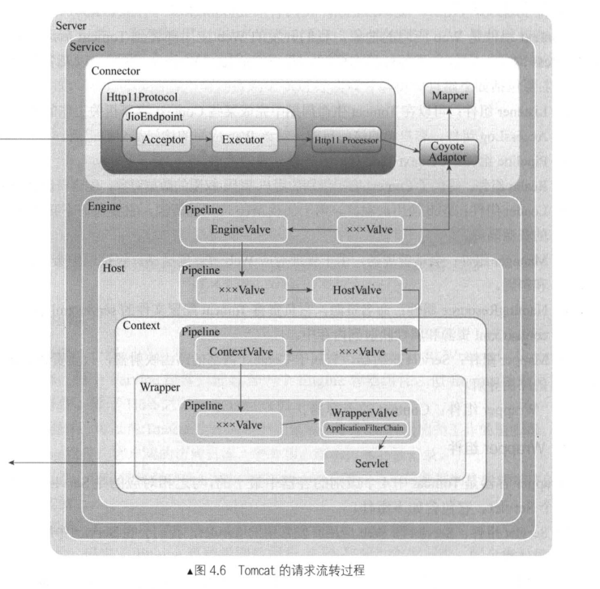

### Tomcat请求流转过程

1.当Tomcat启动后，Connector组件的接收器（Acceptor）将会监听是否有客户端套接字连接并接收Socket

2.一旦监听到客户端连接，则将连接交由线程池Executor处理，开始执行请求响应任务

3.Http11Processor组件负责从客户端连接中读取消息报文，然后开始解析HTTP的请求行、请求头部、请求体。将解析后的报文封装成Request对象，方便后面处理时通过Request对象获取HTTP协议的相关值

4.Mapper组件根据HTTP协议请求行的URL属性值和请求头部的Host属性值匹配由哪个Host容器、哪个Context容器、哪个Wrapper容器处理请求，这个过程其实就是根据请求从Tomcat中找到对应的Servlet。然后将路由的结果封装到Request对象中，方便后面处理时通过Request对象选择容器

5.CoyoteAdaptor组件负责将Connector组件和Engine容器连接起来，把前面处理过程中生成的请求对象Request和响应对象Respone传递到Engine容器，调用它的管道

6.Engine容器的管道开始处理请求，管道里包含若干阀门（Value），每个阀门负责某些处理逻辑。这里用xxxValue代表某阀门，我们可以根据自己的需要往这个管道中添加多个阀门，首先执行这个xxxValue，然后才执行基础阀门EngineValue，它会负责调用Host容器的管道

7.Host容器的管道开始处理请求，它同样也包含若干阀门，首先执行这些阀门，然后执行基础阀门HostValue，它继续往下调用Context容器的管道

8.Context容器的管道开始处理请求，首先执行若干阀门，然后执行基础阀门ContextValue，它负责调用Wrapper容器的管道

9.Wrapper容器的管道开始处理请求，首先执行若干阀门，然后执行基础阀门WrapperValue，它会执行该Wrapper容器对应的Servlet对象的处理方法，对请求进行逻辑处理，并将结果输出到客户端

### Tomcat全局类加载器

在Tomcat目录结构中，有三组目录（“/common/*”,“/server/*”和“shared/* ”）可以存放公用Java类库，此外还有第四组Web应用程序自身的目录“/WEB-INF/*”，把java类库放置在这些目录中的含义分别是：

​	放置在common目录中：类库可被Tomcat和所有的Web应用程序共同使用。
​	放置在server目录中：类库可被Tomcat使用，但对所有的Web应用程序都不可见。
​	放置在shared目录中：类库可被所有的Web应用程序共同使用，但对Tomcat自己不可见。
​	放置在/WebApp/WEB-INF目录中：类库仅仅可以被此Web应用程序使用，对Tomcat和其他Web应用程序都不可见。

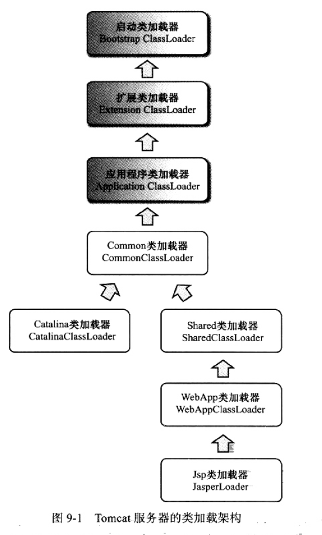

最上层的是Java的类加载器，CommonClassLoader、CatalinaClassLoader、SharedClassLoader 和 WebAppClassLoader 则是 Tomcat 自己定义的类加载器，它们分别加载 /common/* 、/server/* 、/shared/*  和 /WebApp/WEB-INF/*  中的 Java 类库。其中 WebApp 类加载器和 Jsp 类加载器通常会存在多个实例，每一个 Web 应用程序对应一个 WebApp 类加载器，每一个 JSP 文件对应一个 Jsp 类加载器。

从图中的委派关系中可以看出，CommonClassLoader 能加载的类都可以被 CatalinaClassLoader 和 SharedClassLoader 使用，而 CatalinaClassLoader 和 SharedClassLoader 自己能加载的类则与对方相互隔离。WebAppClassLoader 可以使用 SharedClassLoader 加载到的类，但各个 WebAppClassLoader 实例之间相互隔离。而 JasperLoader 的加载范围仅仅是这个 JSP 文件所编译出来的那一个 Class，它出现的目的就是为了被丢弃：当服务器检测到 JSP 文件被修改时，会替换掉目前的 JasperLoader 的实例，并通过再建立一个新的 Jsp 类加载器来实现 JSP 文件的 HotSwap 功能。


### 1.Server组件

​	Server组件是代表整个Tomcat的Servlet容器，属于最外层组件，主要功能：

​	①提供监听功能，对Tomcat整个生命周期中的不同事件进行处理，比如当web应用重新加载时，ThreadLocal会产生内存泄漏，监听器会堵住线程池，并重新创建线程。

​	②监听某个端口以接收SHUTDOWN命令。

​	③提供了Tomcat容器全局的命名资源实现。

#### 生命周期监听器

​	Tomcat中实现一个生命周期监听器很简单，只要实现LifecycleListener接口即可，在lifecycleEvent方法中对感兴趣的生命周期事件进行处理。

1.AprLifecycleListener监听器

​	有时候，Tomcat会使用APR本地库进行优化，通过JNI方式调用本地库能大幅提高对静态文件的处理。

2.JasperListener监听器

​	在Tomcat初始化前该监听器会初始化Jasper组件，Jasper是Tomcat的JSP编译器核心引擎，用于在Web应用启动前初始化Jasper。

3.JreMemoryLeakPreventionListener监听器

​	该监听器主要提供解决JRE内存泄漏和锁文件的一种措施，该监听器会在Tomcat初始化时使用系统类加载器

4.GlobalResourcesLifecycleListener监听器

​	该监听器主要负责实例化Server组件里面JNDI资源的MBean，并提交由JMX管理。此监听器对生命周期内的启动事件和停止事件感兴趣，它会在启动时为JNDI创建MBean，而在停止时销毁Mbean。

5.ThreadLocalLeakPreventionListener监听器

ThreadContextClassLoader（上下文类加载器）

6.NamingContextListener监听器

​	该监听器主要负责Server组件内全局命名资源在不同生命周期的不同操作，在Tomcat启动时创建命名资源，绑定命名资源，在Tomcat停止前解绑命名资源、反注册MBean。

### 2.Service组件

​	Service组件是若干Connector和Executor组成，配置多个Connector可以监听多个端口，如果需要端口单独监听一个项目，就要再添加一个Service组件，并设置Host中的读取目录(webapps2)。

### 3.Connector组件

​	①Protocol组件是协议的抽象，对不同协议进行了封装，HTTP协议、AJP协议。

​	②Endpoint组件存在多种I/O模式，BIO模式的JioEndpoint、NIO模式的NioEndpoint、本地库I/O模式AprEndpoint。

#### BIO

​	BIO模式下，操作系统接收到HTTP请求后，LimitLatch会控制连接数量，达到限制流量的目的。Acceptor会监听是否有客户端套接字（Request），并接收Socket。将连接交由线程池Executor处理后返回操作系统（Response）。如果是HTTPS请求会在LimitLatch前面加入ServerSocketFactory组件实现SSL/TLS协议。

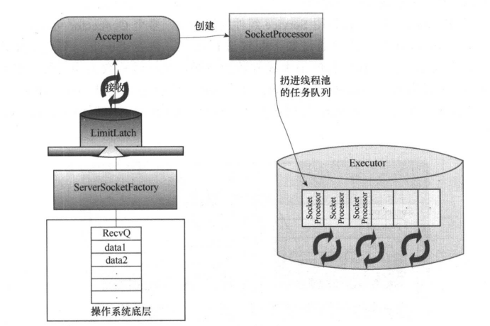

#### NIO

​	NIO模式下，如果是HTTPS请求，则使用SecureNioChannel处理，有多个Poller组成Poller池，所有连接使用轮询调度算法均摊给每个Poller处理，Poller连接轮询器去不断遍历事件列表，一旦发现相应的事件则封装成任务定义器SocketProcessor，并扔进线程池Executor中执行任务，如果没有Executor组件，Poller会自己处理任务。

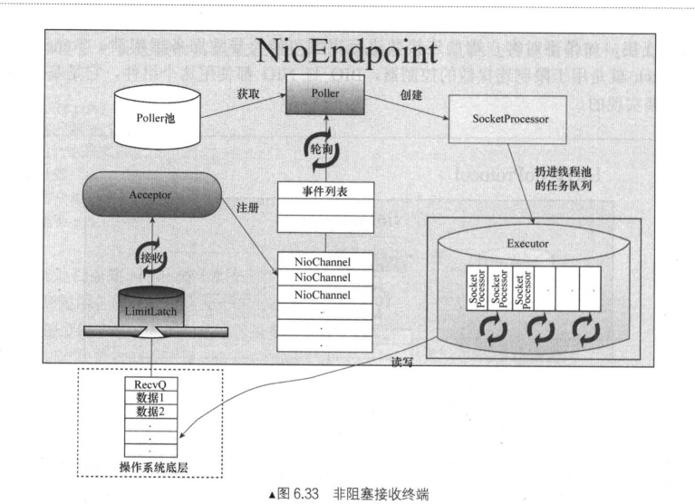

### 4.Engine容器

​	Engine容器为全局引擎容器，主要组件有Host组件、AccessLog组件、Pipeline组件、Cluster组件、Realm组件、LifecycleListener组件、Log组件。

​	①Host组件表示一个虚拟主机

​	②AccessLog组件负责客户端请求访问日志的记录，不管访问哪个Host都会被记录。

​	③Pipeline组是件可以将不通容器级别串联起来的通道，Tomcat中有4个级别的容器。

​	④Cluster组件负责配置集群

​	⑤Realm组件其实是一个存储了用户、密码及权限等数据的对象，存储方式可能是内存、xml文件或数据库等，主要作用是配合Tomcat实现资源认证模块。

​	⑥LifecycleListener组件

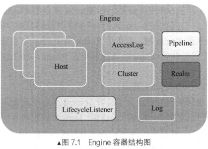

### 5.Host容器

​	Host容器用于表示虚拟主机，是根据URL地址中的主机部分抽象的，一个Servlet引擎可以包含若干个Host容器，一个Host容器可以包含若干个Context容器、AccessLog组件、Pipeline组件、Cluster组件、Realm组件、Log组件（以上重复组件功能与Engine中的组件相同，只是作用范围不同）、HostConfig组件。

​	HostConfig组件：生命周期监听器，用于处理不同类型的Web应用。同时加载多个项目时，使用Future进行线程协调

​		①直接在配置文件<Context/>标签中配置目录，到目录找到context.xml解析后进行部署，Tomcat安装目录下/conf/context.xml

​		②在Host配置的目录下（webapps）导入war包，读取war包里的context.xml文件后进行部署

​		③目录部署，直接放到webapps下，读取META-INF/context.xml文件

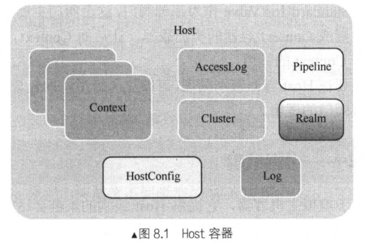

### 6.Context容器 (web.xml)

​	一个Context对应一个Web应用程序，Context容器包含若干Wrapper组件、Realm组件、AccessLog组件、ErrorPage组件、Manager组件、DirContext组件、安全认证组件、JarScanner组件、过滤器组件、NamingResource组件、Mapper组件、Pipeline组件、WebappLoader组件、ApplicationContext组件、InstanceManager组件、ServletContainerInitializer组件、Listeners组件。

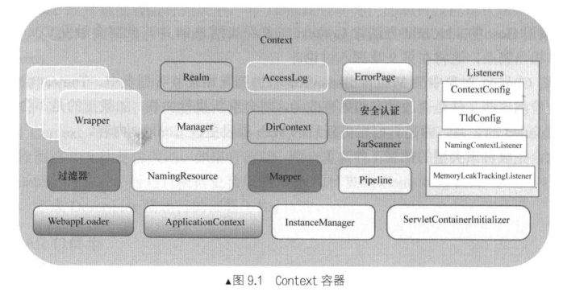

#### WebappLoader Web应用载入器  

​	WebappLoader的核心工作是交给WebappClassLoader类加载器来完成类加载工作，它是一个自定义的类加载器，WebappClassLoader继承了URLClassLoader，只需要把/WEB-INF/lib 和/WEB-INF/classes目录下的类以URL的形式添加到URLClassLoader中，后面就可以使用该类加载器对类进行加载。

​	实现互相隔离：

​	WebappClassLoader没有遵循双亲委派机制，而是按照自己的策略顺序加载类，根据委托标识，加载分为两种方式。

​	①当委托标识delegate为false时，WebappClassLoader类加载器首先尝试从本地缓存中加载该类，然后用System类加载器尝试加载，接着由自己尝试加载类，最后才由父类加载器(Common)加载。

​	②当委托标识delegate为true时，WebappClassLoader类加载器首先尝试从本地缓存中加载该类，然后用System类加载器尝试加载类，接着由父类加载器(Common)尝试加载，最后由自己加载。

​	对于公共资源可以共享，但属于Web应用的资源则通过类加载器进行了隔离。

​	实现重加载：

​	只需要重新实例化一个WebappClassLoader对象并把原来的WebappLoader中旧的置换掉即可完成重加载功能，置换掉的将会被GC回收。

​	System ClassLoader = Application ClassLoader

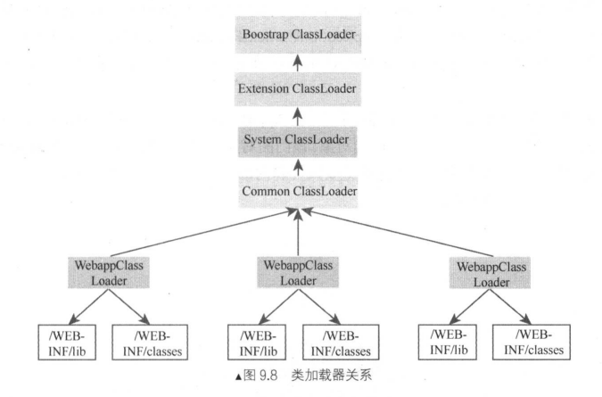

#### ApplicationContext

​	在Servlet的规范中规定了一个ServletContext接口，ApplicationContext实现了ServletContext接口，但实际上getServletContext()获取到的并非ApplicationContext对象，而是ApplicationContextFacade门面对象。

#### InstanceManager实例管理器

Context容器中包含了一个实例管理器，主要作用是实现对Context容器中监听器、过滤器以及Servlet等实例的管理。InstanceManager包含了两个类加载器，一个属于Tomcat容器内部的类加载器，另一个属于Web应用的类加载器。Tomcat容器类加载器是Web应用类加载器的父类加载器，Tomcat加载器在Tomcat整个生命周期中都会存在，Web加载器可能在重启后被丢弃，最终被GC。

#### Context容器的监听器

Tomcat生命周期事件：**AFTER_INIT_DESTROY_EVENT→BEFORE_START_EVENT→CONFIGURE_START_EVENT→AFTER_START_EVENT→CONFIGURE_STOP_EVENT→AFTER_DESTROY_EVENT**

ContextConfig监听器主要负责在适当的阶段对Web项目的配置文件进行相关处理。

TldConfig监听器主要负责对TLD标签配置文件的相

关处理。

NamingContextListener监听器主要负责对命名资源的创建、组织、绑定相关的处理工作。

MemoryLeakTrackingListener监听器主要跟踪重加载可能导致的内存泄露的相关处理。

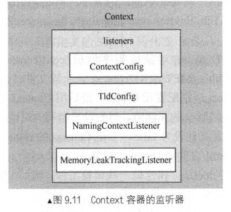

Tomcat热部署时，是将原来的类加载器废弃并且重新实例化一个WebappClassLoader类加载器，Tomcat通过WeakHashMap来实现弱引用，将类加载器当作键放入Map中，当类加载器及其包含的元素没有被其他任何类加载器中的元素引用到时，JVM发生GC()时会自动回收。如果类加载器没有被回收并且非Started状态，则发生了内存泄漏。

#### ConcurrentCache 

是基于java.util.concurrent.ConcurrentHashMap 和 java.util.WeakHashMap 实现的，存放固定大小的数据 java.util.concurrent.ConcurrentHashMap ，当超过固定大小的数据存放在 java.util.WeakHashMap 中，当jvm进行垃圾回收时候，
 java.util.WeakHashMap 的内容会被回收掉，以此保证多余的缓存不占用过多的内存。

```java
public final class ConcurrentCache<K,V> {

    //常驻内容的大小
    private final int size;

    //常驻缓存
    private final Map<K,V> eden;

    //存放多余的内容
    private final Map<K,V> longterm;

    public ConcurrentCache(int size) {
        this.size = size;
        this.eden = new ConcurrentHashMap<>(size);
        this.longterm = new WeakHashMap<>(size);
    }

    public V get(K k) {
       //从常驻缓存中获取内容
        V v = this.eden.get(k);
        if (v == null) {
            synchronized (longterm) {
                v = this.longterm.get(k);
            }
            //非常住缓存如果不为空，那么尝试将内容存放在eden
            if (v != null) {
                this.eden.put(k, v);
            }
        }
        return v;
    }

    public void put(K k, V v) {
        //如果超过常驻缓存的大小
        if (this.eden.size() >= size) {
            synchronized (longterm) {
                this.longterm.putAll(this.eden);
            }
            //清空常驻缓存
            this.eden.clear();
        }
        this.eden.put(k, v);
    }
}
```

https://www.jianshu.com/p/86e8b961221d

### 7.Wrapprt容器

​	Wrapper属于Tomcat中4个级别容器中最小级别的容器，与之相对应的是Servlet，在Servlet中使用doGet和doPost等方法上编写逻辑代码，而Wrapper则负责这些方法的逻辑。Wrapper容器可能多个线程对应一个Servlet对象，也可能对应一个实现了SingleThreadModel接口的Servlet对象池。

​	SingleThreadModel已经弃用，使用SingleThreadModel也不是线程安全的，Servlet本身是线程安全的无状态对象，是否安全取决于对Servlet的实现。

**有状态和无状态对象**
　　有状态就是有数据存储功能。有状态对象(Stateful Bean)，就是有实例变量的对象 ，可以保存数据，是非线程安全的。在不同方法调用间不保留任何状态。其实就是有数据成员的对象。

　　无状态就是一次操作，不能保存数据。无状态对象(Stateless Bean)，就是没有实例变量的对象。不能保存数据，是不变类，是线程安全的。具体来说就是只有方法没有数据成员的对象，或者有数据成员但是数据成员是可读的对象。

#### 工作机制

​	Servlet在初始化时要调用init方法，在销毁时要调用destroy方法，对请求处理时调用service方法。

​	Tomcat中消息流的流转机制是四个不同级别的容器是通过管道机制进行流转的，对于每个请求都是一层层处理的。Servlet工作机制的大致流程是：Request→StandardEngineValue→StandardHostValue→StandardContextValue→StandardWrapperValue→实例化并初始化Servlet对象→由过滤器链执行过滤操作→调用Servlet对象的service方法→Response

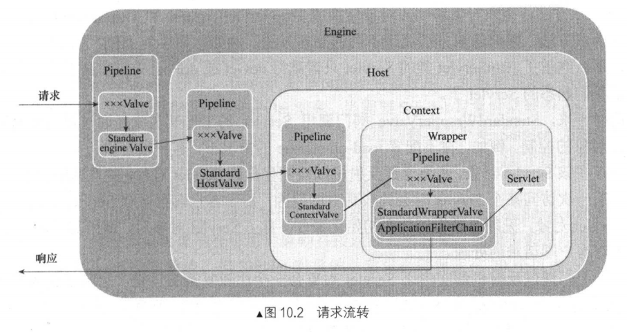

​	StandardWrapperValue阀门在调用Servlet的过程中，会继承HttpServlet类，HttpServlet的service()方法需要针对HTTP协议的GET、POST、PUT、DELETE、HEAD、OPTIONS等请求做出不同分发处理，实现Servlet只需要重写我们需要的对应类型处理方法do*()。

```java
protected void service(HttpServletRequest req, HttpServletResponse resp) throws ServletException, IOException {
    //获取请求类型
    String method = req.getMethod();
    long lastModified;
    if (method.equals("GET")) {
        lastModified = this.getLastModified(req);
        if (lastModified == -1L) {
            this.doGet(req, resp);
        } else {
            long ifModifiedSince;
            try {
                ifModifiedSince = req.getDateHeader("If-Modified-Since");
            } catch (IllegalArgumentException var9) {
                ifModifiedSince = -1L;
            }

            if (ifModifiedSince < lastModified / 1000L * 1000L) {
                this.maybeSetLastModified(resp, lastModified);
                this.doGet(req, resp);
            } else {
                resp.setStatus(304);
            }
        }
    } else if (method.equals("HEAD")) {
        lastModified = this.getLastModified(req);
        this.maybeSetLastModified(resp, lastModified);
        this.doHead(req, resp);
    } else if (method.equals("POST")) {
        this.doPost(req, resp);
    } else if (method.equals("PUT")) {
        this.doPut(req, resp);
    } else if (method.equals("DELETE")) {
        this.doDelete(req, resp);
    } else if (method.equals("OPTIONS")) {
        this.doOptions(req, resp);
    } else if (method.equals("TRACE")) {
        this.doTrace(req, resp);
    } else {
        String errMsg = lStrings.getString("http.method_not_implemented");
        Object[] errArgs = new Object[]{method};
        errMsg = MessageFormat.format(errMsg, errArgs);
        resp.sendError(501, errMsg);
    }

}
```

​	StandardWrapperValue阀门调用Servlet的工作其实就是通过反射机制实现对Servlet对象的控制，初次访问Servlet时才会去实例化Servlet，所以第一次访问会比较耗时。

​	针对SingleThreadModel模式，Wrapper容器使用了对象池策略，Wrapper容器有一个Servlet堆，负责保持若干个Servlet对象，当需要Servlet对象时，从堆中pop出一个对象，如果没有可用对象且对象数量在20个以内，则实例化Servlet对象并push到对象池中，用完之后push回堆中。Wrapper容器中最多可以有20个某Servlet对象，于是在第21个线程执行时会因为阻塞而等待，知道对象池中有可用对象才能继续执行。


​	countAllocated表示有多少线程已经被分配出去，nInstances表示总共有多少个实例，栈中实例数 + countAllocated = nInstances，当countAllocated >= nInstances表示需要新建实例，nInstances < maxInstances才会继续创建实例。

StandardWrapperValue:

```java
public Servlet allocate() throws ServletException {
    if (this.unloading) {
        throw new ServletException(sm.getString("standardWrapper.unloading", new Object[]{this.getName()}));
    } else {
        boolean newInstance = false;
        //非SingleThreadModel模式
        if (!this.singleThreadModel) {
            //单例模式实例对象
            //没有实例 或 Servlet已经完成init方法
            if (this.instance == null || !this.instanceInitialized) {
                synchronized(this) {
                    if (this.instance == null) {
                        try {
                            if (this.log.isDebugEnabled()) {
                                this.log.debug("Allocating non-STM instance");
                            }
							//通过反射加载实例
                            this.instance = this.loadServlet();
                            newInstance = true;
                            if (!this.singleThreadModel) {
                                //countAllocated表示有多少线程已经被分配出去
                                this.countAllocated.incrementAndGet();
                            }
                        } catch (ServletException var12) {
                            throw var12;
                        } catch (Throwable var13) {
                            ExceptionUtils.handleThrowable(var13);
                            throw new ServletException(sm.getString("standardWrapper.allocate"), var13);
                        }
                    }
					//Servlet没有完成init方法
                    if (!this.instanceInitialized) {
                        //执行init方法,instanceInitialized = true
                        this.initServlet(this.instance);
                    }
                }
            }
			//已有对象存在直接返回
            if (!this.singleThreadModel) {
                if (this.log.isTraceEnabled()) {
                    this.log.trace("  Returning non-STM instance");
                }

                if (!newInstance) {
                    //分配过对象的线程数 +1
                    this.countAllocated.incrementAndGet();
                }

                return this.instance;
            }
			//新建实例放到实例池中?
            if (newInstance) {
                synchronized(this.instancePool) {
                    this.instancePool.push(this.instance);
                    ++this.nInstances;
                }
            }
        }
		//SingleThreadModel模式
        synchronized(this.instancePool) {
            //nInstances表示总共有多少个实例，栈中实例数 + countAllocated = nInstances
            //当countAllocated >= nInstances表示需要新建实例
            //表示是否有空闲实例
            while(this.countAllocated.get() >= this.nInstances) {
                //nInstances < maxInstances才会继续创建实例
                if (this.nInstances < this.maxInstances) {
                    try {
                        //新建实例并放入实例池中
                        this.instancePool.push(this.loadServlet());
                        ++this.nInstances;
                    } catch (ServletException var7) {
                        throw var7;
                    } catch (Throwable var8) {
                        ExceptionUtils.handleThrowable(var8);
                        throw new ServletException(sm.getString("standardWrapper.allocate"), var8);
                    }
                } else {
                    try {
                        //如果实例池中的实例数已经达到了最大则挂起
                        this.instancePool.wait();
                    } catch (InterruptedException var9) {
                    }
                }
            }

            if (this.log.isTraceEnabled()) {
                this.log.trace("  Returning allocated STM instance");
            }
			//已分配实例 +1
            this.countAllocated.incrementAndGet();
            //将实例pop返回
            return (Servlet)this.instancePool.pop();
        }
    }
}

public void deallocate(Servlet servlet) throws ServletException {
    //非STM模式
    if (!this.singleThreadModel) {
        //已分配实例的线程数-1
        this.countAllocated.decrementAndGet();
    } else {
        //STM模式
        synchronized(this.instancePool) {
            //已分配实例的线程数-1
            this.countAllocated.decrementAndGet();
            //将实例push回实例池中
            this.instancePool.push(servlet);
            //如果实例已满被挂起，则唤醒
            this.instancePool.notify();
        }
    }
}
```

#### Servlet种类

通过Connector组件中的Mapper进行解析，根据不同资源类型可以分为三种类别，普通Servlet、JspServlet、DefaultServlet

1.首先会通过项目中配置的web.xml文件精准匹配路径

2.通过Tomcat安装目录下conf/web.xml配置的全局jsp规则进行匹配，交由JspServlet进行处理

```xml
<servlet-mapping>

	<servlet-name>jsp</servlet-name>

	<url-pattern>*.jsp</url-pattern>

	<url-pattern>*.jspx</url-pattern>

</servlet-mapping>

```

3.通过Tomcat安装目录下conf/web.xml配置的全局default规则进行匹配，交由DefaultServlet进行处理，会匹配所有URI，但是匹配顺序是最后，只有没有匹配到的资源才会进行匹配，通过JNDI根据URI在Tomcat内部查找资源，相应客户端。

# Java类加载

## 类加载过程

类的加载分为**加载**—>**链接**—>**初始化**

在链接阶段又有**验证**—>**准备**—>**解析**

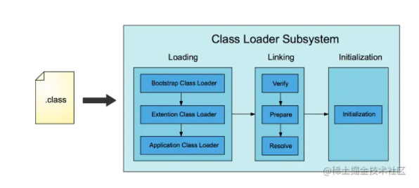

**加载**

类加载过程的第一步，主要完成下面 3 件事情：

1. 通过全类名获取定义此类的二进制字节流
2. 将字节流所代表的静态存储结构转换为方法区的运行时数据结构
3. 在内存中生成一个代表该类的 `Class` 对象，作为方法区这些数据的访问入口

**验证**

验证的目的是为了确保Class文件中的字节流包含的信息符合当前虚拟机的要求，而且不会危害虚拟机自身的安全。不同的虚拟机对类验证的实现可能会有所不同，但大致都会完成以下四个阶段的验证：文件格式的验证、元数据的验证、字节码验证和符号引用验证。

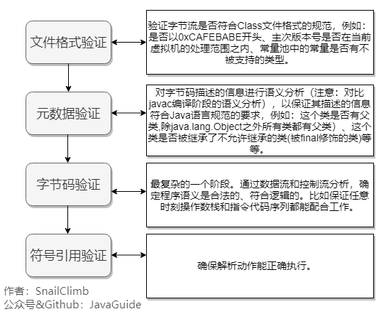

**准备**

准备阶段是正式为类变量分配内存并设置类变量初始值的阶段，这些内存都将在方法区中分配。对于该阶段有以下几点需要注意：

1. 这时候进行内存分配的仅包括类变量（ Class Variables ，即静态变量，被 `static` 关键字修饰的变量，只与类相关，因此被称为类变量），而不包括实例变量。实例变量会在对象实例化时随着对象一块分配在 Java 堆中。
2. 这里所设置的初始值"通常情况"下是数据类型默认的零值（如 0、0L、null、false 等），比如我们定义了`public static int value=111` ，那么 value 变量在准备阶段的初始值就是 0 而不是 111（初始化阶段才会赋值）。特殊情况：比如给 value 变量加上了 final 关键字`public static final int value=111` ，那么准备阶段 value 的值就被赋值为 111。
3. 从概念上讲，类变量所使用的内存都应当在 **方法区** 中进行分配。不过有一点需要注意的是：JDK 7 之前，HotSpot 使用永久代来实现方法区的时候，实现是完全符合这种逻辑概念的。 而在 JDK 7 及之后，HotSpot 已经把原本放在永久代的字符串常量池、静态变量等移动到堆中，这个时候类变量则会随着 Class 对象一起存放在 Java 堆中。

**解析**

解析阶段是虚拟机将常量池内的符号引用替换为直接引用的过程。解析动作主要针对类或接口、字段、类方法、接口方法、方法类型、方法句柄和调用限定符 7 类符号引用进行。

符号引用就是一组符号来描述目标，可以是任何字面量。**直接引用**就是直接指向目标的指针、相对偏移量或一个间接定位到目标的句柄。在程序实际运行时，只有符号引用是不够的，举个例子：在程序执行方法时，系统需要明确知道这个方法所在的位置。Java 虚拟机为每个类都准备了一张方法表来存放类中所有的方法。当需要调用一个类的方法的时候，只要知道这个方法在方法表中的偏移量就可以直接调用该方法了。通过解析操作符号引用就可以直接转变为目标方法在类中方法表的位置，从而使得方法可以被调用。

综上，解析阶段是虚拟机将常量池内的符号引用替换为直接引用的过程，也就是得到类或者字段、方法在内存中的指针或者偏移量。

**初始化**

初始化阶段是执行初始化方法 `<clinit> ()`方法的过程，是类加载的最后一步，这一步 JVM 才开始真正执行类中定义的 Java 程序代码(字节码)。

对于`<clinit> ()` 方法的调用，虚拟机会自己确保其在多线程环境中的安全性。因为 `<clinit> ()` 方法是带锁线程安全，所以在多线程环境下进行类初始化的话可能会引起多个进程阻塞，并且这种阻塞很难被发现。

对于初始化阶段，必须对类进行初始化(只有主动去使用类才会初始化类)：

1. 当遇到new、getstatic、putstatic、invokestatic这 4 条直接码指令时，比如new一个类，读取一个静态字段(未被 final 修饰)、或调用一个类的静态方法时。
   - 当 jvm 执行 `new` 指令时会初始化类。即当程序创建一个类的实例对象。
   - 当 jvm 执行 `getstatic` 指令时会初始化类。即程序访问类的静态变量(不是静态常量，常量会被加载到运行时常量池)。
   - 当 jvm 执行 `putstatic` 指令时会初始化类。即程序给类的静态变量赋值。
   - 当 jvm 执行 `invokestatic` 指令时会初始化类。即程序调用类的静态方法。
2. 使用 `java.lang.reflect` 包的方法对类进行反射调用时如 `Class.forname("...")`, `newInstance()` 等等。如果类没初始化，需要触发其初始化。
3. 初始化一个类，如果其父类还未初始化，则先触发该父类的初始化。
4. 当虚拟机启动时，用户需要定义一个要执行的主类 (包含 `main` 方法的那个类)，虚拟机会先初始化这个类。
5. `MethodHandle` 和 `VarHandle` 可以看作是轻量级的反射调用机制，而要想使用这 2 个调用， 就必须先使用 `findStaticVarHandle` 来初始化要调用的类。
6. 当一个接口中定义了 JDK8 新加入的默认方法（被 default 关键字修饰的接口方法）时，如果有这个接口的实现类发生了初始化，那该接口要在其之前被初始化。

https://github.com/Snailclimb/JavaGuide/blob/main/docs/java/jvm/class-loading-process.md

## 双亲委派

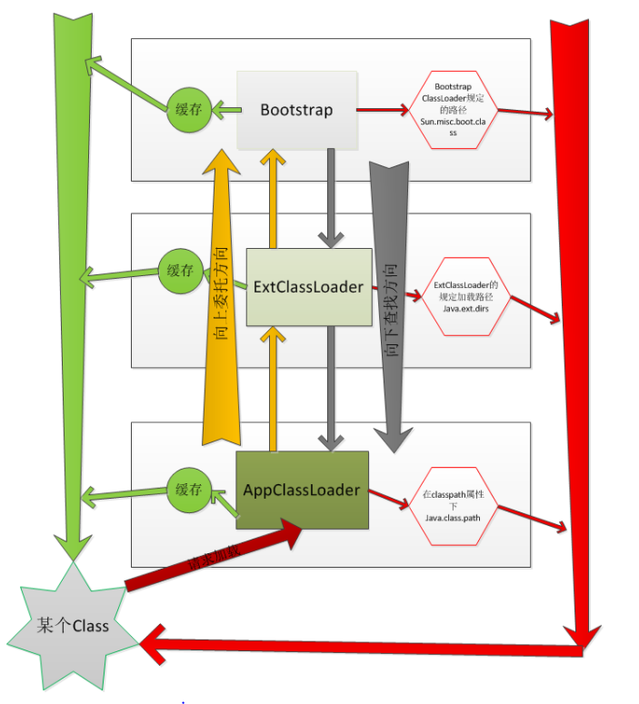

​	接收加载请求的类加载器叫做***初始类加载器(initiating loader)**,完成加载的类加载器叫做**定义类加载器(defining loder)**,初始类加载器和定义类加载器可能相同也可能不同。

​	类加载过程中有三个重要的方法：**loadClass()、findClass()  defineClass()**

​	打破双亲委派机制可以重写loadClass()，但如果完全打破会导致不能使用核心类库，Tomcat的实现是先使用自己的类加载器之后在进入到双亲委派机制中。**//TODO 调试Tomcat源码**

​	重写findClass()可以到指定目录下获取类进行加载。

​	defineClass() 方法主要是把字节数组转化为类的实例。同时definClass方法为final的，故不可以覆写。调用 defineClass 方法时，会对字节流进行校验，校验不通过会抛出 ClassFormatError 异常。字节流可以来源于.class文件，也可来自网络或其他途径。

```java
protected Class<?> loadClass(String name, boolean resolve)
        throws ClassNotFoundException
    {
    	 // 一个类的加载是放在代码同步块里边的，所以不会有同一个类加载多次
        synchronized (getClassLoadingLock(name)) {
            // 首先检查该类是否已加载过
            Class<?> c = findLoadedClass(name);
            // 如果缓存中没有找到，则按双亲委派模型加载
            if (c == null) {
                try {
                    if (parent != null) {
                    	// 如果父加载器不为null，则代理给父加载器加载
                    	// 父加载器在自己搜索范围内找不到该类，则抛出ClassNotFoundException
                        c = parent.loadClass(name, false);
                    } else {
                    	// 如果父加载器为null，则从引导类加载器加载过的类中
                    	// 找是否加载过此类，找不到返回null
                        c = findBootstrapClassOrNull(name);
                    }
                } catch (ClassNotFoundException e) {
                    // 存在父加载器但父加载器没有找到要加载的类触发此异常
                    // 只捕获不处理，交给字加载器自身去加载
                }

            if (c == null) {
                // 如果从父加载器到顶层加载器（引导类加载器）都找不到此类，则自己来加载
                c = findClass(name);
            }
        }
        
        // 如果resolve指定为true，则立即进入链接阶段
        if (resolve) {
            resolveClass(c);
        }
        return c;
    }
}
```

​	ApplicationClassLoader.getParent() = ExtensionClassLoader;

​	ApplicationClassLoader的父类是ExtensionClassLoader。

​	ExtensionClassLoader的父类不是BootstrapClassLoader。

​	父类为空则使用BootstrapClassLoader。

​	BootstrapClassLoader是由C/C++编写的，它本身时虚拟机的一部分，并不是Java类，无法在java代码中获取引用。

**getClassLoadingLock**

```java
protected Object getClassLoadingLock(String className) {
    Object lock = this;
    if (parallelLockMap != null) {
        Object newLock = new Object();
        lock = parallelLockMap.putIfAbsent(className, newLock);
        if (lock == null) {
            lock = newLock;
        }
    }
    return lock;
}

private ClassLoader(Void unused, ClassLoader parent) {
    this.parent = parent;
    if (ParallelLoaders.isRegistered(this.getClass())) {
        parallelLockMap = new ConcurrentHashMap<>();
        package2certs = new ConcurrentHashMap<>();
        assertionLock = new Object();
    } else {
        // no finer-grained lock; lock on the classloader instance
        parallelLockMap = null;
        package2certs = new Hashtable<>();
        assertionLock = this;
    }
}
```

​	classLoader加载器初始化时会创建parallelLockMap，key为ClassName，value为Object锁对象，加载时会尝试获取锁对象，没有则新建。

​	可以确保类可以并发加载。

​	putIfAbsent方法主要是在向ConcurrentHashMap中添加键—值对的时候，它会先判断该键值对是否已经存在。

返回值：
（1）如果是新的记录，那么会向map中添加该键值对，并返回null。
（2）如果已经存在，那么不会覆盖已有的值，直接返回已经存在的值。

## Launcher

​	sun.misc.Launcher是一个java虚拟机的入口应用。AppClassLoader和ExtClassLoader都是在Launcher中加载的。

```java
public Launcher() {
    Launcher.ExtClassLoader var1;
    try {
        //初始化加载扩展类加载器
        var1 = Launcher.ExtClassLoader.getExtClassLoader();
    } catch (IOException var10) {
        throw new InternalError("Could not create extension class loader", var10);
    }

    try {
        //初始化加载应用类加载器
        this.loader = Launcher.AppClassLoader.getAppClassLoader(var1);
    } catch (IOException var9) {
        throw new InternalError("Could not create application class loader", var9);
    }
	//设置线程上下文类加载器为AppClassLoader
    Thread.currentThread().setContextClassLoader(this.loader);
    String var2 = System.getProperty("java.security.manager");
    if (var2 != null) {
        SecurityManager var3 = null;
        if (!"".equals(var2) && !"default".equals(var2)) {
            try {
                //实例化安全管理器
                var3 = (SecurityManager)this.loader.loadClass(var2).newInstance();
            } catch (IllegalAccessException var5) {
            } catch (InstantiationException var6) {
            } catch (ClassNotFoundException var7) {
            } catch (ClassCastException var8) {
            }
        } else {
            var3 = new SecurityManager();
        }

        if (var3 == null) {
            throw new InternalError("Could not create SecurityManager: " + var2);
        }

        System.setSecurityManager(var3);
    }

}
```
## URLClassLoader

```java
static {
    SharedSecrets.setJavaNetAccess(new JavaNetAccess() {
        public URLClassPath getURLClassPath(URLClassLoader var1) {
            return var1.ucp;
        }

        public String getOriginalHostName(InetAddress var1) {
            return var1.holder.getOriginalHostName();
        }
    });
    ClassLoader.registerAsParallelCapable();
}
//将url添加到ucp
protected void addURL(URL url) {
    ucp.addURL(url);
}
```

​	URLClassLoader可以加载任意路径下的类，URLClassLoader继承于ClassLoader，是对于ClassLoader的扩展，ClassLoader只可以加载ClassPath下的类，URLClassLoader可以通过传入的URL地址进行加载。

​	ApplicationClassLoader和ExtensionClassLoaderd都继承了URLClassLoader,所以在初始化的过程中都会执行此静态代码块，将ucp(URLClassLoader) set 到SharedSecrets中。这样AppClassLoader的ucp中可以拿到ExtClassLoader的ucp。

```java
protected Class<?> findClass(final String var1) throws ClassNotFoundException {
    Class var2;
    try {
        var2 = (Class)AccessController.doPrivileged(new PrivilegedExceptionAction<Class<?>>() {
            public Class<?> run() throws ClassNotFoundException {
                String var1x = var1.replace('.', '/').concat(".class");
                //到ucp里面查找resource
                Resource var2 = URLClassLoader.this.ucp.getResource(var1x, false);
                if (var2 != null) {
                    try {
                        //找到这个class的话，执行defineClass()
                        return URLClassLoader.this.defineClass(var1, var2);
                    } catch (IOException var4) {
                        throw new ClassNotFoundException(var1, var4);
                    }
                } else {
                    return null;
                }
            }
        }, this.acc);
    } catch (PrivilegedActionException var4) {
        throw (ClassNotFoundException)var4.getException();
    }

    if (var2 == null) {
        throw new ClassNotFoundException(var1);
    } else {
        return var2;
    }
}
```
## ExtensionClassLoader

```java
static class ExtClassLoader extends URLClassLoader {
    private static volatile Launcher.ExtClassLoader instance;

    //单例模式获取实例
    public static Launcher.ExtClassLoader getExtClassLoader() throws IOException {
        if (instance == null) {
            Class var0 = Launcher.ExtClassLoader.class;
            synchronized(Launcher.ExtClassLoader.class) {
                if (instance == null) {
                    //创建ExtClassLoader
                    instance = createExtClassLoader();
                }
            }
        }

        return instance;
    }

    private static Launcher.ExtClassLoader createExtClassLoader() throws IOException {
        try {
            return (Launcher.ExtClassLoader)AccessController.doPrivileged(new PrivilegedExceptionAction<Launcher.ExtClassLoader>() {
                public Launcher.ExtClassLoader run() throws IOException {
                    //获取加载目录java.ext.dirs
                    File[] var1 = Launcher.ExtClassLoader.getExtDirs();
                    int var2 = var1.length;

                    for(int var3 = 0; var3 < var2; ++var3) {
                        MetaIndex.registerDirectory(var1[var3]);
                    }

                    return new Launcher.ExtClassLoader(var1);
                }
            });
        } catch (PrivilegedActionException var1) {
            throw (IOException)var1.getException();
        }
    }

    public ExtClassLoader(File[] var1) throws IOException {
        super(getExtURLs(var1), (ClassLoader)null, Launcher.factory);
        SharedSecrets.getJavaNetAccess().getURLClassPath(this).initLookupCache(this);
    }
    private static File[] getExtDirs() {
        String var0 = System.getProperty("java.ext.dirs");
        File[] var1;
        if (var0 != null) {
            StringTokenizer var2 = new StringTokenizer(var0, File.pathSeparator);
            int var3 = var2.countTokens();
            var1 = new File[var3];

            for(int var4 = 0; var4 < var3; ++var4) {
                var1[var4] = new File(var2.nextToken());
            }
        } else {
            var1 = new File[0];
        }

        return var1;
    }
}
```
## ApplicationClassLoader

```java
static class AppClassLoader extends URLClassLoader {
    ////此时ucp的值就是 AppClassLoader 父类 URLClassLoader 中的 ucp 
        final URLClassPath ucp = SharedSecrets.getJavaNetAccess().getURLClassPath(this);

        public static ClassLoader getAppClassLoader(final ClassLoader var0) throws IOException {
            final String var1 = System.getProperty("java.class.path");
            final File[] var2 = var1 == null ? new File[0] : Launcher.getClassPath(var1);
            return (ClassLoader)AccessController.doPrivileged(new PrivilegedAction<Launcher.AppClassLoader>() {
                public Launcher.AppClassLoader run() {
                    URL[] var1x = var1 == null ? new URL[0] : Launcher.pathToURLs(var2);
                    return new Launcher.AppClassLoader(var1x, var0);
                }
            });
        }
        AppClassLoader(URL[] var1, ClassLoader var2) {
            super(var1, var2, Launcher.factory);
            this.ucp.initLookupCache(this);
        }
		// Class.forName 的 入口
        public Class<?> loadClass(String var1, boolean var2) throws ClassNotFoundException {
            int var3 = var1.lastIndexOf(46);//检查 类的 全路径中是否含有 . 号
            if (var3 != -1) {//含有.号
                SecurityManager var4 = System.getSecurityManager();
                if (var4 != null) {
                    var4.checkPackageAccess(var1.substring(0, var3));//检查 类 所在的 包（目录） 是否可以访问
                }
            }

            if (this.ucp.knownToNotExist(var1)) {
                Class var5 = this.findLoadedClass(var1);
                if (var5 != null) {
                    if (var2) {
                        this.resolveClass(var5);
                    }

                    return var5;
                } else {
                    throw new ClassNotFoundException(var1);
                }
            } else {
                //交给父类URLClassLoader->ClassLoader
                return super.loadClass(var1, var2);
            }
        }
}
```
​	ApplicationClassLoader和ExtensionClassLoaderd都继承了URLClassLoader，都传入了加载类的固定目录，ExtensionClassLoaderd本身没有实现findClass()，ApplicationClassLoader实现了loadClass()方法，**//TODO ApplicationClassLoader实现loadClass对于this.ucp.knownToNotExist(var1)单独处理**   但还是会调用到父类的loadClass()。URLClassLoader中没有实现loadClass()，调用类加载器中的loadClass()方法会调用到ClassLoader中的loadClass方法，ClassLoader中没有实现findClass()，会调用到URLClassLoader中的findClass()。

https://www.codeleading.com/article/70645146710/

https://zhuanlan.zhihu.com/p/51374915

https://blog.csdn.net/briblue/article/details/54973413

https://www.jianshu.com/p/5c2cd08dfe89

https://juejin.cn/post/6844903564804882445


## Thread.currentThread().getContextClassLoader()

​	通过线程获取类加载器，线程从创建者处继承类加载器，Launcher中ApplicationClassLoader初始化之后会设置Thread.currentThread().setContextClassLoader(ApplicationClassLoader)，所以如果不去特殊设置默认的TCCL就是ApplicationClassLoader。

​	Spring中使用类加载器时都使用TCCL，这样Spring就不需要关心自己的加载位置。比如说在Tomcat中Spring被放到了CommonClassLoader或ShardClassLoader中加载，WebAppClassLoader调用了Spring，Spring只需要获取到调用它的WebAppClassLoader去加载类就可以了。

​	TCCL更通常的使用是在SPI（Service Provider Interface）。

```java
java.sql.DriverManager.getConnection(url, "name", "pwd");
```

​	DriverManager类是由BootstrapClassLoader加载，在这个类中想要获取ApplicationClassLoader中加载的类在默认的双亲委派机制下是不可能的，所以只能获取到TCCL中存放的ApplicationClassLoader去forName()获取这个类，这样就打破了双亲委派机制，在BootStrapCLassLoader中加载的类获取到了ApplicationClassLoader加载的类。

https://blog.csdn.net/yangcheng33/article/details/52631940

## ServiceLoader

```java
//ServiceLoader实现了Iterable接口
public final class ServiceLoader<S>
    implements Iterable<S>
{

    private static final String PREFIX = "META-INF/services/";

    private final Class<S> service;

    private final ClassLoader loader;

    private final AccessControlContext acc;

    private LinkedHashMap<String,S> providers = new LinkedHashMap<>();

    private LazyIterator lookupIterator;

    public void reload() {
        providers.clear();
        lookupIterator = new LazyIterator(service, loader);
    }

    private ServiceLoader(Class<S> svc, ClassLoader cl) {
        service = Objects.requireNonNull(svc, "Service interface cannot be null");
        loader = (cl == null) ? ClassLoader.getSystemClassLoader() : cl;
        acc = (System.getSecurityManager() != null) ? AccessController.getContext() : null;
        reload();
    }

    private Iterator<String> parse(Class<?> service, URL u)
        throws ServiceConfigurationError
    {
        InputStream in = null;
        BufferedReader r = null;
        ArrayList<String> names = new ArrayList<>();
        try {
            in = u.openStream();
            r = new BufferedReader(new InputStreamReader(in, "utf-8"));
            int lc = 1;
            //判断每个文件是否是合法的java类的全限定名称,文件都读完返回-1 或 抛出异常 跳出循环
            while ((lc = parseLine(service, u, r, lc, names)) >= 0);
        } catch (IOException x) {
            fail(service, "Error reading configuration file", x);
        } finally {
            try {
                if (r != null) r.close();
                if (in != null) in.close();
            } catch (IOException y) {
                fail(service, "Error closing configuration file", y);
            }
        }
        return names.iterator();
    }
    //判断每个文件是否是合法的java类的全限定名称
    private int parseLine(Class<?> service, URL u, BufferedReader r, int lc,
                          List<String> names)
        throws IOException, ServiceConfigurationError
    {
        String ln = r.readLine();
        if (ln == null) {
            return -1;
        }
        int ci = ln.indexOf('#');
        if (ci >= 0) ln = ln.substring(0, ci);
        ln = ln.trim();
        int n = ln.length();
        if (n != 0) {
            if ((ln.indexOf(' ') >= 0) || (ln.indexOf('\t') >= 0))
                fail(service, u, lc, "Illegal configuration-file syntax");
            int cp = ln.codePointAt(0);
            if (!Character.isJavaIdentifierStart(cp))
                fail(service, u, lc, "Illegal provider-class name: " + ln);
            for (int i = Character.charCount(cp); i < n; i += Character.charCount(cp)) {
                cp = ln.codePointAt(i);
                if (!Character.isJavaIdentifierPart(cp) && (cp != '.'))
                    fail(service, u, lc, "Illegal provider-class name: " + ln);
            }
            if (!providers.containsKey(ln) && !names.contains(ln))
                names.add(ln);
        }
        return lc + 1;
    }

    public static <S> ServiceLoader<S> load(Class<S> service,
                                            ClassLoader loader)
    {
        return new ServiceLoader<>(service, loader);
    }
	
    //加载ServiceLoader
    public static <S> ServiceLoader<S> load(Class<S> service) {
        //获取TCCL
        ClassLoader cl = Thread.currentThread().getContextClassLoader();
        //将类要加载的类和类加载器传入构造ServiceLoader实例以供调用next()方法时进行类加载处理
        return ServiceLoader.load(service, cl);
    }

    	//实现Iterator
    public Iterator<S> iterator() {
        return new Iterator<S>() {
			//private LinkedHashMap<String,S> providers = new LinkedHashMap<>();
            //缓存
            Iterator<Map.Entry<String,S>> knownProviders
                = providers.entrySet().iterator();

            public boolean hasNext() {
                if (knownProviders.hasNext())
                    return true;
                //private LazyIterator lookupIterator;
                return lookupIterator.hasNext();
            }

            public S next() {
                if (knownProviders.hasNext())
                    return knownProviders.next().getValue();
                //private LazyIterator lookupIterator;
                return lookupIterator.next();
            }

            public void remove() {
                throw new UnsupportedOperationException();
            }

        };
    }
    
    private class LazyIterator
        implements Iterator<S>
    {

        Class<S> service;
        ClassLoader loader;
        Enumeration<URL> configs = null;
        Iterator<String> pending = null;
        String nextName = null;

        private LazyIterator(Class<S> service, ClassLoader loader) {
            this.service = service;
            this.loader = loader;
        }

        //调用hasNextService()
        public boolean hasNext() {
            if (acc == null) {
                return hasNextService();
            } else {
                PrivilegedAction<Boolean> action = new PrivilegedAction<Boolean>() {
                    public Boolean run() { return hasNextService(); }
                };
                return AccessController.doPrivileged(action, acc);
            }
        }
        
        //调用nextService()
        public S next() {
            if (acc == null) {
                return nextService();
            } else {
                PrivilegedAction<S> action = new PrivilegedAction<S>() {
                    public S run() { return nextService(); }
                };
                return AccessController.doPrivileged(action, acc);
            }
        }
        
        private boolean hasNextService() {
            //nextName不为空证明已经查找过了，没有执行next()，next()中nextName==null
            if (nextName != null) {
                return true;
            }
            //configs就是所有名字为PREFIX + service.getName()的资源
            //为空才加载
            if (configs == null) {
                try {
                    //private static final String PREFIX = "META-INF/services/";
                    String fullName = PREFIX + service.getName();
                    
                    //如果loader==null则使用BootstrapClassLoader加载
                    if (loader == null)
                        configs = ClassLoader.getSystemResources(fullName);
                    else
                        //使用传入的类加载器加载
                        configs = loader.getResources(fullName);
                } catch (IOException x) {
                    fail(service, "Error locating configuration files", x);
                }
            }
            //遍历所有的资源,pending用于存放加载到的实现类
            //如果!pending.hasNext()，则加载configs.nextElement()，直到资源已经加载完成!configs.hasMoreElements()
            while ((pending == null) || !pending.hasNext()) {
                //所有资源已经加载完成
                if (!configs.hasMoreElements()) {
                    return false;
                }
                // parse方法主要调用了parseLine,功能:
                // 1. 分析每个PREFIX + service.getName() 目录下面的所有文件
                // 2. 判断configs中ELement是否是合法的java类的全限定名称
                pending = parse(service, configs.nextElement());
            }
            //第一次加载后，只会执行这里，直到加载下一个pending
            nextName = pending.next();
            return true;
        }

        private S nextService() {
            if (!hasNextService())
                throw new NoSuchElementException();
            String cn = nextName;
            //将nextName置空，hasNext()才可以判断下一个元素
            nextName = null;
            Class<?> c = null;
            try {
                //使用传入类加载直接加载类，跳出双亲委派直接加载
                c = Class.forName(cn, false, loader);
            } catch (ClassNotFoundException x) {
                fail(service,
                     "Provider " + cn + " not found");
            }
            if (!service.isAssignableFrom(c)) {
                fail(service,
                     "Provider " + cn  + " not a subtype");
            }
            try {
                S p = service.cast(c.newInstance());
                providers.put(cn, p);
                return p;
            } catch (Throwable x) {
                fail(service,
                     "Provider " + cn + " could not be instantiated",
                     x);
            }
            throw new Error();          // This cannot happen
        }

        public void remove() {
            throw new UnsupportedOperationException();
        }

    }

    public static <S> ServiceLoader<S> loadInstalled(Class<S> service) {
        ClassLoader cl = ClassLoader.getSystemClassLoader();
        ClassLoader prev = null;
        while (cl != null) {
            prev = cl;
            cl = cl.getParent();
        }
        return ServiceLoader.load(service, prev);
    }

}
```

https://juejin.cn/post/6844903890173837326

https://zhuanlan.zhihu.com/p/67665359

https://www.jianshu.com/p/a6073e9f8cb4


# CAS单点登录

登录

https://juejin.cn/post/6844903651320791048

 [终于搞明白了，CAS单点登录原理解析！！ - 掘金.pdf](终于搞明白了，CAS单点登录原理解析！！ - 掘金.pdf) 

登出

https://www.cnblogs.com/xiangkejin/p/8963089.html

在请求Cas Server的logout时，Cas Server会将客户端携带的TGC删除，同时回调该TGT对应的所有service，即所有的Cas Client。

Cas Client如果需要响应该回调，进而在Cas Client端进行登出操作的话就需要有对应的支持。


# ANTLR4

```java
获取原本格式
ctx.start.getInputStream().getText(new Interval(ctx.start.getStartIndex(), ctx.stop.getStopIndex()));
```

# 

