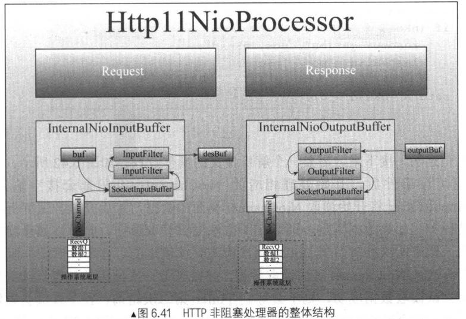

https://github.com/Snailclimb/JavaGuide

https://github.com/AobingJava/JavaFamily

# Tomcat

## Tomcat配置文件
```xml
<?xml version="1.0" encoding="UTF-8"?>
<Server port="8005" shutdown="SHUTDOWN">
  <Listener className="org.apache.catalina.startup.VersionLoggerListener" />
  <Listener className="org.apache.catalina.core.AprLifecycleListener" SSLEngine="on" />
  <Listener className="org.apache.catalina.core.JreMemoryLeakPreventionListener" />
  <Listener className="org.apache.catalina.mbeans.GlobalResourcesLifecycleListener" />
  <Listener className="org.apache.catalina.core.ThreadLocalLeakPreventionListener" />

  <GlobalNamingResources>
    <Resource name="UserDatabase" auth="Container"
              type="org.apache.catalina.UserDatabase"
              description="User database that can be updated and saved"
              factory="org.apache.catalina.users.MemoryUserDatabaseFactory"
              pathname="conf/tomcat-users.xml" />
  </GlobalNamingResources>

  <Service name="Catalina">

    <!--
    <Executor name="tomcatThreadPool" namePrefix="catalina-exec-"
        maxThreads="150" minSpareThreads="4"/>
    -->

<Connector port="8081" protocol="HTTP/1.1"
           connectionTimeout="20000"
           redirectPort="8443"/>

<Connector port="8443" protocol="org.apache.coyote.http11.Http11NioProtocol" maxThreads="150" SSLEnabled="true">
        <SSLHostConfig>
           <Certificate certificateKeystoreFile="D:/liuyx.keystore" type="RSA" certificateKeystoreType="JKS" certificateKeystorePassword="123456"/>
        </SSLHostConfig>
</Connector>


    <Engine name="Catalina" defaultHost="localhost">
    
      <Realm className="org.apache.catalina.realm.LockOutRealm">
        <Realm className="org.apache.catalina.realm.UserDatabaseRealm"
               resourceName="UserDatabase"/>
      </Realm>
    
      <Host name="localhost"  appBase="webapps"
            unpackWARs="true" autoDeploy="true">
    
        <Valve className="org.apache.catalina.valves.AccessLogValve" directory="logs"
               prefix="localhost_access_log" suffix=".txt"
               pattern="%h %l %u %t &quot;%r&quot; %s %b" />
    
      </Host>
    </Engine>
  </Service>
</Server>
```
## tomcat全局组件


https://www.cnblogs.com/java-chen-hao/default.html?page=6

### Tomcat请求流转过程

1.当Tomcat启动后，Connector组件的接收器（Acceptor）将会监听是否有客户端套接字连接并接收Socket

2.一旦监听到客户端连接，则将连接交由线程池Executor处理，开始执行请求响应任务

3.Http11Processor组件负责从客户端连接中读取消息报文，然后开始解析HTTP的请求行、请求头部、请求体。将解析后的报文封装成Request对象，方便后面处理时通过Request对象获取HTTP协议的相关值

4.Mapper组件根据HTTP协议请求行的URL属性值和请求头部的Host属性值匹配由哪个Host容器、哪个Context容器、哪个Wrapper容器处理请求，这个过程其实就是根据请求从Tomcat中找到对应的Servlet。然后将路由的结果封装到Request对象中，方便后面处理时通过Request对象选择容器

5.CoyoteAdaptor组件负责将Connector组件和Engine容器连接起来，把前面处理过程中生成的请求对象Request和响应对象Respone传递到Engine容器，调用它的管道

6.Engine容器的管道开始处理请求，管道里包含若干阀门（Valve），每个阀门负责某些处理逻辑。这里用xxxValve代表某阀门，我们可以根据自己的需要往这个管道中添加多个阀门，首先执行这个xxxValve，然后才执行基础阀门EngineValve，它会负责调用Host容器的管道

7.Host容器的管道开始处理请求，它同样也包含若干阀门，首先执行这些阀门，然后执行基础阀门HostValve，它继续往下调用Context容器的管道

8.Context容器的管道开始处理请求，首先执行若干阀门，然后执行基础阀门ContextValve，它负责调用Wrapper容器的管道

9.Wrapper容器的管道开始处理请求，首先执行若干阀门，然后执行基础阀门WrapperValve，它会执行该Wrapper容器对应的Servlet对象的处理方法，对请求进行逻辑处理，并将结果输出到客户端

### Tomcat全局类加载器

在Tomcat目录结构中，有三组目录（“/common/*”,“/server/*”和“shared/* ”）可以存放公用Java类库，此外还有第四组Web应用程序自身的目录“/WEB-INF/*”，把java类库放置在这些目录中的含义分别是：

​	放置在common目录中：类库可被Tomcat和所有的Web应用程序共同使用。
​	放置在server目录中：类库可被Tomcat使用，但对所有的Web应用程序都不可见。
​	放置在shared目录中：类库可被所有的Web应用程序共同使用，但对Tomcat自己不可见。
​	放置在/WebApp/WEB-INF目录中：类库仅仅可以被此Web应用程序使用，对Tomcat和其他Web应用程序都不可见。


最上层的是Java的类加载器，CommonClassLoader、CatalinaClassLoader、SharedClassLoader 和 WebAppClassLoader 则是 Tomcat 自己定义的类加载器，它们分别加载 /common/* 、/server/* 、/shared/*  和 /WebApp/WEB-INF/*  中的 Java 类库。其中 WebApp 类加载器和 Jsp 类加载器通常会存在多个实例，每一个 Web 应用程序对应一个 WebApp 类加载器，每一个 JSP 文件对应一个 Jsp 类加载器。

从图中的委派关系中可以看出，CommonClassLoader 能加载的类都可以被 CatalinaClassLoader 和 SharedClassLoader 使用，而 CatalinaClassLoader 和 SharedClassLoader 自己能加载的类则与对方相互隔离。WebAppClassLoader 可以使用 SharedClassLoader 加载到的类，但各个 WebAppClassLoader 实例之间相互隔离。而 JasperLoader 的加载范围仅仅是这个 JSP 文件所编译出来的那一个 Class，它出现的目的就是为了被丢弃：当服务器检测到 JSP 文件被修改时，会替换掉目前的 JasperLoader 的实例，并通过再建立一个新的 Jsp 类加载器来实现 JSP 文件的 HotSwap 功能。

### 设计模式

1. 模板方法模式，父类定义框架，子类实现
2. 责任链模式，就是这儿的管道/阀门的实现方式，每个阀门维护一个next属性指向下一个阀门
3. 门面模式


### 1.Server组件

​	Server组件是代表整个Tomcat的Servlet容器，属于最外层组件，主要功能：

​	①提供监听功能，对Tomcat整个生命周期中的不同事件进行处理，比如当web应用重新加载时，ThreadLocal会产生内存泄漏，监听器会堵住线程池，并重新创建线程。

​	②监听某个端口以接收SHUTDOWN命令。

​	③提供了Tomcat容器全局的命名资源实现。


#### 生命周期监听器

​	Tomcat中实现一个生命周期监听器很简单，只要实现LifecycleListener接口即可，在lifecycleEvent方法中对感兴趣的生命周期事件进行处理。

1.AprLifecycleListener监听器

​	有时候，Tomcat会使用APR本地库进行优化，通过JNI方式调用本地库能大幅提高对静态文件的处理。

2.JasperListener监听器

​	在Tomcat初始化前该监听器会初始化Jasper组件，Jasper是Tomcat的JSP编译器核心引擎，用于在Web应用启动前初始化Jasper。

3.JreMemoryLeakPreventionListener监听器

​	该监听器主要提供解决JRE内存泄漏和锁文件的一种措施，该监听器会在Tomcat初始化时使用系统类加载器。

​	内存泄漏的情况例如：DriverManager.getDrivers()，会获取TCCL，并长时间使用，如果当前的TCCL是WebAppClassLoader，在重加载一个Web应用时重新实例一个WebAppClassLoader，之前的WACL会就无法回收，导致内存泄漏。Tomcat并不推荐将驱动jar包放在/WEB-INF/lib，会发出警告提示内存泄漏，正确的是放在服务器的/lib下。

​	jre库中会有一些类，在加载它们的时候会创建一个新的线程并循环，创建新的线程如果不指定TCCL会继承父线程的，会导致WACL无法回收。对于这些类，监听器会进行特殊处理，使用SystemClassLoader进行加载。

javax.imageio.ImageIO、java.awt.Toolkit、sun.misc.GC、javax.security.auth.Policy、javax.security.auth.login.Configuration、java.security.Security、javax.xml.parsers.DocumentBuilderFactory、com.sun.jndi.ldap.LdapPoolManager。

JreMemoryLeakPreventionListener：

```java
public void lifecycleEvent(LifecycleEvent event) {
    if ("before_init".equals(event.getType())) {
        if (this.driverManagerProtection) {
            //改变TCCL之前，加载CATALINA_HOME/lib下的
            DriverManager.getDrivers();
        }
		//获取TCCL
        ClassLoader loader = Thread.currentThread().getContextClassLoader();

        try {
            //将TCCL设置为SystemClassLoader
            Thread.currentThread().setContextClassLoader(ClassLoader.getSystemClassLoader());
            //根据全类名去加载会导致内存泄漏的类
            ......
                
        } finally {
            //还原TCCL
            Thread.currentThread().setContextClassLoader(loader);
        }
    }
}
```

4.GlobalResourcesLifecycleListener监听器

​	该监听器主要负责实例化Server组件里面JNDI资源的MBean，并提交由JMX管理。此监听器对生命周期内的启动事件和停止事件感兴趣，它会在启动时为JNDI创建MBean，而在停止时销毁Mbean。

5.ThreadLocalLeakPreventionListener监听器

​	该监听器主要解决ThreadLocal的使用可能带来的内存泄漏问题。该监听器会在Tomcat启动后将监听Web应用重加载的监听器注册到每个Web应用上，当Web应用重加载时，该监听器会将所有工作线程销毁并再创建，以避免ThreadLocal引起的内存泄漏。

​	如果使用ThreadLocal保存AA对象，AA由WebAppClassLoader加载，这样就可以认为是线程引用了AA对象，由于线程一直不被销毁（//TODO ThreadLocal中的清理机制整理） ，这样WACL就无法回收，导致内存泄漏。

​	Tomcat处理ThreadLoacl内存泄漏的工作主要是销毁线程池原来的线程,然后创建新线程。这分两步做，第一步先将任务队列堵住，不让新任务进来；第二步将线程池中所有线程停止。//TODO 学习threadpoolexecutor

https://juejin.cn/post/6844904138795401224

6.NamingContextListener监听器

​	该监听器主要负责Server组件内全局命名资源在不同生命周期的不同操作，在Tomcat启动时创建命名资源，绑定命名资源，在Tomcat停止前解绑命名资源、反注册MBean。

### 2.Service组件

​	Service组件是若干Connector和Executor组成，配置多个Connector可以监听多个端口，如果需要端口单独监听一个项目，就要再添加一个Service组件，并设置Host中的读取目录(webapps2)。


​	StandardService的源码中initInternal()、startInternal()、stopInternal()、destroyInternal()会调用Connectiors的init()、start()、stop()、destroy()方法。

```java
    @Override
    protected void initInternal() throws LifecycleException {

        super.initInternal();

        if (engine != null) {
            engine.init();
        }

        // Initialize any Executors
        for (Executor executor : findExecutors()) {
            if (executor instanceof JmxEnabled) {
                ((JmxEnabled) executor).setDomain(getDomain());
            }
            executor.init();
        }

        // Initialize mapper listener
        mapperListener.init();

        // Initialize our defined Connectors
        synchronized (connectorsLock) {
            for (Connector connector : connectors) {
                try {
                    connector.init();
                } catch (Exception e) {
                    String message = sm.getString(
                            "standardService.connector.initFailed", connector);
                    log.error(message, e);

                    if (Boolean.getBoolean("org.apache.catalina.startup.EXIT_ON_INIT_FAILURE")) {
                        throw new LifecycleException(message);
                    }
                }
            }
        }
    }

@Override
protected void startInternal() throws LifecycleException {

    if(log.isInfoEnabled()) {
        log.info(sm.getString("standardService.start.name", this.name));
    }
    setState(LifecycleState.STARTING);

    // Start our defined Container first
    if (engine != null) {
        synchronized (engine) {
            engine.start();
        }
    }

    synchronized (executors) {
        for (Executor executor: executors) {
            executor.start();
        }
    }

    mapperListener.start();

    // Start our defined Connectors second
    synchronized (connectorsLock) {
        for (Connector connector: connectors) {
            try {
                // If it has already failed, don't try and start it
                if (connector.getState() != LifecycleState.FAILED) {
                    connector.start();
                }
            } catch (Exception e) {
                log.error(sm.getString(
                        "standardService.connector.startFailed",
                        connector), e);
            }
        }
    }
}
```

### 3.Connector组件

​	①Protocol组件是协议的抽象，对不同协议进行了封装，HTTP协议、AJP协议。

​	②Endpoint组件存在多种I/O模式，BIO模式的JioEndpoint、NIO模式的NioEndpoint、本地库I/O模式AprEndpoint。


​	Mapper组件可以称为路由器，它提供了对客户端请求URL的映射功能，即可以通过它将请求转发到对应的Host组件、Context组件、Wrapper组件以进行处理并响应客户端，也就是我们常说的将某客户端请求发送到某虚拟主机上的某个Web应用的某个Servlet。

​	CoyoteAdaptor组件是一个适配器，它负责将Connector组件和Engine容器适配连接起来，把由接收到的客户端请求报文解析生成的Response和Request传递到Engine容器，交由容器处理。

Connector构造方法

```JAVA
public Connector() {
    this(null); // 1. 无参构造方法，传入参数为空协议，会默认使用`HTTP/1.1`
}

public Connector(String protocol) {
    setProtocol(protocol);
    // Instantiate protocol handler
    // 5. 使用protocolHandler的类名构造ProtocolHandler的实例
    ProtocolHandler p = null;
    try {
        Class<?> clazz = Class.forName(protocolHandlerClassName);
        p = (ProtocolHandler) clazz.getConstructor().newInstance();
    } catch (Exception e) {
        log.error(sm.getString(
                "coyoteConnector.protocolHandlerInstantiationFailed"), e);
    } finally {
        this.protocolHandler = p;
    }

    if (Globals.STRICT_SERVLET_COMPLIANCE) {
        uriCharset = StandardCharsets.ISO_8859_1;
    } else {
        uriCharset = StandardCharsets.UTF_8;
    }
}

@Deprecated
public void setProtocol(String protocol) {
    boolean aprConnector = AprLifecycleListener.isAprAvailable() &&
            AprLifecycleListener.getUseAprConnector();

    // 2. `HTTP/1.1`或`null`，protocolHandler使用`org.apache.coyote.http11.Http11NioProtocol`，不考虑apr
    if ("HTTP/1.1".equals(protocol) || protocol == null) {
        if (aprConnector) {
            setProtocolHandlerClassName("org.apache.coyote.http11.Http11AprProtocol");
        } else {
            setProtocolHandlerClassName("org.apache.coyote.http11.Http11NioProtocol");
        }
    }
    // 3. `AJP/1.3`，protocolHandler使用`org.apache.coyote.ajp.AjpNioProtocol`，不考虑apr
    else if ("AJP/1.3".equals(protocol)) {
        if (aprConnector) {
            setProtocolHandlerClassName("org.apache.coyote.ajp.AjpAprProtocol");
        } else {
            setProtocolHandlerClassName("org.apache.coyote.ajp.AjpNioProtocol");
        }
    }
    // 4. 其他情况，使用传入的protocol作为protocolHandler的类名
    else {
        setProtocolHandlerClassName(protocol);
    }
}
```

Connector.init()

```java
@Override
protected void initInternal() throws LifecycleException {
    super.initInternal();

    // Initialize adapter
    // 1. 初始化adapter
    adapter = new CoyoteAdapter(this);
    protocolHandler.setAdapter(adapter);

    // Make sure parseBodyMethodsSet has a default
    // 2. 设置接受body的method列表，默认为POST
    if (null == parseBodyMethodsSet) {
        setParseBodyMethods(getParseBodyMethods());
    }

    if (protocolHandler.isAprRequired() && !AprLifecycleListener.isAprAvailable()) {
        throw new LifecycleException(sm.getString("coyoteConnector.protocolHandlerNoApr",
                getProtocolHandlerClassName()));
    }
    if (AprLifecycleListener.isAprAvailable() && AprLifecycleListener.getUseOpenSSL() &&
            protocolHandler instanceof AbstractHttp11JsseProtocol) {
        AbstractHttp11JsseProtocol<?> jsseProtocolHandler =
                (AbstractHttp11JsseProtocol<?>) protocolHandler;
        if (jsseProtocolHandler.isSSLEnabled() &&
                jsseProtocolHandler.getSslImplementationName() == null) {
            // OpenSSL is compatible with the JSSE configuration, so use it if APR is available
            jsseProtocolHandler.setSslImplementationName(OpenSSLImplementation.class.getName());
        }
    }

    // 3. 初始化protocolHandler
    try {
        protocolHandler.init();
    } catch (Exception e) {
        throw new LifecycleException(
                sm.getString("coyoteConnector.protocolHandlerInitializationFailed"), e);
    }
}
```
protocolHandler.init();

```java
@Override
public void init() throws Exception {
    if (getLog().isInfoEnabled()) {
        getLog().info(sm.getString("abstractProtocolHandler.init", getName()));
    }

    if (oname == null) {
        // Component not pre-registered so register it
        oname = createObjectName();
        if (oname != null) {
            Registry.getRegistry(null, null).registerComponent(this, oname, null);
        }
    }

    if (this.domain != null) {
        rgOname = new ObjectName(domain + ":type=GlobalRequestProcessor,name=" + getName());
        Registry.getRegistry(null, null).registerComponent(
                getHandler().getGlobal(), rgOname, null);
    }

    // 1. 设置endpoint的名字，默认为：http-nio-{port}
    String endpointName = getName();
    endpoint.setName(endpointName.substring(1, endpointName.length()-1));
    endpoint.setDomain(domain);
    
    // 2. 初始化endpoint
    endpoint.init();
}
```

endpoint.init()由抽象类AbstactEndpoint实现，采用了模板方法模式，在init()中调用bind()，但bind()方法由子类实现。

```java
public abstract void bind() throws Exception;
public abstract void unbind() throws Exception;
public abstract void startInternal() throws Exception;
public abstract void stopInternal() throws Exception;

public void init() throws Exception {
    // 执行bind()方法
    if (bindOnInit) {
        bind();
        bindState = BindState.BOUND_ON_INIT;
    }
    if (this.domain != null) {
        // Register endpoint (as ThreadPool - historical name)
        oname = new ObjectName(domain + ":type=ThreadPool,name=\"" + getName() + "\"");
        Registry.getRegistry(null, null).registerComponent(this, oname, null);

        ObjectName socketPropertiesOname = new ObjectName(domain +
                ":type=ThreadPool,name=\"" + getName() + "\",subType=SocketProperties");
        socketProperties.setObjectName(socketPropertiesOname);
        Registry.getRegistry(null, null).registerComponent(socketProperties, socketPropertiesOname, null);

        for (SSLHostConfig sslHostConfig : findSslHostConfigs()) {
            registerJmx(sslHostConfig);
        }
    }
}
```

NIOEndpoint实现bind()方法,用于绑定ServerSocket到指定的IP和端口。

```java
@Override
public void bind() throws Exception {

    if (!getUseInheritedChannel()) {
        serverSock = ServerSocketChannel.open();
        socketProperties.setProperties(serverSock.socket());
        InetSocketAddress addr = (getAddress()!=null?new InetSocketAddress(getAddress(),getPort()):new InetSocketAddress(getPort()));
        //绑定ServerSocket到指定的IP和端口
        serverSock.socket().bind(addr,getAcceptCount());
    } else {
        // Retrieve the channel provided by the OS
        Channel ic = System.inheritedChannel();
        if (ic instanceof ServerSocketChannel) {
            serverSock = (ServerSocketChannel) ic;
        }
        if (serverSock == null) {
            throw new IllegalArgumentException(sm.getString("endpoint.init.bind.inherited"));
        }
    }

    serverSock.configureBlocking(true); //mimic APR behavior

    // Initialize thread count defaults for acceptor, poller
    if (acceptorThreadCount == 0) {
        // FIXME: Doesn't seem to work that well with multiple accept threads
        acceptorThreadCount = 1;
    }
    if (pollerThreadCount <= 0) {
        //minimum one poller thread
        pollerThreadCount = 1;
    }
    setStopLatch(new CountDownLatch(pollerThreadCount));

    // Initialize SSL if needed
    initialiseSsl();

    selectorPool.open();
}
```

Connector.start()

```java
@Override
protected void startInternal() throws LifecycleException {

    // Validate settings before starting
    if (getPort() < 0) {
        throw new LifecycleException(sm.getString(
                "coyoteConnector.invalidPort", Integer.valueOf(getPort())));
    }

    setState(LifecycleState.STARTING);

    try {
        //启动protocolHandler
        protocolHandler.start();
    } catch (Exception e) {
        throw new LifecycleException(
                sm.getString("coyoteConnector.protocolHandlerStartFailed"), e);
    }
}
```

protocolHandler.start()

```java
@Override
public void start() throws Exception {
    if (getLog().isInfoEnabled()) {
        getLog().info(sm.getString("abstractProtocolHandler.start", getName()));
    }

    // 1. 调用Endpoint.start()方法
    endpoint.start();

    // Start async timeout thread
    // 2. 开启异步超时线程，线程执行单元为`Asynctimeout`
    asyncTimeout = new AsyncTimeout();
    Thread timeoutThread = new Thread(asyncTimeout, getNameInternal() + "-AsyncTimeout");
    int priority = endpoint.getThreadPriority();
    if (priority < Thread.MIN_PRIORITY || priority > Thread.MAX_PRIORITY) {
        priority = Thread.NORM_PRIORITY;
    }
    timeoutThread.setPriority(priority);
    timeoutThread.setDaemon(true);
    timeoutThread.start();
}
```

endpoint.start()，重点关注此方法

```java
public final void start() throws Exception {
    // 1. `bind()`已经在`init()`中分析过了
    //未绑定状态进行绑定
    if (bindState == BindState.UNBOUND) {
        bind();
        bindState = BindState.BOUND_ON_START;
    }
    startInternal();
}

@Override
public void startInternal() throws Exception {
    if (!running) {
        running = true;
        paused = false;

        processorCache = new SynchronizedStack<>(SynchronizedStack.DEFAULT_SIZE,
                socketProperties.getProcessorCache());
        eventCache = new SynchronizedStack<>(SynchronizedStack.DEFAULT_SIZE,
                        socketProperties.getEventCache());
        nioChannels = new SynchronizedStack<>(SynchronizedStack.DEFAULT_SIZE,
                socketProperties.getBufferPool());

        // Create worker collection
        // 2. 创建工作者线程池
        if ( getExecutor() == null ) {
            createExecutor();
        }
        
        // 3. 初始化连接latch，用于限制请求的并发量
        initializeConnectionLatch();

        // Start poller threads
        // 4. 开启poller线程。poller用于对接受者线程生产的消息（或事件）进行处理，poller最终调用的是Handler的代码
        pollers = new Poller[getPollerThreadCount()];
        for (int i=0; i<pollers.length; i++) {
            pollers[i] = new Poller();
            Thread pollerThread = new Thread(pollers[i], getName() + "-ClientPoller-"+i);
            pollerThread.setPriority(threadPriority);
            pollerThread.setDaemon(true);
            pollerThread.start();
        }
        // 5. 开启acceptor线程
        startAcceptorThreads();
    }
}

protected final void startAcceptorThreads() {
    int count = getAcceptorThreadCount();
    acceptors = new Acceptor[count];

    for (int i = 0; i < count; i++) {
        acceptors[i] = createAcceptor();
        String threadName = getName() + "-Acceptor-" + i;
        acceptors[i].setThreadName(threadName);
        Thread t = new Thread(acceptors[i], threadName);
        t.setPriority(getAcceptorThreadPriority());
        t.setDaemon(getDaemon());
        t.start();
    }
}
```


#### Http11Protocol（BIO）

​	BIO模式下，操作系统接收到HTTP请求后，LimitLatch会控制连接数量，达到限制流量的目的。Acceptor会监听是否有客户端套接字（Request），并接收Socket。将连接交由线程池Executor处理后返回操作系统（Response）。如果是HTTPS请求会在LimitLatch前面加入ServerSocketFactory组件实现SSL/TLS协议。

##### JIoEndopint

JIoEndpoint负责启动某端口客户端的请求，负责接收套接字连接，负责提供一个线程池供系统处理接收到的套接字连接，负责对连接数的控制，负责安全与非安全套接字连接的实现。


###### LimitLatch

​	连接数控制器，Tomcat的流量控制器是通过AQS并发框架来实现的。思路是先初始化最大限制值，然后每接收一个套接字就将计数变量累加1，没关闭一个套接字将计数变量减1，一旦计数变量大于最大限制值，则AQS机制将会将接收线程阻塞，而停止对套接字的接收，直到某些套接字处理完关闭后重新唤起接收线程，往下接收套接字。//TODO AQS

​	当到达最大连接数时，操作系统底层还是会继续接收客户端连接，但用户层已经不再接收，操作系统的接收队列长度默认为100。

###### Acceptor

​	Socket接收器，监听是否有客户端套接字连接并接收套接字，再交由任务执行器Executor执行。

Endpoint中的Acceptor伪代码（不同的protocol有不同的实现，逻辑如下）：

```java
//protocol.start方法中会调用Endpoint.start,会调用startInternal()方法完成Acceptor、poller的初始化
//不同Endpoint的最大值不同
LimitLatch limitLatch = new LimitLatch(10000);
public class Acceptor implements Runnable {
    public void run() {
        //获取锁，达到最大阈值则阻塞，不再接收
		limitLatch.countUpOrAwait();
        Socket socket = serverSocket.accept();
        //设置套接字的一些属性
        //将接收到的套接字仍进线程池
        //执行之后
        limitLatch.countDown();
    }
}
```

###### ServerSocketFactory

​	套接字工厂，Tomcat中有两个工厂类DefaultServerSocketFactory和JSSESocketFactory，都实现了ServerSocketFactory接口，分别对应HTTP和HTTPS，根据端口是否使用加密通道来判断使用哪个工厂类。

###### Executor

​	任务执行器的实现使用JUC工具包的ThreadPoolExecutor类，它提供了线程池的多种机制，继承此类并重写一些方法基本就满足Tomcat的个性化需求。

​	Connector组件的Executor分为两种类型：共享Executor和私有Executor。

​	共享Executor是指直接使用Service组件中配置的线程池。

###### SocketProcessor

​	任务定义器，将套接字放进线程池前需要定义好任务，SocketProcessor的任务主要分为三个：处理套接字并响应客户端，计数器-1，关闭套接字。

##### Http11Processor

​	Http11Processor组件提供了对HTTP协议通信的处理，包括对套接字的读写和过滤，对HTTP协议的解析以及封装成请求对象，HTTP协议响应对象的生成等操作。


###### InternalInputBuffer

​	Tomcat在处理客户端请求时需要读取并解析客户端的请求数据，所以需要一个缓冲区用于接收字节流，Tomcat的缓冲区大小默认为8*1024。

​	buf为字节数组，pos是每次写入的起始位置，lastValid是写入结束的位置，每次写入都会从lastValid处开始，pos=lastValid，end表示请求行及请求头部结束的位置。//TODOHttpProtocol 根据解析出的结果继续使用ASCII码存放这些值，并没有直接转为String，只有在需要使用的时候才进行转码，很多参数没使用到就不进行转码，以提高性能。


###### InternalOutputBuffer

​	包含OutputStream、OutputStreamOutputBuffer、OutputFilter和ByteChunk。

###### InputFilter

​	**IdentityInputFilter**：在HTTP包含content-length头部并且指定长度大于0时使用，根据指定的长度从底层读取响应长度的字节数组，当读取足够数据后，将直接返回-1，避免再次执行底层操作。

​	**VoidInputFilter**：当HTTP不包含content-length头部时，说明没有请求体，没必要执行读取套接字的底层操作。

​	**BufferedInputFilter**：负责读取请求体并将其缓存起来，后面读取请求体时直接从此缓冲区读取。

​	**ChunkedInputFilter**：专门用于分块传输，当没有指定content-length时可通过分块传输完成通信。

###### MessageBytes

​	Tomcat不会直接将解析出来的HTTP协议直接转成String类型保存到request中，而是保留字节流的形式，在需要时才进行转码工作。

#### Http11NioProtocol（NIO）

​	NIO模式下，如果是HTTPS请求，则使用SecureNioChannel处理，有多个Poller组成Poller池，所有连接使用轮询调度算法均摊给每个Poller处理，Poller连接轮询器去不断遍历事件列表，一旦发现相应的事件则封装成任务定义器SocketProcessor，并扔进线程池Executor中执行任务，如果没有Executor组件，Poller会自己处理任务。

##### NioEndpoint


###### LimitLatch

​	与BIO不同的是默认阀门大小为10000。

```java
public class LimitLatch {

    private static final Log log = LogFactory.getLog(LimitLatch.class);

    private class Sync extends AbstractQueuedSynchronizer {
        private static final long serialVersionUID = 1L;

        public Sync() {
        }

        @Override
        protected int tryAcquireShared(int ignored) {
            //计数器++
            long newCount = count.incrementAndGet();
            //超过最大值
            if (!released && newCount > limit) {
                // 回退计数器
                count.decrementAndGet();
                //返回-1不能获取锁
                return -1;
            } else {
                return 1;
            }
        }

        @Override
        protected boolean tryReleaseShared(int arg) {
            //计数器--
            count.decrementAndGet();
            return true;
        }
    }

    private final Sync sync;
    //自己维护的计数器
    private final AtomicLong count;
    private volatile long limit;
    private volatile boolean released = false;

    //构造器 传入limit
    public LimitLatch(long limit) {
        this.limit = limit;
        this.count = new AtomicLong(0);
        this.sync = new Sync();
    }

    public void countUpOrAwait() throws InterruptedException {
        if (log.isDebugEnabled()) {
            log.debug("Counting up["+Thread.currentThread().getName()+"] latch="+getCount());
        }
        //AQS获取锁,会调用到tryAcquireShared判断阀门值
        sync.acquireSharedInterruptibly(1);
    }
    
    public long countDown() {
        //释放锁，会调用到tryReleaseShared
        sync.releaseShared(0);
        long result = getCount();
        if (log.isDebugEnabled()) {
            log.debug("Counting down["+Thread.currentThread().getName()+"] latch="+result);
        }
        return result;
    }
}
```

###### Acceptor

​	NIO中accept操作是阻塞的，作为服务器通道的ServerSocketChannel并未设置非阻塞，它将一直阻塞直到有客户端连接可接收。

​	Acceptor接收SocketChannel对象后要设置为非阻塞，接着设置一些属性，再封装为非阻塞通道对象，非阻塞通道根据Http或Https可能是NioChannel或SecureNioChannel，因为每个客户端连接都要有一个Channel与之对应，频繁的生成和销毁会带来性能上的损耗，所以使用ConcurrentLinkedQueue<NioChannel>，封装NioChannel对象时先从队列中取，重置后替换。

NioEndpoint的Acceptor成员内部类继承了AbstractEndpoint.Acceptor

```java
protected class Acceptor extends AbstractEndpoint.Acceptor {
    @Override
    public void run() {
        int errorDelay = 0;

        // Loop until we receive a shutdown command
        while (running) {

            // Loop if endpoint is paused
            // 1. 运行过程中，如果`Endpoint`暂停了，则`Acceptor`进行自旋（间隔50毫秒） `       
            while (paused && running) {
                state = AcceptorState.PAUSED;
                try {
                    Thread.sleep(50);
                } catch (InterruptedException e) {
                    // Ignore
                }
            }
            // 2. 如果`Endpoint`终止运行了，则`Acceptor`也会终止
            if (!running) {
                break;
            }
            state = AcceptorState.RUNNING;

            try {
                //if we have reached max connections, wait
                // 3. 如果请求达到了最大连接数，则wait直到连接数降下来
                countUpOrAwaitConnection();

                SocketChannel socket = null;
                try {
                    // Accept the next incoming connection from the server
                    // socket
                    // 4. 接受下一次连接的socket
                    socket = serverSock.accept();
                } catch (IOException ioe) {
                    // We didn't get a socket
                    countDownConnection();
                    if (running) {
                        // Introduce delay if necessary
                        errorDelay = handleExceptionWithDelay(errorDelay);
                        // re-throw
                        throw ioe;
                    } else {
                        break;
                    }
                }
                // Successful accept, reset the error delay
                errorDelay = 0;

                // Configure the socket
                if (running && !paused) {
                    // setSocketOptions() will hand the socket off to
                    // an appropriate processor if successful
                    // 5. `setSocketOptions()`这儿是关键，会将socket以事件的方式传递给poller
                    // 如果注册到poller失败返回false
                    if (!setSocketOptions(socket)) {
                        //连接数 -1 并关闭socket套接字
                        closeSocket(socket);
                    }
                } else {
                    closeSocket(socket);
                }
            } catch (Throwable t) {
                ExceptionUtils.handleThrowable(t);
                log.error(sm.getString("endpoint.accept.fail"), t);
            }
        }
        state = AcceptorState.ENDED;
    }
}

protected boolean setSocketOptions(SocketChannel socket) {
    // Process the connection
    try {
        //disable blocking, APR style, we are gonna be polling it
        socket.configureBlocking(false);
        Socket sock = socket.socket();
        socketProperties.setProperties(sock);
        //从NioChannel栈中出栈一个，若能重用（即不为null）则重用对象，否则新建一个NioChannel对象
        NioChannel channel = nioChannels.pop();
        if (channel == null) {
            SocketBufferHandler bufhandler = new SocketBufferHandler(
                socketProperties.getAppReadBufSize(),
                socketProperties.getAppWriteBufSize(),
                socketProperties.getDirectBuffer());
            if (isSSLEnabled()) {
                channel = new SecureNioChannel(socket, bufhandler, selectorPool, this);
            } else {
                channel = new NioChannel(socket, bufhandler);
            }
        } else {
            channel.setIOChannel(socket);
            channel.reset();
        }
        //将channel注册到poller
        getPoller0().register(channel);
    } catch (Throwable t) {
        ExceptionUtils.handleThrowable(t);
        try {
            log.error("",t);
        } catch (Throwable tt) {
            ExceptionUtils.handleThrowable(tt);
        }
        // Tell to close the socket
        return false;
    }
    return true;
}

private void closeSocket(SocketChannel socket) {
    //连接数-1
    countDownConnection();
    try {
        //关闭套接字
        socket.socket().close();
    } catch (IOException ioe)  {
        if (log.isDebugEnabled()) {
            log.debug(sm.getString("endpoint.err.close"), ioe);
        }
    }
    try {
        socket.close();
    } catch (IOException ioe) {
        if (log.isDebugEnabled()) {
            log.debug(sm.getString("endpoint.err.close"), ioe);
        }
    }
}
```


###### NioChannel && SecureNioChannel

​	NioChannel组件包含两个重要的部分，SocketChannel和ApplicationBufferHandler。SocketChannel对象是真正与操作系统底层Socket交互的对象，而ApplicationBufferHandler接口提供用于操作待写入SocketChannel的缓冲区和读取SocketChannel的缓冲区的协助方法。通过NioChannel读取来自操作系统底层的套接字数据到直接内存中或Java堆内存，或将直接内存或Java堆内存写入底层套接字。

```JAVA
public static class NioBufferHandler implements ApplicationBufferHandler {
    protected ByteBuffer readbuf = null;
    protected ByteBuffer writebuf = null;
    public NioBufferHandler(int readsize, int writesize, boolean direct) {
        if(direct) {
            readbuf = ByteBuffer.allocateDirect(readsize);
            writebuf = ByteBuffer.allocateDirect(writesize);
        } else {
            readbuf = ByteBuffer.allocate(readsize);
            writebuf = ByteBuffer.allocate(writesize);
        }
    }
    public ByteBuffer getReadBuffer() {return readbuf;}
    public ByteBuffer getWriteBuffer() {return writebuf;}
}
```


​	SecureNioChannel其实就是在NioChannel上依赖JSSE实现SSL加密通道。

###### Poller

​	Poller依赖Selector对象进行轮询，在NIO模式下，因为每次读取的数据是不确定的，对于HTTP协议来说，每次可能包含了请求行也包含了请求头，所以每次只能尝试去解析报文，解析不成功则等待下一次轮询读取更多数据再尝试解析。如果不存在线程池，任务将由Poller直接执行。

Poller实现了Runnable接口，构造函数为每个Poller打开了一个新的Selector。

```java
public class Poller implements Runnable {
    private Selector selector;
    private final SynchronizedQueue<PollerEvent> events =
            new SynchronizedQueue<>();
    // 省略一些代码
    public Poller() throws IOException {
        this.selector = Selector.open();
    }

    public Selector getSelector() { return selector;}
    // 省略一些代码
    
    public boolean events() {
        boolean result = false;
        PollerEvent pe = null;
        for (int i = 0, size = events.size(); i < size && (pe = events.poll()) != null; i++ ) {
            result = true;
            try {
                //直接调用run方法
                pe.run();
                pe.reset();
                if (running && !paused) {
                    eventCache.push(pe);
                }
            } catch ( Throwable x ) {
                log.error("",x);
            }
        }
        return result;
	}

    @Override
    public void run() {
        // Loop until destroy() is called
        while (true) {
            boolean hasEvents = false;

            try {
                if (!close) {
                    /执行PollerEvent的run方法
                    hasEvents = events();
                    if (wakeupCounter.getAndSet(-1) > 0) {
                        //if we are here, means we have other stuff to do
                        //do a non blocking select
                        keyCount = selector.selectNow();
                    } else {
                        keyCount = selector.select(selectorTimeout);
                    }
                    wakeupCounter.set(0);
                }
                if (close) {
                    events();
                    timeout(0, false);
                    try {
                        selector.close();
                    } catch (IOException ioe) {
                        log.error(sm.getString("endpoint.nio.selectorCloseFail"), ioe);
                    }
                    break;
                }
            } catch (Throwable x) {
                ExceptionUtils.handleThrowable(x);
                log.error("",x);
                continue;
            }
            //either we timed out or we woke up, process events first
            if ( keyCount == 0 ) hasEvents = (hasEvents | events());

            // 获取当前选择器中所有注册的“选择键(已就绪的监听事件)”
            Iterator<SelectionKey> iterator =
                keyCount > 0 ? selector.selectedKeys().iterator() : null;
            // Walk through the collection of ready keys and dispatch
            // any active event.
            // 对已经准备好的key进行处理
            while (iterator != null && iterator.hasNext()) {
                SelectionKey sk = iterator.next();
                NioSocketWrapper attachment = (NioSocketWrapper)sk.attachment();
                // Attachment may be null if another thread has called
                // cancelledKey()
                if (attachment == null) {
                    iterator.remove();
                } else {
                    iterator.remove();
                    // 真正处理key的地方
                    processKey(sk, attachment);
                }
            }//while

            //process timeouts
            timeout(keyCount,hasEvents);
        }//while

        getStopLatch().countDown();
    }
}
```

getPoller()

```java
private Poller[] pollers = null;
private AtomicInteger pollerRotater = new AtomicInteger(0);
//以取模的形式从poller池中获取poller
public Poller getPoller0() {
    int idx = Math.abs(pollerRotater.incrementAndGet()) % pollers.length;
    return pollers[idx];
}
```

Poller.register(channel)
Poller维持了一个events同步队列，所以Acceptor接受到的channel会放在这个队列里面，放置的代码为events.offer(event);

```java
private final SynchronizedQueue<PollerEvent> events = new SynchronizedQueue<>();

public void register(final NioChannel socket) {
    socket.setPoller(this);
    NioSocketWrapper ka = new NioSocketWrapper(socket, NioEndpoint.this);
    socket.setSocketWrapper(ka);
    ka.setPoller(this);
    ka.setReadTimeout(getSocketProperties().getSoTimeout());
    ka.setWriteTimeout(getSocketProperties().getSoTimeout());
    ka.setKeepAliveLeft(NioEndpoint.this.getMaxKeepAliveRequests());
    ka.setSecure(isSSLEnabled());
    ka.setReadTimeout(getConnectionTimeout());
    ka.setWriteTimeout(getConnectionTimeout());
    PollerEvent r = eventCache.pop();
    ka.interestOps(SelectionKey.OP_READ);//this is what OP_REGISTER turns into.
    if ( r==null) r = new PollerEvent(socket,ka,OP_REGISTER);
    else r.reset(socket,ka,OP_REGISTER);
    addEvent(r);
}

private void addEvent(PollerEvent event) {
    events.offer(event);
    if ( wakeupCounter.incrementAndGet() == 0 ) selector.wakeup();
}
```

PollerEvent

```java
public static class PollerEvent implements Runnable {
    private NioChannel socket;
    private int interestOps;
    private NioSocketWrapper socketWrapper;

    public PollerEvent(NioChannel ch, NioSocketWrapper w, int intOps) {
        reset(ch, w, intOps);
    }

    public void reset(NioChannel ch, NioSocketWrapper w, int intOps) {
        socket = ch;
        interestOps = intOps;
        socketWrapper = w;
    }

    public void reset() {
        reset(null, null, 0);
    }

    @Override
    public void run() {
        //兴趣集是OP_REGISTER，说明未被Poller处理过
        if (interestOps == OP_REGISTER) {
            try {
                //将channel注册到Poller中的Selector中
                socket.getIOChannel().register(
                        socket.getPoller().getSelector(), SelectionKey.OP_READ, socketWrapper);
            } catch (Exception x) {
                log.error(sm.getString("endpoint.nio.registerFail"), x);
            }
        } else {
            //获取SelectionKey
            final SelectionKey key = socket.getIOChannel().keyFor(socket.getPoller().getSelector());
            try {
                //没有关注的事件则关闭连接
                if (key == null) {
                    socket.socketWrapper.getEndpoint().countDownConnection();
                    ((NioSocketWrapper) socket.socketWrapper).closed = true;
                } else {
                    final NioSocketWrapper socketWrapper = (NioSocketWrapper) key.attachment();
                    if (socketWrapper != null) {
                        //we are registering the key to start with, reset the fairness counter.
                        int ops = key.interestOps() | interestOps;
                        socketWrapper.interestOps(ops);
                        key.interestOps(ops);
                    } else {
                        socket.getPoller().cancelledKey(key);
                    }
                }
            } catch (CancelledKeyException ckx) {
                try {
                    socket.getPoller().cancelledKey(key);
                } catch (Exception ignore) {}
            }
        }
    }

}

```


###### Poller池

​	由多个Poller共同处理所有客户端连接，采用轮询调度算法均摊给每个Poller处理，而这些Poller便组成了Poller池。如果NioEndpoint组件包含Executor则会将任务交给它，没有则自己处理任务。


###### SocketProcessor

​	将任务放到线程池中处理前需要定义好任务的执行逻辑。

​	根据不同的key来进行不同的操作

```java	
protected void processKey(SelectionKey sk, NioSocketWrapper attachment) {
    try {
        if ( close ) {
            cancelledKey(sk);
        } else if ( sk.isValid() && attachment != null ) {
            if (sk.isReadable() || sk.isWritable() ) {
                if ( attachment.getSendfileData() != null ) {
                    processSendfile(sk,attachment, false);
                } else {
                    unreg(sk, attachment, sk.readyOps());
                    boolean closeSocket = false;
                    // 1. 处理读事件，比如生成Request对象
                    // Read goes before write
                    if (sk.isReadable()) {
                        if (!processSocket(attachment, SocketEvent.OPEN_READ, true)) {
                            closeSocket = true;
                        }
                    }
                    // 2. 处理写事件，比如将生成的Response对象通过socket写回客户端
                    if (!closeSocket && sk.isWritable()) {
                        if (!processSocket(attachment, SocketEvent.OPEN_WRITE, true)) {
                            closeSocket = true;
                        }
                    }
                    if (closeSocket) {
                        cancelledKey(sk);
                    }
                }
            }
        } else {
            //invalid key
            cancelledKey(sk);
        }
    } catch ( CancelledKeyException ckx ) {
        cancelledKey(sk);
    } catch (Throwable t) {
        ExceptionUtils.handleThrowable(t);
        log.error("",t);
    }
}
```
​	dispatch参数表示是否要在另外的线程中处理，上文processKey各处传递的参数都是true。
​	dispatch为true且工作线程池存在时会执行executor.execute(sc)，之后是由工作线程池处理已连接套接字；否则继续由Poller线程自己处理已连接套接字。

```java
public boolean processSocket(SocketWrapperBase<S> socketWrapper,
        SocketEvent event, boolean dispatch) {
    try {
        if (socketWrapper == null) {
            return false;
        }
        // 1. 从`processorCache`里面拿一个`Processor`来处理socket，`Processor`的实现为`SocketProcessor`
        SocketProcessorBase<S> sc = processorCache.pop();
        if (sc == null) {
            sc = createSocketProcessor(socketWrapper, event);
        } else {
            sc.reset(socketWrapper, event);
        }
        // 2. 将`Processor`放到工作线程池中执行
        Executor executor = getExecutor();
        if (dispatch && executor != null) {
            executor.execute(sc);
        } else {
            sc.run();
        }
    } catch (RejectedExecutionException ree) {
        getLog().warn(sm.getString("endpoint.executor.fail", socketWrapper) , ree);
        return false;
    } catch (Throwable t) {
        ExceptionUtils.handleThrowable(t);
        // This means we got an OOM or similar creating a thread, or that
        // the pool and its queue are full
        getLog().error(sm.getString("endpoint.process.fail"), t);
        return false;
    }
    return true;
}

```

SocketProcessor.doRun()方法（SocketProcessor.run()方法最终调用此方法）

```java
/**
 * This class is the equivalent of the Worker, but will simply use in an
 * external Executor thread pool.
 */
protected class SocketProcessor extends SocketProcessorBase<NioChannel> {

    public SocketProcessor(SocketWrapperBase<NioChannel> socketWrapper, SocketEvent event) {
        super(socketWrapper, event);
    }

    @Override
    protected void doRun() {
        NioChannel socket = socketWrapper.getSocket();
        SelectionKey key = socket.getIOChannel().keyFor(socket.getPoller().getSelector());

        try {
            int handshake = -1;

            try {
                if (key != null) {
                    if (socket.isHandshakeComplete()) {
                        // No TLS handshaking required. Let the handler
                        // process this socket / event combination.
                        handshake = 0;
                    } else if (event == SocketEvent.STOP || event == SocketEvent.DISCONNECT ||
                            event == SocketEvent.ERROR) {
                        // Unable to complete the TLS handshake. Treat it as
                        // if the handshake failed.
                        handshake = -1;
                    } else {
                        handshake = socket.handshake(key.isReadable(), key.isWritable());
                        // The handshake process reads/writes from/to the
                        // socket. status may therefore be OPEN_WRITE once
                        // the handshake completes. However, the handshake
                        // happens when the socket is opened so the status
                        // must always be OPEN_READ after it completes. It
                        // is OK to always set this as it is only used if
                        // the handshake completes.
                        event = SocketEvent.OPEN_READ;
                    }
                }
            } catch (IOException x) {
                handshake = -1;
                if (log.isDebugEnabled()) log.debug("Error during SSL handshake",x);
            } catch (CancelledKeyException ckx) {
                handshake = -1;
            }
            if (handshake == 0) {
                SocketState state = SocketState.OPEN;
                // Process the request from this socket
                // 将处理逻辑交给`Handler`处理，当event为null时，则表明是一个`OPEN_READ`事件
                if (event == null) {
                    state = getHandler().process(socketWrapper, SocketEvent.OPEN_READ);
                } else {
                    state = getHandler().process(socketWrapper, event);
                }
                if (state == SocketState.CLOSED) {
                    close(socket, key);
                }
            } else if (handshake == -1 ) {
                close(socket, key);
            } else if (handshake == SelectionKey.OP_READ){
                socketWrapper.registerReadInterest();
            } else if (handshake == SelectionKey.OP_WRITE){
                socketWrapper.registerWriteInterest();
            }
        } catch (CancelledKeyException cx) {
            socket.getPoller().cancelledKey(key);
        } catch (VirtualMachineError vme) {
            ExceptionUtils.handleThrowable(vme);
        } catch (Throwable t) {
            log.error("", t);
            socket.getPoller().cancelledKey(key);
        } finally {
            socketWrapper = null;
            event = null;
            //return to cache
            if (running && !paused) {
                processorCache.push(this);
            }
        }
    }
}
```

Handler的关键方法是process(),虽然这个方法有很多条件分支，但是逻辑却非常清楚，主要是调用Processor.process()方法。

```java
@Override
public SocketState process(SocketWrapperBase<S> wrapper, SocketEvent status) {
    try {
     
        if (processor == null) {
            //获取Http11NioProcessor
            processor = getProtocol().createProcessor();
            register(processor);
        }

        processor.setSslSupport(
                wrapper.getSslSupport(getProtocol().getClientCertProvider()));

        // Associate the processor with the connection
        connections.put(socket, processor);

        SocketState state = SocketState.CLOSED;
        do {
            // 关键的代码，终于找到你了
            state = processor.process(wrapper, status);

        } while ( state == SocketState.UPGRADING);
        return state;
    } 
    catch (Throwable e) {
        ExceptionUtils.handleThrowable(e);
        // any other exception or error is odd. Here we log it
        // with "ERROR" level, so it will show up even on
        // less-than-verbose logs.
        getLog().error(sm.getString("abstractConnectionHandler.error"), e);
    } finally {
        ContainerThreadMarker.clear();
    }

    // Make sure socket/processor is removed from the list of current
    // connections
    connections.remove(socket);
    release(processor);
    return SocketState.CLOSED;
}
```

此处只关注service()方法，解析Http协议并封装为request或response，并调用Adapter.service()

```java
public abstract class AbstractProcessorLight implements Processor {

    @Override
    public SocketState process(SocketWrapperBase<?> socketWrapper, SocketEvent status)
            throws IOException {

        SocketState state = SocketState.CLOSED;
        Iterator<DispatchType> dispatches = null;
        do {
            if (dispatches != null) {
                DispatchType nextDispatch = dispatches.next();
                state = dispatch(nextDispatch.getSocketStatus());
            } else if (status == SocketEvent.DISCONNECT) {
                // Do nothing here, just wait for it to get recycled
            } else if (isAsync() || isUpgrade() || state == SocketState.ASYNC_END) {
                state = dispatch(status);
                if (state == SocketState.OPEN) {
                    // There may be pipe-lined data to read. If the data isn't
                    // processed now, execution will exit this loop and call
                    // release() which will recycle the processor (and input
                    // buffer) deleting any pipe-lined data. To avoid this,
                    // process it now.
                    state = service(socketWrapper);
                }
            } else if (status == SocketEvent.OPEN_WRITE) {
                // Extra write event likely after async, ignore
                state = SocketState.LONG;
            } else if (status == SocketEvent.OPEN_READ){
                // 调用`service()`方法
                state = service(socketWrapper);
            } else {
                // Default to closing the socket if the SocketEvent passed in
                // is not consistent with the current state of the Processor
                state = SocketState.CLOSED;
            }

            if (getLog().isDebugEnabled()) {
                getLog().debug("Socket: [" + socketWrapper +
                        "], Status in: [" + status +
                        "], State out: [" + state + "]");
            }

            if (state != SocketState.CLOSED && isAsync()) {
                state = asyncPostProcess();
                if (getLog().isDebugEnabled()) {
                    getLog().debug("Socket: [" + socketWrapper +
                            "], State after async post processing: [" + state + "]");
                }
            }

            if (dispatches == null || !dispatches.hasNext()) {
                // Only returns non-null iterator if there are
                // dispatches to process.
                dispatches = getIteratorAndClearDispatches();
            }
        } while (state == SocketState.ASYNC_END ||
                dispatches != null && state != SocketState.CLOSED);

        return state;
    }
}
```


###### Executor

​	与JIoEndpoint组件中相同，NioEndpoing不是必须的，Poller可以代替。

##### Http11NioProcessor

​	Http11NioProcessor组件提供了HTTP协议非阻塞模式的处理，包括对套接字的读写和过滤，对HTTP协议的解析与封装成请求对象，HTTP协议响应对象的生成。



createProcessor

```java
protected Http11Processor createProcessor() {                          
    // 构建 Http11Processor
    Http11Processor processor = new Http11Processor(
            proto.getMaxHttpHeaderSize(), (JIoEndpoint)proto.endpoint, // 1. http header 的最大尺寸
            proto.getMaxTrailerSize(),proto.getMaxExtensionSize());
    processor.setAdapter(proto.getAdapter());
    // 2. 默认的 KeepAlive 情况下, 每个 Socket 处理的最多的 请求次数
    processor.setMaxKeepAliveRequests(proto.getMaxKeepAliveRequests());
    // 3. 开启 KeepAlive 的 Timeout
    processor.setKeepAliveTimeout(proto.getKeepAliveTimeout());      
    // 4. http 当遇到文件上传时的 默认超时时间 (300 * 1000)    
    processor.setConnectionUploadTimeout(
            proto.getConnectionUploadTimeout());                      
    processor.setDisableUploadTimeout(proto.getDisableUploadTimeout());
    // 5. 当 http 请求的 body size超过这个值时, 通过 gzip 进行压缩
    processor.setCompressionMinSize(proto.getCompressionMinSize());  
    // 6. http 请求是否开启 compression 处理    
    processor.setCompression(proto.getCompression());                  
    processor.setNoCompressionUserAgents(proto.getNoCompressionUserAgents());
    // 7. http body里面的内容是 "text/html,text/xml,text/plain" 才会进行 压缩处理
    processor.setCompressableMimeTypes(proto.getCompressableMimeTypes());
    processor.setRestrictedUserAgents(proto.getRestrictedUserAgents());
    // 8. socket 的 buffer, 默认 9000
    processor.setSocketBuffer(proto.getSocketBuffer());       
    // 9. 最大的 Post 处理尺寸的大小 4 * 1000    
    processor.setMaxSavePostSize(proto.getMaxSavePostSize());          
    processor.setServer(proto.getServer());
    processor.setDisableKeepAlivePercentage(
            proto.getDisableKeepAlivePercentage());                    
    register(processor);                                               
    return processor;
}
```

###### InternalNioInputBuffer

​	在BIO模式中使用InternalNioInputBuffer来接收客户端的数据，它会提供一种缓冲模式以从套接字中读取字节流并解析HTTP协议的请求行和请求头，最后填充好请求对象Request。

​	当Poller轮询检测到有可读取事件后，开始处理相应的NioChannel，InternalNioInputBuffer开始读取NioChannel中的数据，然后开始尝试解析HTTP请求行。解析过程中如果数据不足，则尝试读取数据，读取不到直接返回，结束此处处理。当Poller再次检测到该通道可读事件后，再次从NioChannel中读取数据，并接着上一次结束的位置继续处理。


###### InternalNioOutputBuffer

​	包含NioChannel组件、SocketOutBuffer组件和OutputFilter组件。

##### Adapter

​	Adapter用于连接Connector和Container，起到承上启下的作用。

​	connector.getService().getContainer().getPipeline().getFirst().invoke(request, response);
​	Connector调用getService()返回StandardService；
​	StandardService调用getContainer返回StandardEngine；
​	StandardEngine调用getPipeline返回与其关联的StandardPipeline；

```java
@Override
public void service(org.apache.coyote.Request req, org.apache.coyote.Response res)
        throws Exception {

    // 1. 根据coyote框架的request和response对象，生成connector的request和response对象（是HttpServletRequest和HttpServletResponse的封装）
    Request request = (Request) req.getNote(ADAPTER_NOTES);
    Response response = (Response) res.getNote(ADAPTER_NOTES);

    if (request == null) {
        // Create objects
        request = connector.createRequest();
        request.setCoyoteRequest(req);
        response = connector.createResponse();
        response.setCoyoteResponse(res);

        // Link objects
        request.setResponse(response);
        response.setRequest(request);

        // Set as notes
        req.setNote(ADAPTER_NOTES, request);
        res.setNote(ADAPTER_NOTES, response);

        // Set query string encoding
        req.getParameters().setQueryStringCharset(connector.getURICharset());
    }

    // 2. 补充header
    if (connector.getXpoweredBy()) {
        response.addHeader("X-Powered-By", POWERED_BY);
    }

    boolean async = false;
    boolean postParseSuccess = false;

    req.getRequestProcessor().setWorkerThreadName(THREAD_NAME.get());

    try {
        // Parse and set Catalina and configuration specific
        // request parameters
        // 3. 解析请求，该方法会出现代理服务器、设置必要的header等操作
        // 用来处理请求映射 (获取 host, context, wrapper, URI 后面的参数的解析, sessionId )
        postParseSuccess = postParseRequest(req, request, res, response);
        if (postParseSuccess) {
            //check valves if we support async
            request.setAsyncSupported(
                    connector.getService().getContainer().getPipeline().isAsyncSupported());
            // Calling the container
            // 4. 真正进入容器的地方，调用Engine容器下pipeline的阀门
            connector.getService().getContainer().getPipeline().getFirst().invoke(
                    request, response);
        }
        if (request.isAsync()) {
            async = true;
            ReadListener readListener = req.getReadListener();
            if (readListener != null && request.isFinished()) {
                // Possible the all data may have been read during service()
                // method so this needs to be checked here
                ClassLoader oldCL = null;
                try {
                    oldCL = request.getContext().bind(false, null);
                    if (req.sendAllDataReadEvent()) {
                        req.getReadListener().onAllDataRead();
                    }
                } finally {
                    request.getContext().unbind(false, oldCL);
                }
            }

            Throwable throwable =
                    (Throwable) request.getAttribute(RequestDispatcher.ERROR_EXCEPTION);

            // If an async request was started, is not going to end once
            // this container thread finishes and an error occurred, trigger
            // the async error process
            if (!request.isAsyncCompleting() && throwable != null) {
                request.getAsyncContextInternal().setErrorState(throwable, true);
            }
        } else {
            //5. 通过request.finishRequest 与 response.finishResponse(刷OutputBuffer中的数据到浏览器) 来完成整个请求
            request.finishRequest();
            //将 org.apache.catalina.connector.Response对应的 OutputBuffer 中的数据 刷到 org.apache.coyote.Response 对应的 InternalOutputBuffer 中, 并且最终调用 socket对应的 outputStream 将数据刷出去( 这里会组装 Http Response 中的 header 与 body 里面的数据, 并且刷到远端 )
            response.finishResponse();
        }

    } catch (IOException e) {
        // Ignore
    } finally {
        AtomicBoolean error = new AtomicBoolean(false);
        res.action(ActionCode.IS_ERROR, error);

        if (request.isAsyncCompleting() && error.get()) {
            // Connection will be forcibly closed which will prevent
            // completion happening at the usual point. Need to trigger
            // call to onComplete() here.
            res.action(ActionCode.ASYNC_POST_PROCESS,  null);
            async = false;
        }

        // Access log
        if (!async && postParseSuccess) {
            // Log only if processing was invoked.
            // If postParseRequest() failed, it has already logged it.
            Context context = request.getContext();
            // If the context is null, it is likely that the endpoint was
            // shutdown, this connection closed and the request recycled in
            // a different thread. That thread will have updated the access
            // log so it is OK not to update the access log here in that
            // case.
            if (context != null) {
                context.logAccess(request, response,
                        System.currentTimeMillis() - req.getStartTime(), false);
            }
        }

        req.getRequestProcessor().setWorkerThreadName(null);

        // Recycle the wrapper request and response
        if (!async) {
            request.recycle();
            response.recycle();
        }
    }
}
```


### 4.Engine容器

​	Engine容器为全局引擎容器，主要组件有Host组件、AccessLog组件、Pipeline组件、Cluster组件、Realm组件、LifecycleListener组件、Log组件。

​	①Host组件表示一个虚拟主机

​	②AccessLog组件负责客户端请求访问日志的记录，不管访问哪个Host都会被记录。

​	③Pipeline组是件可以将不通容器级别串联起来的通道，Tomcat中有4个级别的容器。

​	④Cluster组件负责配置集群

​	⑤Realm组件其实是一个存储了用户、密码及权限等数据的对象，存储方式可能是内存、xml文件或数据库等，主要作用是配合Tomcat实现资源认证模块。

​	⑥LifecycleListener组件


StandardEngine的构造函数为自己的Pipeline添加了基本阀StandardEngineValve

```java
public StandardEngine() {
    super();
    pipeline.setBasic(new StandardEngineValve());
    try {
        setJvmRoute(System.getProperty("jvmRoute"));
    } catch(Exception ex) {
        log.warn(sm.getString("standardEngine.jvmRouteFail"));
    }
}

final class StandardEngineValve extends ValveBase {
    public StandardEngineValve() {
        super(true);
    }
    @Override
    public final void invoke(Request request, Response response)
        throws IOException, ServletException {

        // Select the Host to be used for this Request
        Host host = request.getHost();
        if (host == null) {
            // HTTP 0.9 or HTTP 1.0 request without a host when no default host
            // is defined.
            // Don't overwrite an existing error
            if (!response.isError()) {
                response.sendError(404);
            }
            return;
        }
        if (request.isAsyncSupported()) {
            request.setAsyncSupported(host.getPipeline().isAsyncSupported());
        }

        // Ask this Host to process this request
        host.getPipeline().getFirst().invoke(request, response);
    }
}
```


### 5.Host容器

​	Host容器用于表示虚拟主机，是根据URL地址中的主机部分抽象的，一个Servlet引擎可以包含若干个Host容器，一个Host容器可以包含若干个Context容器、AccessLog组件、Pipeline组件、Cluster组件、Realm组件、Log组件（以上重复组件功能与Engine中的组件相同，只是作用范围不同）、HostConfig组件。

​	HostConfig组件：生命周期监听器，用于处理不同类型的Web应用。同时加载多个项目时，使用Future进行线程协调

​		①直接在配置文件<Context/>标签中配置目录，到目录找到context.xml解析后进行部署，Tomcat安装目录下/conf/context.xml

​		②在Host配置的目录下（webapps）导入war包，读取war包里的context.xml文件后进行部署

​		③目录部署，直接放到webapps下，读取META-INF/context.xml文件


Host构造方法，设置基础阀门

```java
public StandardHost() {
    super();
    pipeline.setBasic(new StandardHostValve());
}
```

StandardPipeline调用getFirst得到第一个阀去处理请求，由于基本阀是最后一个，所以最后会由基本阀去处理请求。

StandardHost的Pipeline里面一定有 ErrorReportValve 与 StandardHostValve两个Valve，ErrorReportValve主要是检测 Http 请求过程中是否出现过什么异常, 有异常的话, 直接拼装 html 页面, 输出到客户端。

ErrorReportValve.invoke()

```java
public void invoke(Request request, Response response)
    throws IOException, ServletException {
    // Perform the request
    // 1. 先将 请求转发给下一个 Valve
    getNext().invoke(request, response);  
    // 2. 这里的 isCommitted 表明, 请求是正常处理结束    
    if (response.isCommitted()) {               
        return;
    }
    // 3. 判断请求过程中是否有异常发生
    Throwable throwable = (Throwable) request.getAttribute(RequestDispatcher.ERROR_EXCEPTION);
    if (request.isAsyncStarted() && ((response.getStatus() < 400 &&
            throwable == null) || request.isAsyncDispatching())) {
        return;
    }
    if (throwable != null) {
        // The response is an error
        response.setError();
        // Reset the response (if possible)
        try {
            // 4. 重置 response 里面的数据(此时 Response 里面可能有些数据)
            response.reset();                  
        } catch (IllegalStateException e) {
            // Ignore
        }
         // 5. 这就是我们常看到的 500 错误码
        response.sendError(HttpServletResponse.SC_INTERNAL_SERVER_ERROR);
    }
    response.setSuspended(false);
    try {
        // 6. 这里就是将 异常的堆栈信息组合成 html 页面, 输出到前台        
        report(request, response, throwable);                                   
    } catch (Throwable tt) {
        ExceptionUtils.handleThrowable(tt);
    }
    if (request.isAsyncStarted()) {          
        // 7. 若是异步请求的话, 设置对应的 complete (对应的是 异步 Servlet)                   
        request.getAsyncContext().complete();
    }
}
```

StandardHostValve.invoke()

```java
@Override
public final void invoke(Request request, Response response)
    throws IOException, ServletException {

    // Select the Context to be used for this Request
    Context context = request.getContext();
    //context不存在抛出500异常
    if (context == null) {
        response.sendError
            (HttpServletResponse.SC_INTERNAL_SERVER_ERROR,
             sm.getString("standardHost.noContext"));
        return;
    }

    // Bind the context CL to the current thread
    if( context.getLoader() != null ) {
        // Not started - it should check for availability first
        // This should eventually move to Engine, it's generic.
        if (Globals.IS_SECURITY_ENABLED) {
            PrivilegedAction<Void> pa = new PrivilegedSetTccl(
                    context.getLoader().getClassLoader());
            AccessController.doPrivileged(pa);                
        } else {
            Thread.currentThread().setContextClassLoader
                    (context.getLoader().getClassLoader());
        }
    }
    if (request.isAsyncSupported()) {
        request.setAsyncSupported(context.getPipeline().isAsyncSupported());
    }

    // Don't fire listeners during async processing
    // If a request init listener throws an exception, the request is
    // aborted
    boolean asyncAtStart = request.isAsync(); 
    // An async error page may dispatch to another resource. This flag helps
    // ensure an infinite error handling loop is not entered
    boolean errorAtStart = response.isError();
    if (asyncAtStart || context.fireRequestInitEvent(request)) {

        // Ask this Context to process this request
        try {
            context.getPipeline().getFirst().invoke(request, response);
        } catch (Throwable t) {
            ExceptionUtils.handleThrowable(t);
            if (errorAtStart) {
                container.getLogger().error("Exception Processing " +
                        request.getRequestURI(), t);
            } else {
                request.setAttribute(RequestDispatcher.ERROR_EXCEPTION, t);
                throwable(request, response, t);
            }
        }

        // If the request was async at the start and an error occurred then
        // the async error handling will kick-in and that will fire the
        // request destroyed event *after* the error handling has taken
        // place
        if (!(request.isAsync() || (asyncAtStart &&
                request.getAttribute(
                        RequestDispatcher.ERROR_EXCEPTION) != null))) {
            // Protect against NPEs if context was destroyed during a
            // long running request.
            if (context.getState().isAvailable()) {
                if (!errorAtStart) {
                    // Error page processing
                    response.setSuspended(false);

                    Throwable t = (Throwable) request.getAttribute(
                            RequestDispatcher.ERROR_EXCEPTION);

                    if (t != null) {
                        throwable(request, response, t);
                    } else {
                        status(request, response);
                    }
                }

                context.fireRequestDestroyEvent(request);
            }
        }
    }

    // Access a session (if present) to update last accessed time, based on a
    // strict interpretation of the specification
    if (ACCESS_SESSION) {
        request.getSession(false);
    }

    // Restore the context classloader
    if (Globals.IS_SECURITY_ENABLED) {
        PrivilegedAction<Void> pa = new PrivilegedSetTccl(
                StandardHostValve.class.getClassLoader());
        AccessController.doPrivileged(pa);                
    } else {
        Thread.currentThread().setContextClassLoader
                (StandardHostValve.class.getClassLoader());
    }
}
```


### 6.Context容器 (web.xml)

​	一个Context对应一个Web应用程序，Context容器包含若干Wrapper组件、Realm组件、AccessLog组件、ErrorPage组件、Manager组件、DirContext组件、安全认证组件、JarScanner组件、过滤器组件、NamingResource组件、Mapper组件、Pipeline组件、WebappLoader组件、ApplicationContext组件、InstanceManager组件、ServletContainerInitializer组件、Listeners组件。


StandardContextValve.invoke()

```java
@Override
public final void invoke(Request request, Response response)
    throws IOException, ServletException {
    // Disallow any direct access to resources under WEB-INF or META-INF
    MessageBytes requestPathMB = request.getRequestPathMB();
    if ((requestPathMB.startsWithIgnoreCase("/META-INF/", 0))
            || (requestPathMB.equalsIgnoreCase("/META-INF"))
            || (requestPathMB.startsWithIgnoreCase("/WEB-INF/", 0))
            || (requestPathMB.equalsIgnoreCase("/WEB-INF"))) {
        response.sendError(HttpServletResponse.SC_NOT_FOUND);
        return;
    }

    // Select the Wrapper to be used for this Request
    Wrapper wrapper = request.getWrapper();
    if (wrapper == null || wrapper.isUnavailable()) {
        response.sendError(HttpServletResponse.SC_NOT_FOUND);
        return;
    }

    // Acknowledge the request
    try {
        response.sendAcknowledgement();
    } catch (IOException ioe) {
        container.getLogger().error(sm.getString(
                "standardContextValve.acknowledgeException"), ioe);
        request.setAttribute(RequestDispatcher.ERROR_EXCEPTION, ioe);
        response.sendError(HttpServletResponse.SC_INTERNAL_SERVER_ERROR);
        return;
    }

    if (request.isAsyncSupported()) {
        request.setAsyncSupported(wrapper.getPipeline().isAsyncSupported());
    }
    wrapper.getPipeline().getFirst().invoke(request, response);
}
```


#### Web应用载入器  

​	WebappLoader的核心工作是交给WebappClassLoader类加载器来完成类加载工作，它是一个自定义的类加载器，WebappClassLoader继承了URLClassLoader，只需要把/WEB-INF/lib 和/WEB-INF/classes目录下的类以URL的形式添加到URLClassLoader中，后面就可以使用该类加载器对类进行加载。

​	实现互相隔离：

​	WebappClassLoader没有遵循双亲委派机制，而是按照自己的策略顺序加载类，根据委托标识，加载分为两种方式。

​	①当委托标识delegate为false时，WebappClassLoader类加载器首先尝试从本地缓存中加载该类，然后用System类加载器尝试加载，接着由自己尝试加载类，最后才由父类加载器(Common)加载。

​	②当委托标识delegate为true时，WebappClassLoader类加载器首先尝试从本地缓存中加载该类，然后用System类加载器尝试加载类，接着由父类加载器(Common)尝试加载，最后由自己加载。

​	对于公共资源可以共享，但属于Web应用的资源则通过类加载器进行了隔离。

​	实现重加载：

​	只需要重新实例化一个WebappClassLoader对象并把原来的WebappLoader中旧的置换掉即可完成重加载功能，置换掉的将会被GC回收。

​	System ClassLoader = Application ClassLoader


#### ApplicationContext

​	在Servlet的规范中规定了一个ServletContext接口，ApplicationContext实现了ServletContext接口，但实际上getServletContext()获取到的并非ApplicationContext对象，而是ApplicationContextFacade门面对象。

#### InstanceManager实例管理器

Context容器中包含了一个实例管理器，主要作用是实现对Context容器中监听器、过滤器以及Servlet等实例的管理。InstanceManager包含了两个类加载器，一个属于Tomcat容器内部的类加载器，另一个属于Web应用的类加载器。Tomcat容器类加载器是Web应用类加载器的父类加载器，Tomcat加载器在Tomcat整个生命周期中都会存在，Web加载器可能在重启后被丢弃，最终被GC。

#### Context容器的监听器

Tomcat生命周期事件：**AFTER_INIT_DESTROY_EVENT→BEFORE_START_EVENT→CONFIGURE_START_EVENT→AFTER_START_EVENT→CONFIGURE_STOP_EVENT→AFTER_DESTROY_EVENT**

ContextConfig监听器主要负责在适当的阶段对Web项目的配置文件进行相关处理。

TldConfig监听器主要负责对TLD标签配置文件的相

关处理。

NamingContextListener监听器主要负责对命名资源的创建、组织、绑定相关的处理工作。

MemoryLeakTrackingListener监听器主要跟踪重加载可能导致的内存泄露的相关处理。


Tomcat热部署时，是将原来的类加载器废弃并且重新实例化一个WebappClassLoader类加载器，Tomcat通过WeakHashMap来实现弱引用，将类加载器当作键放入Map中，当类加载器及其包含的元素没有被其他任何类加载器中的元素引用到时，JVM发生GC()时会自动回收。如果类加载器没有被回收并且非Started状态，则发生了内存泄漏。

#### ConcurrentCache 

是基于java.util.concurrent.ConcurrentHashMap 和 java.util.WeakHashMap 实现的，存放固定大小的数据 java.util.concurrent.ConcurrentHashMap ，当超过固定大小的数据存放在 java.util.WeakHashMap 中，当jvm进行垃圾回收时候，
 java.util.WeakHashMap 的内容会被回收掉，以此保证多余的缓存不占用过多的内存。

```java
public final class ConcurrentCache<K,V> {

    //常驻内容的大小
    private final int size;

    //常驻缓存
    private final Map<K,V> eden;

    //存放多余的内容
    private final Map<K,V> longterm;

    public ConcurrentCache(int size) {
        this.size = size;
        this.eden = new ConcurrentHashMap<>(size);
        this.longterm = new WeakHashMap<>(size);
    }

    public V get(K k) {
       //从常驻缓存中获取内容
        V v = this.eden.get(k);
        if (v == null) {
            synchronized (longterm) {
                v = this.longterm.get(k);
            }
            //非常住缓存如果不为空，那么尝试将内容存放在eden
            if (v != null) {
                this.eden.put(k, v);
            }
        }
        return v;
    }

    public void put(K k, V v) {
        //如果超过常驻缓存的大小
        if (this.eden.size() >= size) {
            synchronized (longterm) {
                this.longterm.putAll(this.eden);
            }
            //清空常驻缓存
            this.eden.clear();
        }
        this.eden.put(k, v);
    }
}
```

https://www.jianshu.com/p/86e8b961221d

### 7.Wrapprt容器

​	Wrapper属于Tomcat中4个级别容器中最小级别的容器，与之相对应的是Servlet，在Servlet中使用doGet和doPost等方法上编写逻辑代码，而Wrapper则负责这些方法的逻辑。Wrapper容器可能多个线程对应一个Servlet对象，也可能对应一个实现了SingleThreadModel接口的Servlet对象池。

​	SingleThreadModel已经弃用，使用SingleThreadModel也不是线程安全的，Servlet本身是线程安全的无状态对象，是否安全取决于对Servlet的实现。

StandardWrapper构造方法

```java
public StandardWrapper() {
    super();
    swValve=new StandardWrapperValve();
    pipeline.setBasic(swValve);
    broadcaster = new NotificationBroadcasterSupport();
}
```

StandardWrapperValve.invoke()

```java
@Override
public final void invoke(Request request, Response response)
    throws IOException, ServletException {

    // Initialize local variables we may need
    boolean unavailable = false;
    Throwable throwable = null;
    // This should be a Request attribute...
    long t1=System.currentTimeMillis();
    requestCount.incrementAndGet();
    StandardWrapper wrapper = (StandardWrapper) getContainer();
    Servlet servlet = null;
    Context context = (Context) wrapper.getParent();

    // Check for the application being marked unavailable
    if (!context.getState().isAvailable()) {
        response.sendError(HttpServletResponse.SC_SERVICE_UNAVAILABLE,
                       sm.getString("standardContext.isUnavailable"));
        unavailable = true;
    }

    // Check for the servlet being marked unavailable
    if (!unavailable && wrapper.isUnavailable()) {
        container.getLogger().info(sm.getString("standardWrapper.isUnavailable",
                wrapper.getName()));
        long available = wrapper.getAvailable();
        if ((available > 0L) && (available < Long.MAX_VALUE)) {
            response.setDateHeader("Retry-After", available);
            response.sendError(HttpServletResponse.SC_SERVICE_UNAVAILABLE,
                    sm.getString("standardWrapper.isUnavailable",
                            wrapper.getName()));
        } else if (available == Long.MAX_VALUE) {
            response.sendError(HttpServletResponse.SC_NOT_FOUND,
                    sm.getString("standardWrapper.notFound",
                            wrapper.getName()));
        }
        unavailable = true;
    }

    // Allocate a servlet instance to process this request
    try {
        // 关键点1：这儿调用Wrapper的allocate()方法分配一个Servlet实例
        if (!unavailable) {
            servlet = wrapper.allocate();
        }
    } catch (UnavailableException e) {
        container.getLogger().error(
                sm.getString("standardWrapper.allocateException",
                        wrapper.getName()), e);
        long available = wrapper.getAvailable();
        if ((available > 0L) && (available < Long.MAX_VALUE)) {
            response.setDateHeader("Retry-After", available);
            response.sendError(HttpServletResponse.SC_SERVICE_UNAVAILABLE,
                       sm.getString("standardWrapper.isUnavailable",
                                    wrapper.getName()));
        } else if (available == Long.MAX_VALUE) {
            response.sendError(HttpServletResponse.SC_NOT_FOUND,
                       sm.getString("standardWrapper.notFound",
                                    wrapper.getName()));
        }
    } catch (ServletException e) {
        container.getLogger().error(sm.getString("standardWrapper.allocateException",
                         wrapper.getName()), StandardWrapper.getRootCause(e));
        throwable = e;
        exception(request, response, e);
    } catch (Throwable e) {
        ExceptionUtils.handleThrowable(e);
        container.getLogger().error(sm.getString("standardWrapper.allocateException",
                         wrapper.getName()), e);
        throwable = e;
        exception(request, response, e);
        servlet = null;
    }

    MessageBytes requestPathMB = request.getRequestPathMB();
    DispatcherType dispatcherType = DispatcherType.REQUEST;
    if (request.getDispatcherType()==DispatcherType.ASYNC) dispatcherType = DispatcherType.ASYNC;
    request.setAttribute(Globals.DISPATCHER_TYPE_ATTR,dispatcherType);
    request.setAttribute(Globals.DISPATCHER_REQUEST_PATH_ATTR,
            requestPathMB);
    // Create the filter chain for this request
    // 关键点2，创建过滤器链，类似于Pipeline的功能
    ApplicationFilterChain filterChain =
            ApplicationFilterFactory.createFilterChain(request, wrapper, servlet);

    // Call the filter chain for this request
    // NOTE: This also calls the servlet's service() method
    try {
        if ((servlet != null) && (filterChain != null)) {
            // Swallow output if needed
            if (context.getSwallowOutput()) {
                try {
                    SystemLogHandler.startCapture();
                    if (request.isAsyncDispatching()) {
                        request.getAsyncContextInternal().doInternalDispatch();
                    } else {
                        // 关键点3，调用过滤器链的doFilter，最终会调用到Servlet的service方法
                        filterChain.doFilter(request.getRequest(),
                                response.getResponse());
                    }
                } finally {
                    String log = SystemLogHandler.stopCapture();
                    if (log != null && log.length() > 0) {
                        context.getLogger().info(log);
                    }
                }
            } else {
                if (request.isAsyncDispatching()) {
                    request.getAsyncContextInternal().doInternalDispatch();
                } else {
                    // 关键点3，调用过滤器链的doFilter，最终会调用到Servlet的service方法
                    filterChain.doFilter
                        (request.getRequest(), response.getResponse());
                }
            }

        }
    } catch (ClientAbortException e) {
        throwable = e;
        exception(request, response, e);
    } catch (IOException e) {
        container.getLogger().error(sm.getString(
                "standardWrapper.serviceException", wrapper.getName(),
                context.getName()), e);
        throwable = e;
        exception(request, response, e);
    } catch (UnavailableException e) {
        container.getLogger().error(sm.getString(
                "standardWrapper.serviceException", wrapper.getName(),
                context.getName()), e);
        //            throwable = e;
        //            exception(request, response, e);
        wrapper.unavailable(e);
        long available = wrapper.getAvailable();
        if ((available > 0L) && (available < Long.MAX_VALUE)) {
            response.setDateHeader("Retry-After", available);
            response.sendError(HttpServletResponse.SC_SERVICE_UNAVAILABLE,
                       sm.getString("standardWrapper.isUnavailable",
                                    wrapper.getName()));
        } else if (available == Long.MAX_VALUE) {
            response.sendError(HttpServletResponse.SC_NOT_FOUND,
                        sm.getString("standardWrapper.notFound",
                                    wrapper.getName()));
        }
        // Do not save exception in 'throwable', because we
        // do not want to do exception(request, response, e) processing
    } catch (ServletException e) {
        Throwable rootCause = StandardWrapper.getRootCause(e);
        if (!(rootCause instanceof ClientAbortException)) {
            container.getLogger().error(sm.getString(
                    "standardWrapper.serviceExceptionRoot",
                    wrapper.getName(), context.getName(), e.getMessage()),
                    rootCause);
        }
        throwable = e;
        exception(request, response, e);
    } catch (Throwable e) {
        ExceptionUtils.handleThrowable(e);
        container.getLogger().error(sm.getString(
                "standardWrapper.serviceException", wrapper.getName(),
                context.getName()), e);
        throwable = e;
        exception(request, response, e);
    }

    // Release the filter chain (if any) for this request
    // 关键点4，释放掉过滤器链及其相关资源
    if (filterChain != null) {
        filterChain.release();
    }

    // 关键点5，释放掉Servlet及相关资源
    // Deallocate the allocated servlet instance
    try {
        if (servlet != null) {
            wrapper.deallocate(servlet);
        }
    } catch (Throwable e) {
        ExceptionUtils.handleThrowable(e);
        container.getLogger().error(sm.getString("standardWrapper.deallocateException",
                         wrapper.getName()), e);
        if (throwable == null) {
            throwable = e;
            exception(request, response, e);
        }
    }

    // If this servlet has been marked permanently unavailable,
    // unload it and release this instance
    // 关键点6，如果servlet被标记为永远不可达，则需要卸载掉它，并释放这个servlet实例
    try {
        if ((servlet != null) &&
            (wrapper.getAvailable() == Long.MAX_VALUE)) {
            wrapper.unload();
        }
    } catch (Throwable e) {
        ExceptionUtils.handleThrowable(e);
        container.getLogger().error(sm.getString("standardWrapper.unloadException",
                         wrapper.getName()), e);
        if (throwable == null) {
            throwable = e;
            exception(request, response, e);
        }
    }
    long t2=System.currentTimeMillis();

    long time=t2-t1;
    processingTime += time;
    if( time > maxTime) maxTime=time;
    if( time < minTime) minTime=time;
}
```


**有状态和无状态对象**
　　有状态就是有数据存储功能。有状态对象(Stateful Bean)，就是有实例变量的对象 ，可以保存数据，是非线程安全的。在不同方法调用间不保留任何状态。其实就是有数据成员的对象。

　　无状态就是一次操作，不能保存数据。无状态对象(Stateless Bean)，就是没有实例变量的对象。不能保存数据，是不变类，是线程安全的。具体来说就是只有方法没有数据成员的对象，或者有数据成员但是数据成员是可读的对象。

#### 工作机制

​	Servlet在初始化时要调用init方法，在销毁时要调用destroy方法，对请求处理时调用service方法。

​	Tomcat中消息流的流转机制是四个不同级别的容器是通过管道机制进行流转的，对于每个请求都是一层层处理的。Servlet工作机制的大致流程是：Request→StandardEngineValve→StandardHostValve→StandardContextValve→StandardWrapperValve→实例化并初始化Servlet对象→由过滤器链执行过滤操作→调用Servlet对象的service方法→Response


​	StandardWrapperValve阀门在调用Servlet的过程中，会继承HttpServlet类，HttpServlet的service()方法需要针对HTTP协议的GET、POST、PUT、DELETE、HEAD、OPTIONS等请求做出不同分发处理，实现Servlet只需要重写我们需要的对应类型处理方法do*()。

```java
protected void service(HttpServletRequest req, HttpServletResponse resp) throws ServletException, IOException {
    //获取请求类型
    String method = req.getMethod();
    long lastModified;
    if (method.equals("GET")) {
        lastModified = this.getLastModified(req);
        if (lastModified == -1L) {
            this.doGet(req, resp);
        } else {
            long ifModifiedSince;
            try {
                ifModifiedSince = req.getDateHeader("If-Modified-Since");
            } catch (IllegalArgumentException var9) {
                ifModifiedSince = -1L;
            }

            if (ifModifiedSince < lastModified / 1000L * 1000L) {
                this.maybeSetLastModified(resp, lastModified);
                this.doGet(req, resp);
            } else {
                resp.setStatus(304);
            }
        }
    } else if (method.equals("HEAD")) {
        lastModified = this.getLastModified(req);
        this.maybeSetLastModified(resp, lastModified);
        this.doHead(req, resp);
    } else if (method.equals("POST")) {
        this.doPost(req, resp);
    } else if (method.equals("PUT")) {
        this.doPut(req, resp);
    } else if (method.equals("DELETE")) {
        this.doDelete(req, resp);
    } else if (method.equals("OPTIONS")) {
        this.doOptions(req, resp);
    } else if (method.equals("TRACE")) {
        this.doTrace(req, resp);
    } else {
        String errMsg = lStrings.getString("http.method_not_implemented");
        Object[] errArgs = new Object[]{method};
        errMsg = MessageFormat.format(errMsg, errArgs);
        resp.sendError(501, errMsg);
    }

}
```

​	StandardWrapperValve阀门调用Servlet的工作其实就是通过反射机制实现对Servlet对象的控制，初次访问Servlet时才会去实例化Servlet，所以第一次访问会比较耗时。

​	针对SingleThreadModel模式，Wrapper容器使用了对象池策略，Wrapper容器有一个Servlet堆，负责保持若干个Servlet对象，当需要Servlet对象时，从堆中pop出一个对象，如果没有可用对象且对象数量在20个以内，则实例化Servlet对象并push到对象池中，用完之后push回堆中。Wrapper容器中最多可以有20个某Servlet对象，于是在第21个线程执行时会因为阻塞而等待，知道对象池中有可用对象才能继续执行。


​	countAllocated表示有多少线程已经被分配出去，nInstances表示总共有多少个实例，栈中实例数 + countAllocated = nInstances，当countAllocated >= nInstances表示需要新建实例，nInstances < maxInstances才会继续创建实例。

StandardWrapperValve.invoke()中调用StandardWrapper.allocate()分配实例:

```java
public Servlet allocate() throws ServletException {
    if (this.unloading) {
        throw new ServletException(sm.getString("standardWrapper.unloading", new Object[]{this.getName()}));
    } else {
        boolean newInstance = false;
        //非SingleThreadModel模式
        if (!this.singleThreadModel) {
            //单例模式实例对象
            //没有实例 或 Servlet已经完成init方法
            if (this.instance == null || !this.instanceInitialized) {
                synchronized(this) {
                    if (this.instance == null) {
                        try {
                            if (this.log.isDebugEnabled()) {
                                this.log.debug("Allocating non-STM instance");
                            }
							//通过反射加载实例
                            this.instance = this.loadServlet();
                            newInstance = true;
                            if (!this.singleThreadModel) {
                                //countAllocated表示有多少线程已经被分配出去
                                this.countAllocated.incrementAndGet();
                            }
                        } catch (ServletException var12) {
                            throw var12;
                        } catch (Throwable var13) {
                            ExceptionUtils.handleThrowable(var13);
                            throw new ServletException(sm.getString("standardWrapper.allocate"), var13);
                        }
                    }
					//Servlet没有完成init方法
                    if (!this.instanceInitialized) {
                        //执行init方法,instanceInitialized = true
                        this.initServlet(this.instance);
                    }
                }
            }
			//已有对象存在直接返回
            if (!this.singleThreadModel) {
                if (this.log.isTraceEnabled()) {
                    this.log.trace("  Returning non-STM instance");
                }

                if (!newInstance) {
                    //分配过对象的线程数 +1
                    this.countAllocated.incrementAndGet();
                }

                return this.instance;
            }
			//新建实例放到实例池中?
            if (newInstance) {
                synchronized(this.instancePool) {
                    this.instancePool.push(this.instance);
                    ++this.nInstances;
                }
            }
        }
		//SingleThreadModel模式
        synchronized(this.instancePool) {
            //nInstances表示总共有多少个实例，栈中实例数 + countAllocated = nInstances
            //当countAllocated >= nInstances表示需要新建实例
            //表示是否有空闲实例
            while(this.countAllocated.get() >= this.nInstances) {
                //nInstances < maxInstances才会继续创建实例
                if (this.nInstances < this.maxInstances) {
                    try {
                        //新建实例并放入实例池中
                        this.instancePool.push(this.loadServlet());
                        ++this.nInstances;
                    } catch (ServletException var7) {
                        throw var7;
                    } catch (Throwable var8) {
                        ExceptionUtils.handleThrowable(var8);
                        throw new ServletException(sm.getString("standardWrapper.allocate"), var8);
                    }
                } else {
                    try {
                        //如果实例池中的实例数已经达到了最大则挂起
                        this.instancePool.wait();
                    } catch (InterruptedException var9) {
                    }
                }
            }

            if (this.log.isTraceEnabled()) {
                this.log.trace("  Returning allocated STM instance");
            }
			//已分配实例 +1
            this.countAllocated.incrementAndGet();
            //将实例pop返回
            return (Servlet)this.instancePool.pop();
        }
    }
}

public void deallocate(Servlet servlet) throws ServletException {
    //非STM模式
    if (!this.singleThreadModel) {
        //已分配实例的线程数-1
        this.countAllocated.decrementAndGet();
    } else {
        //STM模式
        synchronized(this.instancePool) {
            //已分配实例的线程数-1
            this.countAllocated.decrementAndGet();
            //将实例push回实例池中
            this.instancePool.push(servlet);
            //如果实例已满被挂起，则唤醒
            this.instancePool.notify();
        }
    }
}
```

#### Servlet种类

通过Connector组件中的Mapper进行解析，根据不同资源类型可以分为三种类别，普通Servlet、JspServlet、DefaultServlet

1.首先会通过项目中配置的web.xml文件精准匹配路径

2.通过Tomcat安装目录下conf/web.xml配置的全局jsp规则进行匹配，交由JspServlet进行处理

```xml
<servlet-mapping>

	<servlet-name>jsp</servlet-name>

	<url-pattern>*.jsp</url-pattern>

	<url-pattern>*.jspx</url-pattern>

</servlet-mapping>

```

3.通过Tomcat安装目录下conf/web.xml配置的全局default规则进行匹配，交由DefaultServlet进行处理，会匹配所有URI，但是匹配顺序是最后，只有没有匹配到的资源才会进行匹配，通过JNDI根据URI在Tomcat内部查找资源，相应客户端。

### 动态修改Filter

动态添加Filter：https://l3yx.github.io/2020/03/31/Java-Web%E4%BB%A3%E7%A0%81%E6%89%A7%E8%A1%8C%E6%BC%8F%E6%B4%9E%E5%9B%9E%E6%98%BE%E6%80%BB%E7%BB%93/#%E5%8A%A8%E6%80%81%E6%B3%A8%E5%86%8Cfilter

动态删除Filter：https://l3yx.github.io/2020/05/28/Tomcat-%E8%BF%90%E8%A1%8C%E6%97%B6%E5%8A%A8%E6%80%81%E6%B7%BB%E5%8A%A0%E5%88%A0%E9%99%A4filter/

# Java

## Classloader

### 类加载过程

类的加载分为**加载**—>**链接**—>**初始化**

在链接阶段又有**验证**—>**准备**—>**解析**


**加载**

类加载过程的第一步，主要完成下面 3 件事情：

1. 通过全类名获取定义此类的二进制字节流
2. 将字节流所代表的静态存储结构转换为方法区的运行时数据结构
3. 在内存中生成一个代表该类的 `Class` 对象，作为方法区这些数据的访问入口

**验证**

验证的目的是为了确保Class文件中的字节流包含的信息符合当前虚拟机的要求，而且不会危害虚拟机自身的安全。不同的虚拟机对类验证的实现可能会有所不同，但大致都会完成以下四个阶段的验证：文件格式的验证、元数据的验证、字节码验证和符号引用验证。


**准备**

准备阶段是正式为类变量分配内存并设置类变量初始值的阶段，这些内存都将在方法区中分配。对于该阶段有以下几点需要注意：

1. 这时候进行内存分配的仅包括类变量（ Class Variables ，即静态变量，被 `static` 关键字修饰的变量，只与类相关，因此被称为类变量），而不包括实例变量。实例变量会在对象实例化时随着对象一块分配在 Java 堆中。
2. 这里所设置的初始值"通常情况"下是数据类型默认的零值（如 0、0L、null、false 等），比如我们定义了`public static int value=111` ，那么 value 变量在准备阶段的初始值就是 0 而不是 111（初始化阶段才会赋值）。特殊情况：比如给 value 变量加上了 final 关键字`public static final int value=111` ，那么准备阶段 value 的值就被赋值为 111。
3. 从概念上讲，类变量所使用的内存都应当在 **方法区** 中进行分配。不过有一点需要注意的是：JDK 7 之前，HotSpot 使用永久代来实现方法区的时候，实现是完全符合这种逻辑概念的。 而在 JDK 7 及之后，HotSpot 已经把原本放在永久代的字符串常量池、静态变量等移动到堆中，这个时候类变量则会随着 Class 对象一起存放在 Java 堆中。

**解析**

解析阶段是虚拟机将常量池内的符号引用替换为直接引用的过程。解析动作主要针对类或接口、字段、类方法、接口方法、方法类型、方法句柄和调用限定符 7 类符号引用进行。

符号引用就是一组符号来描述目标，可以是任何字面量。**直接引用**就是直接指向目标的指针、相对偏移量或一个间接定位到目标的句柄。在程序实际运行时，只有符号引用是不够的，举个例子：在程序执行方法时，系统需要明确知道这个方法所在的位置。Java 虚拟机为每个类都准备了一张方法表来存放类中所有的方法。当需要调用一个类的方法的时候，只要知道这个方法在方法表中的偏移量就可以直接调用该方法了。通过解析操作符号引用就可以直接转变为目标方法在类中方法表的位置，从而使得方法可以被调用。

综上，解析阶段是虚拟机将常量池内的符号引用替换为直接引用的过程，也就是得到类或者字段、方法在内存中的指针或者偏移量。

**初始化**

初始化阶段是执行初始化方法 `<clinit> ()`方法的过程，是类加载的最后一步，这一步 JVM 才开始真正执行类中定义的 Java 程序代码(字节码)。

对于`<clinit> ()` 方法的调用，虚拟机会自己确保其在多线程环境中的安全性。因为 `<clinit> ()` 方法是带锁线程安全，所以在多线程环境下进行类初始化的话可能会引起多个进程阻塞，并且这种阻塞很难被发现。

对于初始化阶段，必须对类进行初始化(只有主动去使用类才会初始化类)：

1. 当遇到new、getstatic、putstatic、invokestatic这 4 条直接码指令时，比如new一个类，读取一个静态字段(未被 final 修饰)、或调用一个类的静态方法时。
   - 当 jvm 执行 `new` 指令时会初始化类。即当程序创建一个类的实例对象。
   - 当 jvm 执行 `getstatic` 指令时会初始化类。即程序访问类的静态变量(不是静态常量，常量会被加载到运行时常量池)。
   - 当 jvm 执行 `putstatic` 指令时会初始化类。即程序给类的静态变量赋值。
   - 当 jvm 执行 `invokestatic` 指令时会初始化类。即程序调用类的静态方法。
2. 使用 `java.lang.reflect` 包的方法对类进行反射调用时如 `Class.forname("...")`, `newInstance()` 等等。如果类没初始化，需要触发其初始化。
3. 初始化一个类，如果其父类还未初始化，则先触发该父类的初始化。
4. 当虚拟机启动时，用户需要定义一个要执行的主类 (包含 `main` 方法的那个类)，虚拟机会先初始化这个类。
5. `MethodHandle` 和 `VarHandle` 可以看作是轻量级的反射调用机制，而要想使用这 2 个调用， 就必须先使用 `findStaticVarHandle` 来初始化要调用的类。
6. 当一个接口中定义了 JDK8 新加入的默认方法（被 default 关键字修饰的接口方法）时，如果有这个接口的实现类发生了初始化，那该接口要在其之前被初始化。

https://github.com/Snailclimb/JavaGuide/blob/main/docs/java/jvm/class-loading-process.md

### 双亲委派


​	接收加载请求的类加载器叫做***初始类加载器(initiating loader)**,完成加载的类加载器叫做**定义类加载器(defining loder)**,初始类加载器和定义类加载器可能相同也可能不同。

​	类加载过程中有三个重要的方法：**loadClass()、findClass()  defineClass()**

​	打破双亲委派机制可以重写loadClass()，但如果完全打破会导致不能使用核心类库，Tomcat的实现是先使用自己的类加载器之后在进入到双亲委派机制中。

​	重写findClass()可以到指定目录下获取类进行加载。

​	defineClass() 方法主要是把字节数组转化为类的实例。同时definClass方法为final的，故不可以覆写。调用 defineClass 方法时，会对字节流进行校验，校验不通过会抛出 ClassFormatError 异常。字节流可以来源于.class文件，也可来自网络或其他途径。

```java
protected Class<?> loadClass(String name, boolean resolve)
        throws ClassNotFoundException
    {
    	 // 一个类的加载是放在代码同步块里边的，所以不会有同一个类加载多次
        synchronized (getClassLoadingLock(name)) {
            // 首先检查该类是否已加载过
            Class<?> c = findLoadedClass(name);
            // 如果缓存中没有找到，则按双亲委派模型加载
            if (c == null) {
                try {
                    if (parent != null) {
                    	// 如果父加载器不为null，则代理给父加载器加载
                    	// 父加载器在自己搜索范围内找不到该类，则抛出ClassNotFoundException
                        c = parent.loadClass(name, false);
                    } else {
                    	// 如果父加载器为null，则从引导类加载器加载过的类中
                    	// 找是否加载过此类，找不到返回null
                        c = findBootstrapClassOrNull(name);
                    }
                } catch (ClassNotFoundException e) {
                    // 存在父加载器但父加载器没有找到要加载的类触发此异常
                    // 只捕获不处理，交给字加载器自身去加载
                }

            if (c == null) {
                // 如果从父加载器到顶层加载器（引导类加载器）都找不到此类，则自己来加载
                c = findClass(name);
            }
        }
        
        // 如果resolve指定为true，则立即进入链接阶段
        if (resolve) {
            resolveClass(c);
        }
        return c;
    }
}
```

​	ApplicationClassLoader.getParent() = ExtensionClassLoader;

​	ApplicationClassLoader的父类是ExtensionClassLoader。

​	ExtensionClassLoader的父类不是BootstrapClassLoader。

​	父类为空则使用BootstrapClassLoader。

​	BootstrapClassLoader是由C/C++编写的，它本身时虚拟机的一部分，并不是Java类，无法在java代码中获取引用。

**getClassLoadingLock**

```java
protected Object getClassLoadingLock(String className) {
    Object lock = this;
    if (parallelLockMap != null) {
        Object newLock = new Object();
        lock = parallelLockMap.putIfAbsent(className, newLock);
        if (lock == null) {
            lock = newLock;
        }
    }
    return lock;
}

private ClassLoader(Void unused, ClassLoader parent) {
    this.parent = parent;
    if (ParallelLoaders.isRegistered(this.getClass())) {
        parallelLockMap = new ConcurrentHashMap<>();
        package2certs = new ConcurrentHashMap<>();
        assertionLock = new Object();
    } else {
        // no finer-grained lock; lock on the classloader instance
        parallelLockMap = null;
        package2certs = new Hashtable<>();
        assertionLock = this;
    }
}
```

​	classLoader加载器初始化时会创建parallelLockMap，key为ClassName，value为Object锁对象，加载时会尝试获取锁对象，没有则新建。

​	可以确保类可以并发加载。

​	putIfAbsent方法主要是在向ConcurrentHashMap中添加键—值对的时候，它会先判断该键值对是否已经存在。

返回值：
（1）如果是新的记录，那么会向map中添加该键值对，并返回null。
（2）如果已经存在，那么不会覆盖已有的值，直接返回已经存在的值。

### Launcher

​	sun.misc.Launcher是一个java虚拟机的入口应用。AppClassLoader和ExtClassLoader都是在Launcher中加载的。

```java
public Launcher() {
    Launcher.ExtClassLoader var1;
    try {
        //初始化加载扩展类加载器
        var1 = Launcher.ExtClassLoader.getExtClassLoader();
    } catch (IOException var10) {
        throw new InternalError("Could not create extension class loader", var10);
    }

    try {
        //初始化加载应用类加载器
        this.loader = Launcher.AppClassLoader.getAppClassLoader(var1);
    } catch (IOException var9) {
        throw new InternalError("Could not create application class loader", var9);
    }
	//设置线程上下文类加载器为AppClassLoader
    Thread.currentThread().setContextClassLoader(this.loader);
    String var2 = System.getProperty("java.security.manager");
    if (var2 != null) {
        SecurityManager var3 = null;
        if (!"".equals(var2) && !"default".equals(var2)) {
            try {
                //实例化安全管理器
                var3 = (SecurityManager)this.loader.loadClass(var2).newInstance();
            } catch (IllegalAccessException var5) {
            } catch (InstantiationException var6) {
            } catch (ClassNotFoundException var7) {
            } catch (ClassCastException var8) {
            }
        } else {
            var3 = new SecurityManager();
        }

        if (var3 == null) {
            throw new InternalError("Could not create SecurityManager: " + var2);
        }

        System.setSecurityManager(var3);
    }

}
```
### URLClassLoader

```java
static {
    SharedSecrets.setJavaNetAccess(new JavaNetAccess() {
        public URLClassPath getURLClassPath(URLClassLoader var1) {
            return var1.ucp;
        }

        public String getOriginalHostName(InetAddress var1) {
            return var1.holder.getOriginalHostName();
        }
    });
    ClassLoader.registerAsParallelCapable();
}
//将url添加到ucp
protected void addURL(URL url) {
    ucp.addURL(url);
}
```

​	URLClassLoader可以加载任意路径下的类，URLClassLoader继承于ClassLoader，是对于ClassLoader的扩展，ClassLoader只可以加载ClassPath下的类，URLClassLoader可以通过传入的URL地址进行加载。

​	ApplicationClassLoader和ExtensionClassLoaderd都继承了URLClassLoader,所以在初始化的过程中都会执行此静态代码块，将ucp(URLClassLoader) set 到SharedSecrets中。这样AppClassLoader的ucp中可以拿到ExtClassLoader的ucp。

```java
protected Class<?> findClass(final String var1) throws ClassNotFoundException {
    Class var2;
    try {
        var2 = (Class)AccessController.doPrivileged(new PrivilegedExceptionAction<Class<?>>() {
            public Class<?> run() throws ClassNotFoundException {
                String var1x = var1.replace('.', '/').concat(".class");
                //到ucp里面查找resource
                Resource var2 = URLClassLoader.this.ucp.getResource(var1x, false);
                if (var2 != null) {
                    try {
                        //找到这个class的话，执行defineClass()
                        return URLClassLoader.this.defineClass(var1, var2);
                    } catch (IOException var4) {
                        throw new ClassNotFoundException(var1, var4);
                    }
                } else {
                    return null;
                }
            }
        }, this.acc);
    } catch (PrivilegedActionException var4) {
        throw (ClassNotFoundException)var4.getException();
    }

    if (var2 == null) {
        throw new ClassNotFoundException(var1);
    } else {
        return var2;
    }
}
```
### ExtensionClassLoader

```java
static class ExtClassLoader extends URLClassLoader {
    private static volatile Launcher.ExtClassLoader instance;

    //单例模式获取实例
    public static Launcher.ExtClassLoader getExtClassLoader() throws IOException {
        if (instance == null) {
            Class var0 = Launcher.ExtClassLoader.class;
            synchronized(Launcher.ExtClassLoader.class) {
                if (instance == null) {
                    //创建ExtClassLoader
                    instance = createExtClassLoader();
                }
            }
        }

        return instance;
    }

    private static Launcher.ExtClassLoader createExtClassLoader() throws IOException {
        try {
            return (Launcher.ExtClassLoader)AccessController.doPrivileged(new PrivilegedExceptionAction<Launcher.ExtClassLoader>() {
                public Launcher.ExtClassLoader run() throws IOException {
                    //获取加载目录java.ext.dirs
                    File[] var1 = Launcher.ExtClassLoader.getExtDirs();
                    int var2 = var1.length;

                    for(int var3 = 0; var3 < var2; ++var3) {
                        MetaIndex.registerDirectory(var1[var3]);
                    }

                    return new Launcher.ExtClassLoader(var1);
                }
            });
        } catch (PrivilegedActionException var1) {
            throw (IOException)var1.getException();
        }
    }

    public ExtClassLoader(File[] var1) throws IOException {
        super(getExtURLs(var1), (ClassLoader)null, Launcher.factory);
        SharedSecrets.getJavaNetAccess().getURLClassPath(this).initLookupCache(this);
    }
    private static File[] getExtDirs() {
        String var0 = System.getProperty("java.ext.dirs");
        File[] var1;
        if (var0 != null) {
            StringTokenizer var2 = new StringTokenizer(var0, File.pathSeparator);
            int var3 = var2.countTokens();
            var1 = new File[var3];

            for(int var4 = 0; var4 < var3; ++var4) {
                var1[var4] = new File(var2.nextToken());
            }
        } else {
            var1 = new File[0];
        }

        return var1;
    }
}
```
### ApplicationClassLoader

```java
static class AppClassLoader extends URLClassLoader {
    ////此时ucp的值就是 AppClassLoader 父类 URLClassLoader 中的 ucp 
        final URLClassPath ucp = SharedSecrets.getJavaNetAccess().getURLClassPath(this);

        public static ClassLoader getAppClassLoader(final ClassLoader var0) throws IOException {
            final String var1 = System.getProperty("java.class.path");
            final File[] var2 = var1 == null ? new File[0] : Launcher.getClassPath(var1);
            return (ClassLoader)AccessController.doPrivileged(new PrivilegedAction<Launcher.AppClassLoader>() {
                public Launcher.AppClassLoader run() {
                    URL[] var1x = var1 == null ? new URL[0] : Launcher.pathToURLs(var2);
                    return new Launcher.AppClassLoader(var1x, var0);
                }
            });
        }
        AppClassLoader(URL[] var1, ClassLoader var2) {
            super(var1, var2, Launcher.factory);
            this.ucp.initLookupCache(this);
        }
		// Class.forName 的 入口
        public Class<?> loadClass(String var1, boolean var2) throws ClassNotFoundException {
            int var3 = var1.lastIndexOf(46);//检查 类的 全路径中是否含有 . 号
            if (var3 != -1) {//含有.号
                SecurityManager var4 = System.getSecurityManager();
                if (var4 != null) {
                    var4.checkPackageAccess(var1.substring(0, var3));//检查 类 所在的 包（目录） 是否可以访问
                }
            }

            if (this.ucp.knownToNotExist(var1)) {
                Class var5 = this.findLoadedClass(var1);
                if (var5 != null) {
                    if (var2) {
                        this.resolveClass(var5);
                    }

                    return var5;
                } else {
                    throw new ClassNotFoundException(var1);
                }
            } else {
                //交给父类URLClassLoader->ClassLoader
                return super.loadClass(var1, var2);
            }
        }
}
```
​	ApplicationClassLoader和ExtensionClassLoaderd都继承了URLClassLoader，都传入了加载类的固定目录，ExtensionClassLoaderd本身没有实现findClass()，ApplicationClassLoader实现了loadClass()方法， 但还是会调用到父类的loadClass()。URLClassLoader中没有实现loadClass()，调用类加载器中的loadClass()方法会调用到ClassLoader中的loadClass方法，ClassLoader中没有实现findClass()，会调用到URLClassLoader中的findClass()。

https://www.codeleading.com/article/70645146710/

https://zhuanlan.zhihu.com/p/51374915

https://blog.csdn.net/briblue/article/details/54973413

https://www.jianshu.com/p/5c2cd08dfe89

https://juejin.cn/post/6844903564804882445

### TCCL


​	通过线程获取类加载器，线程从创建者处继承类加载器，Launcher中ApplicationClassLoader初始化之后会设置Thread.currentThread().setContextClassLoader(ApplicationClassLoader)，所以如果不去特殊设置默认的TCCL就是ApplicationClassLoader。

​	Spring中使用类加载器时都使用TCCL，这样Spring就不需要关心自己的加载位置。比如说在Tomcat中Spring被放到了CommonClassLoader或ShardClassLoader中加载，WebAppClassLoader调用了Spring，Spring只需要获取到调用它的WebAppClassLoader去加载类就可以了。

​	TCCL更通常的使用是在SPI（Service Provider Interface）。

```java
java.sql.DriverManager.getConnection(url, "name", "pwd");
```

​	DriverManager类是由BootstrapClassLoader加载，在这个类中想要获取ApplicationClassLoader中加载的类在默认的双亲委派机制下是不可能的，所以只能获取到TCCL中存放的ApplicationClassLoader去forName()获取这个类，这样就打破了双亲委派机制，在BootStrapCLassLoader中加载的类获取到了ApplicationClassLoader加载的类。

https://blog.csdn.net/yangcheng33/article/details/52631940

### ServiceLoader

```java
//ServiceLoader实现了Iterable接口
public final class ServiceLoader<S>
    implements Iterable<S>
{

    private static final String PREFIX = "META-INF/services/";

    private final Class<S> service;

    private final ClassLoader loader;

    private final AccessControlContext acc;

    private LinkedHashMap<String,S> providers = new LinkedHashMap<>();

    private LazyIterator lookupIterator;

    public void reload() {
        providers.clear();
        lookupIterator = new LazyIterator(service, loader);
    }

    private ServiceLoader(Class<S> svc, ClassLoader cl) {
        service = Objects.requireNonNull(svc, "Service interface cannot be null");
        loader = (cl == null) ? ClassLoader.getSystemClassLoader() : cl;
        acc = (System.getSecurityManager() != null) ? AccessController.getContext() : null;
        reload();
    }

    private Iterator<String> parse(Class<?> service, URL u)
        throws ServiceConfigurationError
        
    {
        InputStream in = null;
        BufferedReader r = null;
        ArrayList<String> names = new ArrayList<>();
        try {
            in = u.openStream();
            r = new BufferedReader(new InputStreamReader(in, "utf-8"));
            int lc = 1;
            //判断每个文件是否是合法的java类的全限定名称,文件都读完返回-1 或 抛出异常 跳出循环
            while ((lc = parseLine(service, u, r, lc, names)) >= 0);
        } catch (IOException x) {
            fail(service, "Error reading configuration file", x);
        } finally {
            try {
                if (r != null) r.close();
                if (in != null) in.close();
            } catch (IOException y) {
                fail(service, "Error closing configuration file", y);
            }
        }
        return names.iterator();
    }
    //判断每个文件是否是合法的java类的全限定名称
    private int parseLine(Class<?> service, URL u, BufferedReader r, int lc,
                          List<String> names)
        throws IOException, ServiceConfigurationError
    {
        String ln = r.readLine();
        if (ln == null) {
            return -1;
        }
        int ci = ln.indexOf('#');
        if (ci >= 0) ln = ln.substring(0, ci);
        ln = ln.trim();
        int n = ln.length();
        if (n != 0) {
            if ((ln.indexOf(' ') >= 0) || (ln.indexOf('\t') >= 0))
                fail(service, u, lc, "Illegal configuration-file syntax");
            int cp = ln.codePointAt(0);
            if (!Character.isJavaIdentifierStart(cp))
                fail(service, u, lc, "Illegal provider-class name: " + ln);
            for (int i = Character.charCount(cp); i < n; i += Character.charCount(cp)) {
                cp = ln.codePointAt(i);
                if (!Character.isJavaIdentifierPart(cp) && (cp != '.'))
                    fail(service, u, lc, "Illegal provider-class name: " + ln);
            }
            if (!providers.containsKey(ln) && !names.contains(ln))
                names.add(ln);
        }
        return lc + 1;
    }

    public static <S> ServiceLoader<S> load(Class<S> service,
                                            ClassLoader loader)
    {
        return new ServiceLoader<>(service, loader);
    }
	
    //加载ServiceLoader
    public static <S> ServiceLoader<S> load(Class<S> service) {
        //获取TCCL
        ClassLoader cl = Thread.currentThread().getContextClassLoader();
        //将类要加载的类和类加载器传入构造ServiceLoader实例以供调用next()方法时进行类加载处理
        return ServiceLoader.load(service, cl);
    }

    	//实现Iterator
    public Iterator<S> iterator() {
        return new Iterator<S>() {
			//private LinkedHashMap<String,S> providers = new LinkedHashMap<>();
            //缓存
            Iterator<Map.Entry<String,S>> knownProviders
                = providers.entrySet().iterator();

            public boolean hasNext() {
                if (knownProviders.hasNext())
                    return true;
                //private LazyIterator lookupIterator;
                return lookupIterator.hasNext();
            }

            public S next() {
                if (knownProviders.hasNext())
                    return knownProviders.next().getValue();
                //private LazyIterator lookupIterator;
                return lookupIterator.next();
            }

            public void remove() {
                throw new UnsupportedOperationException();
            }

        };
    }
    
    private class LazyIterator
        implements Iterator<S>
    {

        Class<S> service;
        ClassLoader loader;
        Enumeration<URL> configs = null;
        Iterator<String> pending = null;
        String nextName = null;

        private LazyIterator(Class<S> service, ClassLoader loader) {
            this.service = service;
            this.loader = loader;
        }

        //调用hasNextService()
        public boolean hasNext() {
            if (acc == null) {
                return hasNextService();
            } else {
                PrivilegedAction<Boolean> action = new PrivilegedAction<Boolean>() {
                    public Boolean run() { return hasNextService(); }
                };
                return AccessController.doPrivileged(action, acc);
            }
        }
        
        //调用nextService()
        public S next() {
            if (acc == null) {
                return nextService();
            } else {
                PrivilegedAction<S> action = new PrivilegedAction<S>() {
                    public S run() { return nextService(); }
                };
                return AccessController.doPrivileged(action, acc);
            }
        }
        
        private boolean hasNextService() {
            //nextName不为空证明已经查找过了，没有执行next()，next()中nextName==null
            if (nextName != null) {
                return true;
            }
            //configs就是所有名字为PREFIX + service.getName()的资源
            //为空才加载
            if (configs == null) {
                try {
                    //private static final String PREFIX = "META-INF/services/";
                    String fullName = PREFIX + service.getName();
                    
                    //如果loader==null则使用BootstrapClassLoader加载
                    if (loader == null)
                        configs = ClassLoader.getSystemResources(fullName);
                    else
                        //使用传入的类加载器加载
                        configs = loader.getResources(fullName);
                } catch (IOException x) {
                    fail(service, "Error locating configuration files", x);
                }
            }
            //遍历所有的资源,pending用于存放加载到的实现类
            //如果!pending.hasNext()，则加载configs.nextElement()，直到资源已经加载完成!configs.hasMoreElements()
            while ((pending == null) || !pending.hasNext()) {
                //所有资源已经加载完成
                if (!configs.hasMoreElements()) {
                    return false;
                }
                // parse方法主要调用了parseLine,功能:
                // 1. 分析每个PREFIX + service.getName() 目录下面的所有文件
                // 2. 判断configs中ELement是否是合法的java类的全限定名称
                pending = parse(service, configs.nextElement());
            }
            //第一次加载后，只会执行这里，直到加载下一个pending
            nextName = pending.next();
            return true;
        }

        private S nextService() {
            if (!hasNextService())
                throw new NoSuchElementException();
            String cn = nextName;
            //将nextName置空，hasNext()才可以判断下一个元素
            nextName = null;
            Class<?> c = null;
            try {
                //使用传入类加载直接加载类，跳出双亲委派直接加载
                c = Class.forName(cn, false, loader);
            } catch (ClassNotFoundException x) {
                fail(service,
                     "Provider " + cn + " not found");
            }
            if (!service.isAssignableFrom(c)) {
                fail(service,
                     "Provider " + cn  + " not a subtype");
            }
            try {
                S p = service.cast(c.newInstance());
                providers.put(cn, p);
                return p;
            } catch (Throwable x) {
                fail(service,
                     "Provider " + cn + " could not be instantiated",
                     x);
            }
            throw new Error();          // This cannot happen
        }

        public void remove() {
            throw new UnsupportedOperationException();
        }

    }

    public static <S> ServiceLoader<S> loadInstalled(Class<S> service) {
        ClassLoader cl = ClassLoader.getSystemClassLoader();
        ClassLoader prev = null;
        while (cl != null) {
            prev = cl;
            cl = cl.getParent();
        }
        return ServiceLoader.load(service, prev);
    }

}
```

https://juejin.cn/post/6844903890173837326

https://zhuanlan.zhihu.com/p/67665359

https://www.jianshu.com/p/a6073e9f8cb4

### Tomcat类加载

```java
private void initClassLoaders() {
    try {
        commonLoader = createClassLoader("common", null);
        if (commonLoader == null) {
            // no config file, default to this loader - we might be in a 'single' env.
            commonLoader = this.getClass().getClassLoader();
        }
        catalinaLoader = createClassLoader("server", commonLoader);
        sharedLoader = createClassLoader("shared", commonLoader);
    } catch (Throwable t) {
        handleThrowable(t);
        log.error("Class loader creation threw exception", t);
        System.exit(1);
    }
}

public Class<?> loadClass(String name) throws ClassNotFoundException {
    return loadClass(name, false);
}
 
public Class<?> loadClass(String name, boolean resolve) throws ClassNotFoundException {
 
    synchronized (JreCompat.isGraalAvailable() ? this : getClassLoadingLock(name)) {
        if (log.isDebugEnabled())
            log.debug("loadClass(" + name + ", " + resolve + ")");
        Class<?> clazz = null;
 
        // 1. 先从本地缓存中查找类是否已经加载过
        clazz = findLoadedClass0(name);
        if (clazz != null) {
            // ……
            return clazz;
        }
 
        // 2. 从系统类加载器缓存中查找是否已经加载过
        clazz = JreCompat.isGraalAvailable() ? null : findLoadedClass(name);
        if (clazz != null) {
            // ……
            return clazz;
        }
 
        // ……
 
        if (tryLoadingFromJavaseLoader) {
            try {
                // 3. 尝试使用javaSE classLoader来加载，避免web应用覆盖核心jre类
                // 这里的javaSE classLoader是ExtClassLoader还是BootstrapClassLoader，要看具体的jvm实现
                clazz = javaseLoader.loadClass(name);
                if (clazz != null) {
                    // ……
                    return clazz;
                }
            } catch (ClassNotFoundException e) {
                // Ignore
            }
        }
 
        // ……
 
        boolean delegateLoad = delegate || filter(name, true);
 
        // 3. 如果delegateLoad为true，则先使用parent(sharedLoader\commonLoader)加载
        if (delegateLoad) {
            if (log.isDebugEnabled())
                log.debug("  Delegating to parent classloader1 " + parent);
            try {
                clazz = Class.forName(name, false, parent);
                if (clazz != null) {
                    // ……
                    return clazz;
                }
            } catch (ClassNotFoundException e) {
                // Ignore
            }
        }
 
        // 4. 在Web应用目录中加载类
        try {
            clazz = findClass(name);
            if (clazz != null) {
                return clazz;
            }
        } catch (ClassNotFoundException e) {
            // Ignore
        }
 
        // 5. 如果delegateLoad为false，则在web应用目录中加载后，再使用parent(sharedLoader\commonLoader)加载
        if (!delegateLoad) {
            try {
                clazz = Class.forName(name, false, parent);
                if (clazz != null) {
                    // ……
                    return clazz;
                }
            } catch (ClassNotFoundException e) {
                // Ignore
            }
        }
    }
 
    // 6. 如果上述步骤都未加载到Class，抛ClassNotFoundException
    throw new ClassNotFoundException(name);
}
```

**ClassNotFoundException**

```java
public static void main(String[] args) throws Exception {
        URL[] urls = new URL[] {new URL("file:/Temp/")};
    	//如果URLClassLoader没有传入parent，默认为SystemClassLoader(ApplicationClassLoader)
        ClassLoader cl = new URLClassLoader(urls);
		
    	//TestImpl实现了TestInterface，加载时会先去加载TestInterface
    	//TestInterface由ApplicationClassLoader加载，TestImpl由URLClassLoader加载
        //URLClassLoader对于ApplicationClassLoader加载的类是可见的，不会出现异常
        Class clz = cl.loadClass("TestImpl");

        System.out.println("1:" + TestInterface.class.getClassLoader());
        System.out.println("2:" + clz.getClassLoader());

        TestInterface test = (TestInterface)clz.newInstance();
}
//Tomcat中
public static void main(String[] args) throws Exception {
        URL[] urls = new URL[] {new URL("file:/Temp/")};
    	//如果URLClassLoader没有传入parent，默认为SystemClassLoader(ApplicationClassLoader)
        ClassLoader cl = new URLClassLoader(urls);
		
    	//TestImpl实现了TestInterface，加载时会先去加载TestInterface
    	//TestInterface由WebApp类加载器加载，会抛出无法加载异常ClassNotFoundException
    	//正确做法是cl.loadClass("TestImpl"，TCCL);
        Class clz = cl.loadClass("TestImpl");

        System.out.println("1:" + TestInterface.class.getClassLoader());
        System.out.println("2:" + clz.getClassLoader());

        TestInterface test = (TestInterface)clz.newInstance();
}

protected ClassLoader() {
    this(checkCreateClassLoader(), getSystemClassLoader());
}
```

​	Tomcat会在完成CommonClassLoader实例化后，将其设置为TCCL，避免出现以上类似问题。

​	java本身的类加载器加载的类对于CommonClassLoader是可见的。

​	servlet在实例化的时候用的WebAppClassLoader，这样Servlet所依赖的类都会使用该类加载器进行加载。

https://blog.csdn.net/weixin_41835612/article/details/111401857


## Proxy

```java
//类加载器， 接口， InvocationHandler
newProxyInstance(ClassLoader loader, Class<?>[] interfaces, InvocationHandler h);


//快速理解demo
=====
public static interface Hello {
    void hi(String msg);
}
public static class HelloImpl implements Hello {
    @Override
    public void hi(String msg) {
        System.out.println("hello " + msg);
    }
}

/**
 * 生成的代理类
 */
@Data
@NoArgsConstructor
@AllArgsConstructor
public static class HelloProxy implements InvocationHandler {
    private Object proxied = null;

    @Override
    public Object invoke(Object proxy, Method method, Object[] args) throws Throwable {
        System.out.println("hello proxy");
        return method.invoke(proxied, args);
    }
}

public static void main(String[] args) {
    Hello hello = (Hello) Proxy.newProxyInstance(Hello.class.getClassLoader(), new Class[]{Hello.class}, new HelloProxy(new HelloImpl()));

    System.out.println(hello.getClass()); // class com.sun.proxy.$Proxy0
    hello.hi("world");
}

```

### 源码


```java
//源码
public static Object newProxyInstance(ClassLoader loader, Class<?>[] interfaces, InvocationHandler h) {
	//验证被代理类不为空
    Objects.requireNonNull(h);
	//复制代理类实现的所有接口
    final Class<?>[] intfs = interfaces.clone();
    final SecurityManager sm = System.getSecurityManager();
    if (sm != null) {
        checkProxyAccess(Reflection.getCallerClass(), loader, intfs);
    }
	/*
	 * Look up or generate the designated proxy class.
	 */
	//查找或生成指定的代理类，返回继承了Proxy的代理类
    Class<?> cl = getProxyClass0(loader, intfs);

    /*
	 * Invoke its constructor with the designated invocation handler.
	 */
    try {
        //处理JDK权限
        if (sm != null) {
            checkNewProxyPermission(Reflection.getCallerClass(), cl);
        }
		//获取 Proxy 参数类型是InvocationHandler.class的代理类构造器
        final Constructor<?> cons = cl.getConstructor(constructorParams);
        final InvocationHandler ih = h;
        
        //如果代理类是不可访问的, 就使用特权将它的构造器设置为可访问
        if (!Modifier.isPublic(cl.getModifiers())) {
            AccessController.doPrivileged(new PrivilegedAction<Void>() {
                public Void run() {
                    cons.setAccessible(true);
                    return null;
                }
            });
        }
        //将实现的Handler类传入构造器，返回实例对象
        return cons.newInstance(new Object[]{h});
    } catch (Exception e) {
        ...
    }
}

private static final WeakCache<ClassLoader, Class<?>[], Class<?>>
    proxyClassCache = new WeakCache<>(new KeyFactory(), new ProxyClassFactory());

private static Class<?> getProxyClass0(ClassLoader loader,
                                       Class<?>... interfaces) {
	//检测接口最大实现数
    if (interfaces.length > 65535) {
        throw new IllegalArgumentException("interface limit exceeded");
    }

    // If the proxy class defined by the given loader implementing
    // the given interfaces exists, this will simply return the cached copy;
    // otherwise, it will create the proxy class via the ProxyClassFactory
    // 从获取代理类，如果已经进行过实例化从缓存中取，否则使用ProxyClassFactory进行实例化
    return proxyClassCache.get(loader, interfaces);
}

final class WeakCache<K, P, V> {
    //Reference引用队列
    private final ReferenceQueue<K> refQueue = new ReferenceQueue<>();
    // the key type is Object for supporting null key
    //缓存的底层实现，key为一级缓存，value为二级缓存
    private final ConcurrentMap<Object, ConcurrentMap<Object, Supplier<V>>> map = new ConcurrentHashMap<>();
    //recerseMap记录了所有代理类生成器是否可用，为了实现过期机制
    private final ConcurrentMap<Supplier<V>, Boolean> reverseMap = new ConcurrentHashMap<>();
    //生成二级缓存key的工厂， 这里传入的是KeyFactory
    private final BiFunction<K, P, ?> subKeyFactory;
    //生成二级缓存value的工厂, 这里传入的是ProxyClassFactor
    private final BiFunction<K, P, V> valueFactory;
    
    
    //构造器, 传入生成二级缓存key的工厂和生成二级缓存value的工厂
    public WeakCache(BiFunction<K, P, ?> subKeyFactory, BiFunction<K, P, V> valueFactory) {
        this.subKeyFactory = Objects.requireNonNull(subKeyFactory);
        this.valueFactory = Objects.requireNonNull(valueFactory);
    }
	public V get(K key, P parameter) {
        Objects.requireNonNull(parameter);
		
        //根据recerseMap中记录的缓存过期状态，清理缓存map中的数据
        expungeStaleEntries();
		//将传入的classloader和refQueue包装后成为key，作为一级缓存使用
        Object cacheKey = CacheKey.valueOf(key, refQueue);

        // lazily install the 2nd level valuesMap for the particular cacheKey
        //根据一级缓存获取二级缓存
        ConcurrentMap<Object, Supplier<V>> valuesMap = map.get(cacheKey);
        if (valuesMap == null) {
            //创建二级缓存
            ConcurrentMap<Object, Supplier<V>> oldValuesMap = map.putIfAbsent(cacheKey, valuesMap = new ConcurrentHashMap<>());
            //值存在说明并发创建
            if (oldValuesMap != null) {
                valuesMap = oldValuesMap;
            }
        }

        // create subKey and retrieve the possible Supplier<V> stored by that
        // subKey from valuesMap
        //keyFactory创建subkey
        Object subKey = Objects.requireNonNull(subKeyFactory.apply(key, parameter));
        Supplier<V> supplier = valuesMap.get(subKey);
        Factory factory = null;

        while (true) {
            //循环取 supplier(value)
            if (supplier != null) {
                // supplier might be a Factory or a CacheValue<V> instance
                //factory.get()获取代理类
                V value = supplier.get();
                if (value != null) {
                    return value;
                }
            }
            // else no supplier in cache
            // or a supplier that returned null (could be a cleared CacheValue
            // or a Factory that wasn't successful in installing the CacheValue)
			//加载ProxyClassFactory
            // lazily construct a Factory
            if (factory == null) {
                factory = new Factory(key, parameter, subKey, valuesMap);
            }

            if (supplier == null) {
                //value不存在，放入factory
                supplier = valuesMap.putIfAbsent(subKey, factory);
                if (supplier == null) {
                    // successfully installed Factory
                    supplier = factory;
                }
                // else retry with winning supplier
            } else {
                //尝试替换value
                if (valuesMap.replace(subKey, supplier, factory)) {
                    // successfully replaced
                    // cleared CacheEntry / unsuccessful Factory
                    // with our Factory
                    supplier = factory;
                } else {
                    // retry with current supplier
                    supplier = valuesMap.get(subKey);
                }
            }
        }
    }
}


private static final class KeyFactory implements BiFunction<ClassLoader, Class<?>[], Object> {
    //大部分类只实现1-2个接口，此处做了优化
    @Override
    public Object apply(ClassLoader classLoader, Class<?>[] interfaces) {
		//key继承WeakReference
        switch (interfaces.length) {
            case 1: return new Key1(interfaces[0]); // the most frequent
            case 2: return new Key2(interfaces[0], interfaces[1]);
            case 0: return key0;
            default: return new KeyX(interfaces);
        }
    }
}

private final class Factory implements Supplier<V> {

    private final K key;
    private final P parameter;
    private final Object subKey;
    private final ConcurrentMap<Object, Supplier<V>> valuesMap;

    Factory(K key, P parameter, Object subKey,
            ConcurrentMap<Object, Supplier<V>> valuesMap) {
        this.key = key;
        this.parameter = parameter;
        this.subKey = subKey;
        this.valuesMap = valuesMap;
    }

    @Override
    public synchronized V get() { // serialize access
        // re-check
        //再次验证，查看缓存map中的value是不是已经被改变
        Supplier<V> supplier = valuesMap.get(subKey);
        if (supplier != this) {
            // something changed while we were waiting:
            // might be that we were replaced by a CacheValue
            // or were removed because of failure ->
            // return null to signal WeakCache.get() to retry
            // the loop
            return null;
        }
        // else still us (supplier == this)

        // create new value
        V value = null;
        try {
            //通过传入的ProxyClassFactory去生成代理类
            value = Objects.requireNonNull(valueFactory.apply(key, parameter));
        } finally {
            //生成代理失败移除缓存
            if (value == null) { // remove us on failure
                valuesMap.remove(subKey, this);
            }
        }
        // the only path to reach here is with non-null value
        assert value != null;

        // wrap value with CacheValue (WeakReference)
        CacheValue<V> cacheValue = new CacheValue<>(value);

        // put into reverseMap
        reverseMap.put(cacheValue, Boolean.TRUE);

        // try replacing us with CacheValue (this should always succeed)
        if (!valuesMap.replace(subKey, this, cacheValue)) {
            throw new AssertionError("Should not reach here");
        }

        // successfully replaced us with new CacheValue -> return the value
        // wrapped by it
        return value;
    }
}

private static final class ProxyClassFactory implements BiFunction<ClassLoader, Class<?>[], Class<?>> {
    // prefix for all proxy class names
    private static final String proxyClassNamePrefix = "$Proxy";

    // next number to use for generation of unique proxy class names
    private static final AtomicLong nextUniqueNumber = new AtomicLong();

    @Override
    public Class<?> apply(ClassLoader loader, Class<?>[] interfaces) {

        Map<Class<?>, Boolean> interfaceSet = new IdentityHashMap<>(interfaces.length);
        for (Class<?> intf : interfaces) {
            /*
            * Verify that the class loader resolves the name of this
            * interface to the same Class object.
            */
            Class<?> interfaceClass = null;
            try {
                //使用当前类加载器加载接口
                interfaceClass = Class.forName(intf.getName(), false, loader);
            } catch (ClassNotFoundException e) {
            }
            if (interfaceClass != intf) {
                throw new IllegalArgumentException(
                    intf + " is not visible from class loader");
            }
            /*
            * Verify that the Class object actually represents an
            * interface.
            */
            if (!interfaceClass.isInterface()) {
                throw new IllegalArgumentException(
                    interfaceClass.getName() + " is not an interface");
            }
            /*
            * Verify that this interface is not a duplicate.
            */
            if (interfaceSet.put(interfaceClass, Boolean.TRUE) != null) {
                throw new IllegalArgumentException(
                    "repeated interface: " + interfaceClass.getName());
            }
        }
		//生成代理类的包名
        String proxyPkg = null;     // package to define proxy class in
		//设置访问标志，public final
        int accessFlags = Modifier.PUBLIC | Modifier.FINAL;

        /*
        * Record the package of a non-public proxy interface so that the
        * proxy class will be defined in the same package.  Verify that
        * all non-public proxy interfaces are in the same package.
        */
        for (Class<?> intf : interfaces) {
            int flags = intf.getModifiers();
            //如果接口的访问标志不是public, 那么生成代理类的包名和接口包名相同
            if (!Modifier.isPublic(flags)) {
                accessFlags = Modifier.FINAL;
                //获取接口全限定名, 例如：java.util.Collection
                String name = intf.getName();
                int n = name.lastIndexOf('.');
                //剪裁后得到包名:java.util
                String pkg = ((n == -1) ? "" : name.substring(0, n + 1));
                //生成的代理类的包名和接口包名是一样的
                if (proxyPkg == null) {
                    proxyPkg = pkg;
                } else if (!pkg.equals(proxyPkg)) {
                    //代理类如果实现不同包的接口, 并且接口都不是public的, 那么就会在这里报错
                    throw new IllegalArgumentException(
                        "non-public interfaces from different packages");
                }
            }
        }
		//如果接口访问标志都是public的话, 那生成的代理类都放到默认的包下：com.sun.proxy
        if (proxyPkg == null) {
            // if no non-public proxy interfaces, use com.sun.proxy package
            proxyPkg = ReflectUtil.PROXY_PACKAGE + ".";
        }

        /*
         * Choose a name for the proxy class to generate.
         */
        //生成代理类的序号
        long num = nextUniqueNumber.getAndIncrement();
        //生成代理类的全限定名, 包名+前缀+序号, 例如：com.sun.proxy.$Proxy0
        String proxyName = proxyPkg + proxyClassNamePrefix + num;

        /*
         * Generate the specified proxy class.
         */
        //这里是核心, 用ProxyGenerator来生成字节码, 该类放在sun.misc包下
        byte[] proxyClassFile = ProxyGenerator.generateProxyClass(
            proxyName, interfaces, accessFlags);
        try {
            //根据二进制文件生成相应的Class实例
            return defineClass0(loader, proxyName,
                                proxyClassFile, 0, proxyClassFile.length);
        } catch (ClassFormatError e) {
            /*
                 * A ClassFormatError here means that (barring bugs in the
                 * proxy class generation code) there was some other
                 * invalid aspect of the arguments supplied to the proxy
                 * class creation (such as virtual machine limitations
                 * exceeded).
                 */
            throw new IllegalArgumentException(e.toString());
        }
    }
}
```


**JDK 动态代理和 CGLIB 动态代理对比**

1. JDK 动态代理只能代理实现了接口的类或者直接代理接口，而 CGLIB 可以代理未实现任何接口的类。 另外， CGLIB 动态代理是通过生成一个被代理类的子类来拦截被代理类的方法调用，因此不能代理声明为 final 类型的类和方法。
2. 就二者的效率来说，大部分情况都是 JDK 动态代理更优秀，随着 JDK 版本的升级，这个优势更加明显。

https://juejin.cn/post/6844903744954433544
https://zhuanlan.zhihu.com/p/86740798


https://www.cnblogs.com/liuyun1995/p/8144706.html


###  Spring代理


```java
public AopProxy createAopProxy(AdvisedSupport config) throws AopConfigException {
    if (config.isOptimize() || config.isProxyTargetClass() || hasNoUserSuppliedProxyInterfaces(config)) {
        Class<?> targetClass = config.getTargetClass();
        if (targetClass == null) {
            throw new AopConfigException("TargetSource cannot determine target class: " +
                                         "Either an interface or a target is required for proxy creation.");
        }
        //没有父类并且实现了接口使用JDK代理
        if (targetClass.isInterface() || Proxy.isProxyClass(targetClass)) {
            return new JdkDynamicAopProxy(config);
        }
        return new ObjenesisCglibAopProxy(config);
    }
    else {
        return new JdkDynamicAopProxy(config);
    }
}
```


+ JdkDynamicAopProxy：jdk代理 ，实现了invoke方法，可以作为通用handle。
  + Proxy.newProxyInstance(classLoader, proxiedInterfaces, JdkDynamicAopProxy); 

+ ObjenesisCglibAopProxy： cglib代理
  - Proxy.newProxyInstance(ObjenesisCglibAopProxy);


## Collection

### List

#### ArrayList

扩容 原容量 + 原容量 >> 1 = 1.5

两个关键api

Array.copyof(a, 20)  `扩容时使用，将数组复制到新创建的指定容量的数组中`
System.arraycopy(Object src, int srcPos, Object dest, int destPos, int length)  `添加或删除时使用，先将数组扩容，将需要操作的位置通过调用将位置空置出来`

### Map

#### HashMap

**hash()**

```java
static final int hash(Object key) {
    int h;
    return (key == null) ? 0 : (h = key.hashCode()) ^ (h >>> 16);
}
```

右移16位，将高位加入到计算中，降低hash冲突的概率。

**resize()**

```java
final Node<K,V>[] resize() {
    Node<K,V>[] oldTab = table;
    int oldCap = (oldTab == null) ? 0 : oldTab.length;
    int oldThr = threshold;
    int newCap, newThr = 0;
    if (oldCap > 0) {
        if (oldCap >= MAXIMUM_CAPACITY) {
            threshold = Integer.MAX_VALUE;
            return oldTab;
        }
        else if ((newCap = oldCap << 1) < MAXIMUM_CAPACITY &&
                 oldCap >= DEFAULT_INITIAL_CAPACITY)
            newThr = oldThr << 1; // double threshold
    }
    else if (oldThr > 0) // initial capacity was placed in threshold
        newCap = oldThr;
    else {               // zero initial threshold signifies using defaults
        newCap = DEFAULT_INITIAL_CAPACITY;
        newThr = (int)(DEFAULT_LOAD_FACTOR * DEFAULT_INITIAL_CAPACITY);
    }
    if (newThr == 0) {
        float ft = (float)newCap * loadFactor;
        newThr = (newCap < MAXIMUM_CAPACITY && ft < (float)MAXIMUM_CAPACITY ?
                  (int)ft : Integer.MAX_VALUE);
    }
    threshold = newThr;
    @SuppressWarnings({"rawtypes","unchecked"})
    Node<K,V>[] newTab = (Node<K,V>[])new Node[newCap];
    table = newTab;
    if (oldTab != null) {
        for (int j = 0; j < oldCap; ++j) {
            Node<K,V> e;
            if ((e = oldTab[j]) != null) {
                oldTab[j] = null;
                if (e.next == null)
                    newTab[e.hash & (newCap - 1)] = e;
                else if (e instanceof TreeNode)
                    ((TreeNode<K,V>)e).split(this, newTab, j, oldCap);
                else { // preserve order
                    Node<K,V> loHead = null, loTail = null;
                    Node<K,V> hiHead = null, hiTail = null;
                    Node<K,V> next;
                    do {
                        next = e.next;
                        if ((e.hash & oldCap) == 0) {
                            if (loTail == null)
                                loHead = e;
                            else
                                loTail.next = e;
                            loTail = e;
                        }
                        else {
                            if (hiTail == null)
                                hiHead = e;
                            else
                                hiTail.next = e;
                            hiTail = e;
                        }
                    } while ((e = next) != null);
                    if (loTail != null) {
                        loTail.next = null;
                        newTab[j] = loHead;
                    }
                    if (hiTail != null) {
                        hiTail.next = null;
                        newTab[j + oldCap] = hiHead;
                    }
                }
            }
        }
    }
    return newTab;
}
```

​	扩容如果还是数组的时候会重新创建一个扩容后的容器，将旧节点重新计算hash值并放入，计算时采用`e.hash & (newCap - 1)`，引出问题**为什么HashMap的容量为2的n次幂**，例如`10000 - 1 = 1111`此时做&操作减少hash冲突。|
​	为链表时，根据容量计算出高低位，例如 `10101&1000=0`，低位直接放入原位置，高位用`j + oldCap`原位置加原容量。

**HashMap线程不安全**

​	1.7之前为头插法，1.8之后为尾插法。

​	头插法在并发环境下会导致指针形成循环，遍历时会导致死循环。

​	尾插法，如果有Hash冲突直接插入尾部，在并发环境下会出现覆盖情况


**HashMap中变量modCount**

https://blog.csdn.net/dabusiGin/article/details/105483426

**红黑树**

	红黑树
	性质：
	1.每个节点要么是黑色要么是红色
	2.根节点是黑色
	3.每个叶子结点是黑色
	4.每个红色节点的两个子节点一定是黑色，不能有两个红色节点相连
	5.任意一节点到叶子结点的路径包含的黑节点数量相同
	
	变色：结点的颜色由红变黑
	左旋：以某个节点作为支点，其右子节点变为旋转节点的父节点，右子节点的左子节点变为旋转节点的右子节点，左子节点保持不变
	右旋：以某个节点作为支点，其左子节点变为旋转节点的父节点，左子节点的右子节点变为旋转节点的左子节点，右子节点保持不变
	
	插入后修复红黑树平衡的方法
	
	情况1：红黑树为空树，将root根节点染色为黑色
	情况2：插入节点的key已经存在，不需要处理
	情况3：插入节点的父节点为黑色，因为插入的为红色节点，所以路径上的黑色总数没有变化不需要处理
	情况4：插入节点的父节点为红色
	情况4.1：叔叔节点存在，并且为红色（父-叔    双红），将两个节点染黑，爷爷节点染为红，并且以爷爷节点为当前节点再处理
	情况4.2：叔叔节点不存在，或者为黑色，父节点为爷爷节点的左子树
	情况4.2.1：插入节点为其父节点的左子节点（LL情况），将父节点染黑，爷爷节点染红，以爷爷节点右旋
	情况4.2.2：插入节点为其父节点的右子节点（LR情况），以父节点进行一次左旋，得到（LL情况），以父节点为当前节点变为情况4.2.1
	情况4.3：叔叔节点不存在，或者为黑色，父节点为爷爷节点的右子树
	情况4.3.1：插入节点为其父节点的右子节点（RR情况），将父节点染黑，爷爷节点染红，以爷爷节点左旋
	情况4.3.2：插入节点为其父节点的左子节点（RL情况），以父节点进行一次右旋，得到（RR情况），以父节点为当前节点变为情况4.3.1

#### LinkedHashMap

***基于JDK8***

LinkedHashMap继承HashMap

```Java
public class LinkedHashMap<K,V>
    extends HashMap<K,V>
    implements Map<K,V> 
{
    ........
}
```

LinkedHashMap大多数方法都依赖于HashMap。在Map的`Entry`基础上维护了before，after用来表示链表中节点的前后关系。


自身维护了`accessOrder`字段，用来表示链表的维护方式。

>true：节点维护访问顺序，LRU，将最近访问的节点放到末尾。
>
>false：维护插入顺序。

LinkedHashMap没有实现put方法，只重写了一些对于node的结构操作方法(整体使用此方法实现)。插入时相对于head：插入末尾，相对于table：插入末尾(HashMap尾插法)。

```java
//HashMap:
final V putVal(int hash, K key, V value, boolean onlyIfAbsent,
               boolean evict) {
    Node<K,V>[] tab; Node<K,V> p; int n, i;
    if ((tab = table) == null || (n = tab.length) == 0)
        n = (tab = resize()).length;
    if ((p = tab[i = (n - 1) & hash]) == null)
        tab[i] = newNode(hash, key, value, null);
    else {
        Node<K,V> e; K k;
        if (p.hash == hash &&
            ((k = p.key) == key || (key != null && key.equals(k))))
            e = p;
        else if (p instanceof TreeNode)
            e = ((TreeNode<K,V>)p).putTreeVal(this, tab, hash, key, value);
        else {
            for (int binCount = 0; ; ++binCount) {
                if ((e = p.next) == null) {
                    p.next = newNode(hash, key, value, null);
                    if (binCount >= TREEIFY_THRESHOLD - 1) // -1 for 1st
                        treeifyBin(tab, hash);
                    break;
                }
                if (e.hash == hash &&
                    ((k = e.key) == key || (key != null && key.equals(k))))
                    break;
                p = e;
            }
        }
        if (e != null) { // existing mapping for key
            V oldValue = e.value;
            if (!onlyIfAbsent || oldValue == null)
                e.value = value;
            afterNodeAccess(e);
            return oldValue;
        }
    }
    ++modCount;
    if (++size > threshold)
        resize();
    afterNodeInsertion(evict);
    return null;
}

//LinkedHashMap
//维护节点
Node<K,V> newNode(int hash, K key, V value, Node<K,V> e) {
    LinkedHashMap.Entry<K,V> p =
        new LinkedHashMap.Entry<K,V>(hash, key, value, e);
    linkNodeLast(p);
    return p;
}

// link at the end of list
//插入到head位置，head处于List最后
private void linkNodeLast(LinkedHashMap.Entry<K,V> p) {
    LinkedHashMap.Entry<K,V> last = tail;
    tail = p;
    if (last == null)
        head = p;
    else {
        p.before = last;
        last.after = p;
    }
}
//维护访问顺序LRU
void afterNodeAccess(Node<K,V> e) { // move node to last
    LinkedHashMap.Entry<K,V> last;
    if (accessOrder && (last = tail) != e) {
        LinkedHashMap.Entry<K,V> p =
            (LinkedHashMap.Entry<K,V>)e, b = p.before, a = p.after;
        p.after = null;
        if (b == null)
            head = a;
        else
            b.after = a;
        if (a != null)
            a.before = b;
        else
            last = b;
        if (last == null)
            head = p;
        else {
            p.before = last;
            last.after = p;
        }
        tail = p;
        ++modCount;
    }
}
//添加后维护节点顺序，将刚访问的节点放到末尾
void afterNodeInsertion(boolean evict) { // possibly remove eldest
    LinkedHashMap.Entry<K,V> first;
    if (evict && (first = head) != null && removeEldestEntry(first)) {
        K key = first.key;
        removeNode(hash(key), key, null, false, true);
    }
}
//通过重写此方法控制是否删除节点
protected boolean removeEldestEntry(Map.Entry<K,V> eldest) {
    return false;
/**
*   private static final int MAX_ENTRIES = 100;
*
*   protected boolean removeEldestEntry(Map.Entry eldest) {
*        return size() &gt; MAX_ENTRIES;
*   }
*/
}
```

#### ConcurrentHashMap

##### 常量

```java
// 默认并发度，同时允许多少个线程访问
private static final int DEFAULT_CONCURRENCY_LEVEL = 16;
// 扩容时每个线程扩容时至少要迁移的桶的数量，最低不能少于 16
private static final int MIN_TRANSFER_STRIDE = 16;
// 辅助变量，没啥用
private static int RESIZE_STAMP_BITS = 16;
// 可用于扩容的最大线程数，但一般肯定到不了这个数
private static final int MAX_RESIZERS = (1 << (32 - RESIZE_STAMP_BITS)) - 1;
// 会用来计算一个标志位，实际上也没什么用
private static final int RESIZE_STAMP_SHIFT = 32 - RESIZE_STAMP_BITS;
// 下面三个常量是几个特殊的哈希值
// MOVED：表示桶正在经被迁移
// TREEBIN：表示桶正在进行树化
// RESERVED：表示节点运行 computeIfAbsent 等方法
static final int MOVED     = -1;
static final int TREEBIN   = -2;
static final int RESERVED  = -3;
// 用于计算 key 的 hash 值
static final int HASH_BITS = 0x7fffffff; 
// CPU 的数量
static final int NCPU = Runtime.getRuntime().availableProcessors();
```

##### 变量

```java
// 桶数组，与 HashMap 基本一致，也是延迟加载，不过这里使用了 volatile 关键字
transient volatile Node<K,V>[] table;
// 桶数组，用于扩容
private transient volatile Node<K,V>[] nextTable;
// 记录所有的元素的个数，类似于 HashMap 的 size
private transient volatile long baseCount;
// 初始化和扩容的标志位
// 默认值：0
// 初始化前：初始化容量大小
// 正在初始化：-1
// 扩容前：触发扩容操作的元素个数,相当于 HashMap 的 threshold
// 正在扩容：-(1 + 参与扩容的线程数量)
// sizeCtl高16位用于扩容标记，低16位用于记录并行线程数
private transient volatile int sizeCtl;
// 扩容的时候需要对桶内的元素进行迁移，这个变量用来记录桶的下标，表示迁移的进度，下面会详细介绍这个变量
private transient volatile int transferIndex;
// 更新 counterCells 时使用的自旋锁
private transient volatile int cellsBusy;
// 计数用，用于计算还没来的及更新到 baseCount 中的变化
private transient volatile CounterCell[] counterCells;
```

​	 *sizeCtl高16位用于扩容标记，低16位用于记录并行线程数*

##### putVal

```java
final V putVal(K key, V value, boolean onlyIfAbsent) {
    if (key == null || value == null) throw new NullPointerException();
    //计算hash
    int hash = spread(key.hashCode());
    int binCount = 0;
    for (Node<K,V>[] tab = table;;) {
        Node<K,V> f; int n, i, fh;
        if (tab == null || (n = tab.length) == 0)
            //初始化
            tab = initTable();
        //当前hash对应桶为空，直接cas写入
        else if ((f = tabAt(tab, i = (n - 1) & hash)) == null) {
            //cas保证线程安全
            if (casTabAt(tab, i, null,
                         new Node<K,V>(hash, key, value, null)))
                break;                   // no lock when adding to empty bin
        }
        //判断当前节点正在扩容
        else if ((fh = f.hash) == MOVED)
            //当前线程帮助扩容
            tab = helpTransfer(tab, f);
        else {
            V oldVal = null;
            //加锁
            synchronized (f) {
                //校验节点是否被改动
                if (tabAt(tab, i) == f) {
                    //判断是否为链表，扩容：-1，树：-2
                    if (fh >= 0) {
                        binCount = 1;
                        for (Node<K,V> e = f;; ++binCount) {
                            K ek;
                            //该hash不存在时直接插入
                            if (e.hash == hash &&
                                ((ek = e.key) == key ||
                                 (ek != null && key.equals(ek)))) {
                                oldVal = e.val;
                                if (!onlyIfAbsent)
                                    e.val = value;
                                break;
                            }
                            Node<K,V> pred = e;
                            //hash冲突判断下一节点
                            if ((e = e.next) == null) {
                                pred.next = new Node<K,V>(hash, key,
                                                          value, null);
                                break;
                            }
                        }
                    }
                    //红黑树
                    else if (f instanceof TreeBin) {
                        Node<K,V> p;
                        binCount = 2;
                        //向红黑树添加元素
                        if ((p = ((TreeBin<K,V>)f).putTreeVal(hash, key,
                                                              value)) != null) {
                            oldVal = p.val;
                            if (!onlyIfAbsent)
                                p.val = value;
                        }
                    }
                }
            }
            if (binCount != 0) {
                //链表节点判断扩容,转换红黑树
                if (binCount >= TREEIFY_THRESHOLD)
                    treeifyBin(tab, i);
                if (oldVal != null)
                    return oldVal;
                break;
            }
        }
    }
    //调整扩容
    addCount(1L, binCount);
    return null;
}
```

##### initTable

```java
private final Node<K,V>[] initTable() {
    Node<K,V>[] tab; int sc;
    while ((tab = table) == null || tab.length == 0) {
        //sizeCtl = -1表示初始化
        //判断是否处于初始化
        if ((sc = sizeCtl) < 0)
            //当前线程让出时间片
            Thread.yield(); // lost initialization race; just spin
        //cas设置初始化标志
        else if (U.compareAndSwapInt(this, SIZECTL, sc, -1)) {
            try {
                //Double Check
                if ((tab = table) == null || tab.length == 0) {
                    //获取指定容量，DEFAULT_CAPACITY=16
                    int n = (sc > 0) ? sc : DEFAULT_CAPACITY;
                    @SuppressWarnings("unchecked")
                    Node<K,V>[] nt = (Node<K,V>[])new Node<?,?>[n];
                    table = tab = nt;
                    //获取负载因子（扩容阈值）
                    sc = n - (n >>> 2);
                }
            } finally {
                sizeCtl = sc;
            }
            break;
        }
    }
    return tab;
}
```

##### helpTransfer

```java
final Node<K,V>[] helpTransfer(Node<K,V>[] tab, Node<K,V> f) {
    Node<K,V>[] nextTab; int sc;
    //校验节点类型
    if (tab != null && (f instanceof ForwardingNode) &&
        (nextTab = ((ForwardingNode<K,V>)f).nextTable) != null) {
        //JDK8有bug 后续被修改为int rs = resizeStamp(n) << RESIZE_STAMP_SHIFT; 
        //维持JDK8写法
        int rs = resizeStamp(tab.length);
        //nt tab 都没有被修改，sc为负数，证明正在扩容中
        while (nextTab == nextTable && table == tab &&
               (sc = sizeCtl) < 0) {
                //1.判断高16位扩容标识是否正确
                //2.sc==rs+1 修改为 sc == (rs << RESIZE_STAMP_SHIFT) + 1
                //判断低16位扩容标记，是否所有线程都结束了扩容
                //3.sc == rs + MAX_RESIZERS 修改为 sc == (rs << RESIZE_STAMP_SHIFT) + MAX_RESIZERS
                //判断协助扩容线程数
            if ((sc >>> RESIZE_STAMP_SHIFT) != rs || sc == rs + 1 ||
                sc == rs + MAX_RESIZERS || transferIndex <= 0)
                break;
            //扩容线程+1
            if (U.compareAndSwapInt(this, SIZECTL, sc, sc + 1)) {
                //扩容
                transfer(tab, nextTab);
                break;
            }
        }
        return nextTab;
    }
    return table;
}
```

##### resizeStamp

```java
static final int resizeStamp(int n) {
    //Integer.numberOfLeadingZeros(n)返回二进制左边零的个数
    //RESIZE_STAMP_BITS = 16
    //将计算的值当sizeCtl的高16位标识
    return Integer.numberOfLeadingZeros(n) 
        //保证sc标记扩容后为负数
        | (1 << (RESIZE_STAMP_BITS - 1));
}
```


##### addCount

```java
private final void addCount(long x, int check) {
    CounterCell[] as; long b, s;
    //couterCells为baseCount在并发时的缓存区，更新失败会存入couterCells中
    //couterCells不为空 或 修改baseCount失败
    if ((as = counterCells) != null ||
        !U.compareAndSwapLong(this, BASECOUNT, b = baseCount, s = b + x)) {
        CounterCell a; long v; int m;
        //cas失败标识
        boolean uncontended = true;
        // 如果计数盒子是空（尚未出现并发）
        // 如果随机取余一个数组位置为空（CounterCells未初始化）
        // 修改这个槽位的变量失败（出现并发了）
        if (as == null || (m = as.length - 1) < 0 ||
            (a = as[ThreadLocalRandom.getProbe() & m]) == null ||
            !(uncontended =
              U.compareAndSwapLong(a, CELLVALUE, v = a.value, v + x))) {
            //进入fullAddCount就不会协助线程扩容
            fullAddCount(x, uncontended);
            return;
        }
        if (check <= 1)
            return;
        //计算容量
        s = sumCount();
    }
    //是否检查扩容，putVal默认检查
    if (check >= 0) {
        Node<K,V>[] tab, nt; int n, sc;
        //当前容量s大于负载因子，并没有达到最大容量
        while (s >= (long)(sc = sizeCtl) && (tab = table) != null &&
               (n = tab.length) < MAXIMUM_CAPACITY) {
            //JDK8有bug 后续被修改为int rs = resizeStamp(n) << RESIZE_STAMP_SHIFT; 
            //维持JDK8写法
            int rs = resizeStamp(n);
            //扩容中
            if (sc < 0) {
                //1.判断高16位扩容标识是否正确
                //2.sc==rs+1 修改为 sc == (rs << RESIZE_STAMP_SHIFT) + 1
                //判断低16位扩容标记，是否所有线程都结束了扩容
                //3.sc == rs + MAX_RESIZERS 修改为 sc == (rs << RESIZE_STAMP_SHIFT) + MAX_RESIZERS
                //判断协助扩容线程数
                if ((sc >>> RESIZE_STAMP_SHIFT) != rs || sc == rs + 1 ||
                    sc == rs + MAX_RESIZERS || (nt = nextTable) == null ||
                    transferIndex <= 0)
                    break;
                //增加扩容线程数
                if (U.compareAndSwapInt(this, SIZECTL, sc, sc + 1))
                    //扩容
                    transfer(tab, nt);
            }
            //未扩容，将计算的resizeStamp左移16位，变成sizeCtl的高16位，进而标识扩容
            //低16位+2标识扩容中（扩容标志+当前线程），当sc=rs+1,代表扩容结束（每个线程结束扩容会-1）
            else if (U.compareAndSwapInt(this, SIZECTL, sc,
                                         (rs << RESIZE_STAMP_SHIFT) + 2))
                transfer(tab, null);
            //计算容量
            s = sumCount();
        }
    }
}
```


##### sumCount

```java
//size数为baseCount + counterCells相加
final long sumCount() {
    CounterCell[] as = counterCells; CounterCell a;
    long sum = baseCount;
    //当counterCells不为空，获取counterCells数组中的值与baseCount相加
    if (as != null) {
        for (int i = 0; i < as.length; ++i) {
            if ((a = as[i]) != null)
                sum += a.value;
        }
    }
    return sum;
}
```


##### fullAddCount

​	有并发时尝试向counterCells中hash下标++，并发过大时扩容counterCells。总数计算为counterCells+baseCount。

```java
private final void fullAddCount(long x, boolean wasUncontended) {
    int h;
    //判断线程的探针hash是否初始化
    if ((h = ThreadLocalRandom.getProbe()) == 0) {
        ThreadLocalRandom.localInit();      // force initialization
        h = ThreadLocalRandom.getProbe();
        //完成初始化，认为没有并发发生
        wasUncontended = true;
    }
    //counterCells扩容标记
    boolean collide = false;                // True if last slot nonempty
    for (;;) {
        CounterCell[] as; CounterCell a; int n; long v;
        //已经完成counterCells初始化
        if ((as = counterCells) != null && (n = as.length) > 0) {
            //懒加载，根据线程计算对应数组下标的CounterCell未初始化
            if ((a = as[(n - 1) & h]) == null) {
                //判断CounterCells操作锁是否空闲
                if (cellsBusy == 0) {            // Try to attach new Cell
                    //初始化CounterCell
                    CounterCell r = new CounterCell(x); // Optimistic create
                    //double check
                    //设置CounterCells操作锁
                    if (cellsBusy == 0 &&
                        U.compareAndSwapInt(this, CELLSBUSY, 0, 1)) {
                        //cell创建标识
                        boolean created = false;
                        try {               // Recheck under lock
                            CounterCell[] rs; int m, j;
                            //判断其他线程是否已经完成初始化
                            if ((rs = counterCells) != null &&
                                (m = rs.length) > 0 &&
                                rs[j = (m - 1) & h] == null) {
                                rs[j] = r;
                                created = true;
                            }
                        } finally {
                            //释放锁
                            cellsBusy = 0;
                        }
                        //扩容线程完成后退出循环
                        if (created)
                            break;
                        continue;           // Slot is now non-empty
                    }
                }
                collide = false;
            }
            //wasUncontended区分非初始化，还是并发导致修改cell失败
            else if (!wasUncontended)       // CAS already known to fail
                wasUncontended = true;      // Continue after rehash
            //再次尝试修改
            else if (U.compareAndSwapLong(a, CELLVALUE, v = a.value, v + x))
                break;
            //不是当前对象，已经扩容，或数组长度已经到达处理器数，不再扩容
            else if (counterCells != as || n >= NCPU)
                collide = false;            // At max size or stale
            //数组没有在扩容，没有达到处理器数，并且cas失败，准备进行扩容
            else if (!collide)
                collide = true;
            //获取counterCells操作锁
            else if (cellsBusy == 0 &&
                     U.compareAndSwapInt(this, CELLSBUSY, 0, 1)) {
                try {
                    //尝试扩容counterCells
                    if (counterCells == as) {// Expand table unless stale
                        CounterCell[] rs = new CounterCell[n << 1];
                        for (int i = 0; i < n; ++i)
                            rs[i] = as[i];
                        counterCells = rs;
                    }
                } finally {
                    cellsBusy = 0;
                }
                collide = false;
                //再次判断是否需要扩容
                continue;                   // Retry with expanded table
            //扩容之后更改当前线程的探针hash    
            h = ThreadLocalRandom.advanceProbe(h);
        }
        //获取counterCells操作锁
        else if (cellsBusy == 0 && counterCells == as &&
                 U.compareAndSwapInt(this, CELLSBUSY, 0, 1)) {
            boolean init = false;
            //counterCells初始化
            try {                           // Initialize table
                if (counterCells == as) {
                    CounterCell[] rs = new CounterCell[2];
                    rs[h & 1] = new CounterCell(x);
                    counterCells = rs;
                    init = true;
                }
            } finally {
                cellsBusy = 0;
            }
            if (init)
                break;
        }
        //以上操作都不达成，尝试对baseCount++
        else if (U.compareAndSwapLong(this, BASECOUNT, v = baseCount, v + x))
            break;                          // Fall back on using base
    }
}
```


##### transfer

```java
private final void transfer(Node<K,V>[] tab, Node<K,V>[] nextTab) {
    int n = tab.length, stride;
    //根据 容量/cpu数计算每个线程处理的桶数，不足16取16
    if ((stride = (NCPU > 1) ? (n >>> 3) / NCPU : n) < MIN_TRANSFER_STRIDE)
        stride = MIN_TRANSFER_STRIDE; // subdivide range
    //未初始化的table
    if (nextTab == null) {            // initiating
        try {
            //扩容2倍
            @SuppressWarnings("unchecked")
            Node<K,V>[] nt = (Node<K,V>[])new Node<?,?>[n << 1];
            nextTab = nt;
        //尝试在oom情况下扩容会出现异常
        } catch (Throwable ex) {      // try to cope with OOME
            sizeCtl = Integer.MAX_VALUE;
            return;
        }
        //扩容参数
        nextTable = nextTab;
        //需要扩容的数组下标
        transferIndex = n;
    }
    //新tab的长度
    int nextn = nextTab.length;
    //创建扩容标记节点，会将节点的hash设置为-1，其他线程检测到就不会进行处理
    ForwardingNode<K,V> fwd = new ForwardingNode<K,V>(nextTab);
    //推进标识，用于控制并发扩容
    boolean advance = true;
    //完成标识
    boolean finishing = false; // to ensure sweep before committing nextTab
    for (int i = 0, bound = 0;;) {
        Node<K,V> f; int fh;
        while (advance) {
            int nextIndex, nextBound;
            //判断当前线程获取的扩容区间是否完成
            //--i >= bound 分配的区间还没有完成
            //--i移动数组游标
            if (--i >= bound || finishing)
                advance = false;
            //nextIndex = transferIndex设置未处理的节点数量
            // <= 0 已经没有节点未处理
            else if ((nextIndex = transferIndex) <= 0) {
                //设置标识
                i = -1;
                //不再分配节点
                advance = false;
            }
            //分配每个线程处理的节点数
            else if (U.compareAndSwapInt
                     (this, TRANSFERINDEX, nextIndex,
                      nextBound = (nextIndex > stride ?
                                   nextIndex - stride : 0))) {
                //当前区间可以处理的最小下标
                bound = nextBound;
                //最大下标
                i = nextIndex - 1;
                //获取到任务，不再分配
                advance = false;
            }
        }
        if (i < 0 || i >= n || i + n >= nextn) {
            int sc;
            //完成扩容
            if (finishing) {
                //释放扩容table
                nextTable = null;
                //更新扩容后的table
                table = nextTab;
                //更新负载因子
                sizeCtl = (n << 1) - (n >>> 1);
                return;
            }
            //当前线程完成了扩容，尝试将sizeCtl低16位减一
            if (U.compareAndSwapInt(this, SIZECTL, sc = sizeCtl, sc - 1)) {
                //如果sc-2等于高16位扩容标记，证明没有其他线程在扩容，并且已经完成了扩容
                if ((sc - 2) != resizeStamp(n) << RESIZE_STAMP_SHIFT)
                    //扩容没有完成
                    return;
                //设置完成标识
                finishing = advance = true;
                //再次检查
                i = n; // recheck before commit
            }
        }
        //如果i位置tab位null
        else if ((f = tabAt(tab, i)) == null)
            //将fwd节点写入，防止写入
            advance = casTabAt(tab, i, null, fwd);
        //已经是fwd节点，其他线程已经处理
        else if ((fh = f.hash) == MOVED)
            //获取下一区间
            advance = true; // already processed
        else {
            synchronized (f) {
                //double check
                if (tabAt(tab, i) == f) {
                    Node<K,V> ln, hn;
                    //链表hash > 0,树hash = -2
                    if (fh >= 0) {
                        //hashMap容量为2的n次幂，(fh&1000)?1:0
                        //取尾节点高低位(尾插法)
                        int runBit = fh & n;
                        Node<K,V> lastRun = f;
                        //遍历桶节点
                        //lastRun 先遍历一次，取到 最后一个 与 最后节点 高低位不同的节点 的 下一节点
                        //节约空间?
                        for (Node<K,V> p = f.next; p != null; p = p.next) {
                            //取高低位
                            int b = p.hash & n;
                            //高低位不同
                            if (b != runBit) {
                                runBit = b;
                                lastRun = p;
                            }
                        }
                        //将lastRun节点放入对应的链表
                        if (runBit == 0) {
                            ln = lastRun;
                            hn = null;
                        }
                        else {
                            hn = lastRun;
                            ln = null;
                        }
                        //遍历剩下的节点，直到lastRun，lastRun之后的节点高低位与lastRun相同
                        for (Node<K,V> p = f; p != lastRun; p = p.next) {
                            int ph = p.hash; K pk = p.key; V pv = p.val;
                            if ((ph & n) == 0)
                                ln = new Node<K,V>(ph, pk, pv, ln);
                            else
                                hn = new Node<K,V>(ph, pk, pv, hn);
                        }
                        //低位链表放入原位置节点
                        setTabAt(nextTab, i, ln);
                        //高位链表放入原位置 + 原容量节点
                        setTabAt(nextTab, i + n, hn);
                        //将原数组位置设置标识，防止其他线程再处理
                        //完成扩容迁移的节点才会将fwd放置
                        //fwd实现了find方法，会到根据hash到新扩容的数组中取值
                        setTabAt(tab, i, fwd);
                        advance = true;
                    }
                    //红黑树，扩容原理与链表相同
                    else if (f instanceof TreeBin) {
                        TreeBin<K,V> t = (TreeBin<K,V>)f;
                        TreeNode<K,V> lo = null, loTail = null;
                        TreeNode<K,V> hi = null, hiTail = null;
                        int lc = 0, hc = 0;
                        for (Node<K,V> e = t.first; e != null; e = e.next) {
                            int h = e.hash;
                            TreeNode<K,V> p = new TreeNode<K,V>
                                (h, e.key, e.val, null, null);
                            if ((h & n) == 0) {
                                if ((p.prev = loTail) == null)
                                    lo = p;
                                else
                                    loTail.next = p;
                                loTail = p;
                                ++lc;
                            }
                            else {
                                if ((p.prev = hiTail) == null)
                                    hi = p;
                                else
                                    hiTail.next = p;
                                hiTail = p;
                                ++hc;
                            }
                        }
                        ln = (lc <= UNTREEIFY_THRESHOLD) ? untreeify(lo) :
                        (hc != 0) ? new TreeBin<K,V>(lo) : t;
                        hn = (hc <= UNTREEIFY_THRESHOLD) ? untreeify(hi) :
                        (lc != 0) ? new TreeBin<K,V>(hi) : t;
                        setTabAt(nextTab, i, ln);
                        setTabAt(nextTab, i + n, hn);
                        setTabAt(tab, i, fwd);
                        advance = true;
                    }
                }
            }
        }
    }
}
```


https://www.jianshu.com/p/29d8e66bc3bf

https://juejin.cn/post/6844903573973630984

https://juejin.cn/post/6844903508546682887

https://www.cnblogs.com/zerotomax/p/8687425.html


## JUC

### 锁升级

对象在堆内存中，由对象头`(Header)`，实例数据`(Instance Data)` 和对齐填充`(Padding)`。

- 对象头由标记`(mark word)`、类指针`(klass word)` 和数组长度组成。

  - mark word：主要用来表示对象的线程锁状态，另外还可以用来配合GC、以及存放该对象的HashCode。

  - klass word：指向该对象类元数据(方法区)的指针，JVM通过这个指针确定对象是哪个类的实例。

  - 数组长度：如果对象是一个数组，那么对象头还需要有额外的空间来存储数组的长度。
- 实例数据主要包括对象的各种成员变量，包括基本类型和引用类型。基本类型直接存储内容，引用类型则是存储的指针，static类型的变量会放到类中，而不是放到实例数据里。
- 对齐填充主要作用是提高CPU内存访问速度。

**对象头 Mark Word**


​	锁标志位时最低2位，表示对象的线程锁状态，正常和偏向锁时都是01，轻量级锁用00表示，重量级锁用10表示，标记了GC用11表示，由于正常和偏向锁都为01表示，因此低3位偏向锁标记位`(biased_lock)`用0或1表示是否偏向。

**HashCode在锁中的处理**

- **无锁**，MarkWord中可以存储对象的`identity hash code`值，当对象的`hashCode()`方法`(非用户自定义)`第一次被调用时，JVM会生成`identity hash code`值，并将该值存储到`Mark Word`中，后续则不会再计算，这样才能确保`identity hash code`值每次获取到是相同的。
- **偏向锁**，在线程获取偏向锁时，会用`Thread ID` 和 `epoch值`覆盖 `identity hash code` 所在位置，***如果一个对象的hashCode()方法已经被调用过一次之后，这个对象就不能被设置偏向锁***，如果允许覆盖的话，会导致重复获取的`identity hash code`值不同。
      如果想在对象上使用偏向锁，最好覆盖默认`hashCode()`实现，如果一个对象正在偏向锁状态，但需要计算`identity hash code`的话偏向锁会被撤销，并且锁会发生膨胀。
- **轻量级锁**，获取锁的线程栈帧中有锁记录空间`(Lock Record)` 空间，用于存储`Mark Word`的拷贝，官方称之为`Displaced Mark Word`，该拷贝中可以包含`identity hash code`，所以轻量级锁可以和`identity hash code`共存。
- **重量级锁**，`ObjectMonitor`类里有字段可以记录非加锁状态下的`Mark Word`，其中也可以存储`identity hash code`，所以重量级可以和`identity hash code`共存。

**锁一共有4种状态** ：无锁、偏向锁、轻量级锁、重量级锁。

**偏向锁：**

- 当一个线程访问同步代码块并获取锁时，会在锁对象的对象头和栈帧中的所记录里存储偏向的线程ID，偏向锁是一个可重入的锁，记录的线程在后续进入同步代码块中只需要校验锁对象的`MarkWord`里是否存储着当前线程的偏向锁`(当前线程的线程ID)`，如果失败再校验`MarkWord中`偏向锁是否设置为1`(表示当前是偏向锁)`，是则CAS进行锁获取，尝试将锁对象头的偏向锁指向当前线程，如果CAS获取锁失败，则表示出现了锁的竞争，需要对偏向锁进行撤销操作。
- **锁撤销**：偏向锁使用了一种竞争出现才释放锁的机制，有竞争出现时会将偏向锁撤销，撤销需要等待拥有偏向锁的线程到达全局安全点`(在这个时间点上没有字节码正在执行)`,会首先暂停拥有偏向锁的线程，检查持有偏向锁的线程是否还活着，如果已经不再活动，则将对象头设置为无状态，允许其他线程获得偏向锁。如果还需要持有偏向锁，则将偏向锁升级为轻量级锁。

**轻量级锁：**

- 线程在执行同步代码块之前，JVM会现在当前线程的栈帧中创建用于存储锁记录的空间，并将`Mark Word`复制到所记录中`(Displaced Mark Word)`，然后尝试使用CAS将对象头中的`Mark Word`替换为指向锁记录的指针，如果成功，当前线程获得锁，如果失败，表示有其他线程在竞争锁，当前线程通过自旋来获取锁，自旋有一定的次数，如果超过阈值则升级到重量级锁，如果有一个线程持有锁，另一个在自旋，此时又一个线程加入到竞争中，轻量级锁升级为重量级锁，重量级锁使除了拥有锁的线程以外的线程都阻塞，防止CPU空转。
- **轻量级解锁**：轻量级锁解锁时，会CAS将`Displaced Mark Word`替换回原对象头，如果失败，证明有其他线程来竞争锁，锁已经膨胀为重量级锁，进行重量级锁的解锁。

**重量级锁：**

- Synchronized是非公平锁，Synchronized在线程进入阻塞队列时，等待的线程会优先尝试获取锁，如果锁取不到就进入阻塞队列，对于进入等待队列的线程是不公平的。


**锁的优缺点对比**

| 锁       | 优点                                                         | 缺点                                         | 适用场景                               |
| -------- | ------------------------------------------------------------ | -------------------------------------------- | -------------------------------------- |
| 偏向锁   | 加锁和解锁不需要额外的消耗，和执行非同步代码块仅存在纳秒级差距 | 如果线程间存在锁竞争，会带来额外的锁撤销消耗 | 适用于只有一个线程访问同步代码块场景   |
| 轻量级锁 | 竞争的线程不会阻塞，提高了程序的响应速度                     | 如果始终得不到锁，使用自旋会消耗CPU          | 追求响应时间；同步代码块执行时间非常短 |
| 重量级锁 | 线程竞争不使用自旋，不会消耗CPU                              | 线程阻塞，响应时间缓慢                       | 追求吞吐量；同步代码块执行时间较长     |


https://mp.weixin.qq.com/s?__biz=MjM5NjQ5MTI5OA==&mid=2651749434&idx=3&sn=5ffa63ad47fe166f2f1a9f604ed10091&chksm=bd12a5778a652c61509d9e718ab086ff27ad8768586ea9b38c3dcf9e017a8e49bcae3df9bcc8&scene=38#wechat_redirect

https://juejin.cn/post/6844903913120874510

https://juejin.cn/post/6978882583492821023

https://www.jianshu.com/p/e777b8c3823b

https://blog.csdn.net/tongdanping/article/details/79647337

### ThreadLocal


https://learn.lianglianglee.com/%E4%B8%93%E6%A0%8F/Java%20%E5%B9%B6%E5%8F%91%E7%BC%96%E7%A8%8B%2078%20%E8%AE%B2-%E5%AE%8C/47%20%E5%86%85%E5%AD%98%E6%B3%84%E6%BC%8F%E2%80%94%E2%80%94%E4%B8%BA%E4%BD%95%E6%AF%8F%E6%AC%A1%E7%94%A8%E5%AE%8C%20ThreadLocal%20%E9%83%BD%E8%A6%81%E8%B0%83%E7%94%A8%20remove()%EF%BC%9F.md


### ThreadPoolExecutor

#### 线程池状态

1. **RUNNING：**可以接受新的任务，也可以处理阻塞队列里的任务
2. **SHUTDOWN：**不接受新的任务，但是可以处理阻塞队列里的任务
3. **STOP：**不接受新的任务，不处理阻塞队列里的任务，中断正在处理的任务
4. **TIDYING：**过渡状态，也就是说所有的任务都执行完了，当前线程池已经没有有效的线程，这个时候线程池的状态将会TIDYING，并且将要调用terminated方法
5. **TERMINATED：**终止状态。terminated方法调用完成以后的状态

**状态转换**

> - **RUNNING -> SHUTDOWN：**手动调用shutdown方法，或者ThreadPoolExecutor要被GC回收时候调用finalize方法，finalize方法内部也会调用shutdown方法
> - **(RUNNING or SHUTDOWN) -> STOP：**调用shutdownNow方法
> - **SHUTDOWN -> TIDYING：**当队列和线程池都为空的时候
> - **STOP -> TIDYING：**当线程池为空的时候
> - **TIDYING -> TERMINATED：**terminated方法调用完成之后

#### 核心参数

1. **corePoolSize：**线程池基本数量
2. **workQueue：**用于保存等待执行的任务的阻塞队列。阻塞队列的类型可自己选择，阻塞有这几种类型，ArrayBlockingQueue(基于数组的有界阻塞队列，按FIFO进出任务)，LinkedBlockingQueue(基于链表的阻塞队列，FIFO方式)，SynchronousQueue(不存储元素的阻塞队列。每个插入操作必须等到另一个线程调用移除操作，否则插入操作一直处于阻塞状态，吞吐量要高于LinkedBlockingQueue，是一个无限阻塞队列)，PriorityBlockingQueue(具有优先级的无限阻塞队列)
3. **maximunPoolSize：**线程池最大数量，也就是线程池允许创建的最大线程数。这个参数跟阻塞队列的关系是这样的：如果阻塞队列满了，这个时候又来了一个任务，那么这个时候如果当前线程数小于最大数量，那么就会直接创建新的线程执行任务。当然，如果工作队列是无界的，那么这个参数就没有意义了，因为队列无界，任务都会在队列中存储着
4. **ThreadFactory：**创建线程的工厂
5. **RejectedExecutionHandler：**饱和策略，也就是当队列和线程数目都满了以后，采取的策略。有AbortPolicy(直接抛出异常)，CallerRunsPolicy(只用调用者所在线程来运行任务)，DiscardOldestPolicy(丢弃队列里最近的一个任务，并执行当前任务)，DiscardPolicy(不处理，直接丢弃)。当然，还可以自定义策略
6. **keeyAliveTime：**存活时间。如果当前线程池中的线程数量比基本数量要多，并且是闲置状态的话，这些闲置的线程能存活的最大时间
7. **TimeUnit：**跟第6个参数一起使用，表示存活时间的时间单位

#### 源码

​    在ThreadPoolExecutor，它同时包含两部分的信息：线程池的运行状态 (runState) 和线程池内有效线程的数量 (workerCount)，高3位保存runState，低29位保存workerCount，两个变量之间互不干扰。用一个变量去存储两个值，可避免在做相关决策时，出现不一致的情况，不必为了维护两者的一致，而占用锁资源。

```java
private static final int COUNT_BITS = Integer.SIZE - 3;
//00011111111111111111111111111111
private static final int CAPACITY   = (1 << COUNT_BITS) - 1;

// runState is stored in the high-order bits
private static final int RUNNING    = -1 << COUNT_BITS;
private static final int SHUTDOWN   =  0 << COUNT_BITS;
private static final int STOP       =  1 << COUNT_BITS;
private static final int TIDYING    =  2 << COUNT_BITS;
private static final int TERMINATED =  3 << COUNT_BITS;

//获取前三位，当前线程池状态
private static int runStateOf(int c)     { return c & ~CAPACITY; }
//获取后29位，线程池内有效线程的数量
private static int workerCountOf(int c)  { return c & CAPACITY; }
//或操作，更新变量
private static int ctlOf(int rs, int wc) { return rs | wc; }

// 初始化状态和数量，状态为RUNNING，线程数为0
private final AtomicInteger ctl = new AtomicInteger(ctlOf(RUNNING, 0));
```

##### submit

```java
public Future<?> submit(Runnable task) {
    if (task == null) throw new NullPointerException();
    //使用异步任务包装提交任务
    RunnableFuture<Void> ftask = newTaskFor(task, null);
    execute(ftask);
    return ftask;
}
```

##### execute

```java
public void execute(Runnable command) {
    if (command == null)
        throw new NullPointerException();
	//获取线程池状态
    int c = ctl.get();
    //当前工作线程数小于核心线程数，创建一个worker执行任务
    if (workerCountOf(c) < corePoolSize) {
        //添加核心线程
        if (addWorker(command, true))
            return;
        c = ctl.get();
    }
    //工作线程大于等于核心线程数
    //double check线程池是否还在运行，并将任务添加到队列
    if (isRunning(c) && workQueue.offer(command)) {
        int recheck = ctl.get();
        //线程池已关闭，将任务移除队列，并执行拒绝策略
        if (! isRunning(recheck) && remove(command))
            reject(command);
        //可用线程为0，尝试添加非核心线程
        //比如核心corePoolSize=0时
        else if (workerCountOf(recheck) == 0)
            //添加空任务非核心线程，执行队列中的任务
            addWorker(null, false);
    }
    //添加队列失败，尝试添加非核心线程
    else if (!addWorker(command, false))
        //添加非核心线程失败，执行拒绝策略
        reject(command);
}
```

##### addWorker

```java
private boolean addWorker(Runnable firstTask, boolean core) {
    retry:
    for (;;) {
        //获得运行状态
        int c = ctl.get();
        int rs = runStateOf(c);

		//是否不为running
        if (rs >= SHUTDOWN && 
            //允许SHUTDOWN状态，队列不为空，并且创建空任务线程去处理队列中余留的任务
            ! (rs == SHUTDOWN && firstTask == null && ! workQueue.isEmpty()))
            return false;

        for (;;) {
            //获取工作线程数
            int wc = workerCountOf(c);
            //工作线程是否达到最大值 || 是否达到核心线程最大值 或 达到线程最大值
            if (wc >= CAPACITY ||
                wc >= (core ? corePoolSize : maximumPoolSize))
                return false;
            //cas尝试对工作线程数 +1
            if (compareAndIncrementWorkerCount(c))
                //成功则跳出两层循环
                break retry;
            //添加失败
            c = ctl.get();  // Re-read ctl
            //线程池状态已经改变
            if (runStateOf(c) != rs)
                //交给外层循环处理
                continue retry;
            // else CAS failed due to workerCount change; retry inner loop
        }
    }
	
    //工作线程数记录成功
    boolean workerStarted = false;
    boolean workerAdded = false;
    Worker w = null;
    try {
        //创建worker，同时通过线程工厂创建线程
        w = new Worker(firstTask);
        final Thread t = w.thread;
        if (t != null) {
            //获取可重入锁
            final ReentrantLock mainLock = this.mainLock;
            mainLock.lock();
            try {
                // Recheck while holding lock.
                // Back out on ThreadFactory failure or if
                // shut down before lock acquired.
                int rs = runStateOf(ctl.get());
				//线程池处于RUNNING状态 || 线程池SHUTDOWN，创建空线程处理队列任务
                if (rs < SHUTDOWN ||
                    (rs == SHUTDOWN && firstTask == null)) {
                    //线程已经运行，报错
                    if (t.isAlive()) // precheck that t is startable
                        throw new IllegalThreadStateException();
                    //记录worker
                    workers.add(w);
                    int s = workers.size();
                    //记录最大同时运行线程
                    if (s > largestPoolSize)
                        largestPoolSize = s;
                    //添加成功
                    workerAdded = true;
                }
            } finally {
                mainLock.unlock();
            }
            //添加成功
            if (workerAdded) {
                //启动线程
                t.start();
                //标记线程启动
                workerStarted = true;
            }
        }
    } finally {
        //启动失败
        if (! workerStarted)
            //将worker回滚
            addWorkerFailed(w);
    }
    return workerStarted;
}
```

##### Worker

```java
private final class Worker
        extends AbstractQueuedSynchronizer
        implements Runnable
    {
        private static final long serialVersionUID = 6138294804551838833L;

        final Thread thread;

        Runnable firstTask;

        volatile long completedTasks;

        Worker(Runnable firstTask) {
            //加锁，防止线程没有成功创建就终止
            setState(-1); // inhibit interrupts until runWorker
            this.firstTask = firstTask;
            //创建线程将Worker作为runnable传入，t.start时会调用worker的run方法
            this.thread = getThreadFactory().newThread(this);
        }

        public void run() {
            //交由ThreadPoolExecutor的runWorker方法
            runWorker(this);
        }

        protected boolean isHeldExclusively() {
            return getState() != 0;
        }

        protected boolean tryAcquire(int unused) {
            if (compareAndSetState(0, 1)) {
                setExclusiveOwnerThread(Thread.currentThread());
                return true;
            }
            return false;
        }

        protected boolean tryRelease(int unused) {
            setExclusiveOwnerThread(null);
            setState(0);
            return true;
        }

        public void lock()        { acquire(1); }
        public boolean tryLock()  { return tryAcquire(1); }
        public void unlock()      { release(1); }
        public boolean isLocked() { return isHeldExclusively(); }

        void interruptIfStarted() {
            Thread t;
            if (getState() >= 0 && (t = thread) != null && !t.isInterrupted()) {
                try {
                    t.interrupt();
                } catch (SecurityException ignore) {
                }
            }
        }
    }

```


##### runWorker

创建线程将Worker作为runnable传入，t.start时会调用worker的run方法，run()调用runWorker()

```java
final void runWorker(Worker w) {
    Thread wt = Thread.currentThread();
    Runnable task = w.firstTask;
    w.firstTask = null;
    //解锁worker，允许中断
    w.unlock(); // allow interrupts
    boolean completedAbruptly = true;
    try {
        //worker携带任务不为空 或 从队列中成功获取任务
        while (task != null || (task = getTask()) != null) {
            //加锁，标识当前worker不属于空闲线程
            w.lock();
			//线程池已经stop
            //worker已经被标记终止，再次检测线程池状态
            if ((runStateAtLeast(ctl.get(), STOP) ||
                 (Thread.interrupted() &&
                  runStateAtLeast(ctl.get(), STOP))) &&
                !wt.isInterrupted())
                //中断线程
                wt.interrupt();
            try {
                //任务前置钩子，未实现不处理
                beforeExecute(wt, task);
                Throwable thrown = null;
                try {
                    task.run();
                } catch (RuntimeException x) {
                    thrown = x; throw x;
                } catch (Error x) {
                    thrown = x; throw x;
                } catch (Throwable x) {
                    thrown = x; throw new Error(x);
                } finally {
                    //任务后置钩子，未实现不处理
                    afterExecute(task, thrown);
                }
            } finally {
                task = null;
                //worker任务计数
                w.completedTasks++;
                //解锁
                w.unlock();
            }
        }
        //线程任务未异常退出
        completedAbruptly = false;
    } finally {
        //worker无任务，进行后续处理
        processWorkerExit(w, completedAbruptly);
    }
}
```


##### getTask

从队列中获取任务

```java

private Runnable getTask() {
    boolean timedOut = false; // Did the last poll() time out?

    for (;;) {
        int c = ctl.get();
        int rs = runStateOf(c);

		//SHUTDOWN并且任务队列为空 或 已经为STOP及以上状态
        if (rs >= SHUTDOWN && (rs >= STOP || workQueue.isEmpty())) {
            //减少工作线程计
            decrementWorkerCount();
            return null;
        }

        int wc = workerCountOf(c);

		//allowCoreThreadTimeOut: 是否允许核心线程超时关闭
        //允许核心线程超时关闭 或 正在工作线程大于核心线程数
        boolean timed = allowCoreThreadTimeOut || wc > corePoolSize;
		//(工作线程大于线程池最大限制 或 允许超时并已经超时) 并 (不是最后唯一的工作线程 或 队列已经为空)
        if ((wc > maximumPoolSize || (timed && timedOut))
            && (wc > 1 || workQueue.isEmpty())) {
            //减少工作线程计数
            if (compareAndDecrementWorkerCount(c))
                return null;
            //cas失败再次尝试
            continue;
        }

        try {
            //是否允许超时，允许则设置等待时间
            Runnable r = timed ?
                workQueue.poll(keepAliveTime, TimeUnit.NANOSECONDS) :
            //阻塞等待
            workQueue.take();
            if (r != null)
                return r;
            //已经超时
            timedOut = true;
        } catch (InterruptedException retry) {
            timedOut = false;
        }
    }
}
```


##### processWorkerExit

关闭worker

```java
private void processWorkerExit(Worker w, boolean completedAbruptly) {
    //异常退出，正常退出情况已经在gatTask中减少数量
    if (completedAbruptly) // If abrupt, then workerCount wasn't adjusted
        //减少工作线程计数
        decrementWorkerCount();

    final ReentrantLock mainLock = this.mainLock;
    //获取锁
    mainLock.lock();
    try {
        //总任务计数
        completedTaskCount += w.completedTasks;
        //移除worker
        workers.remove(w);
    } finally {
        //解锁
        mainLock.unlock();
    }
	//尝试终止线程池
    tryTerminate();

    int c = ctl.get();
    //线程池还处于SHOTDOWN 或 RUNNING
    if (runStateLessThan(c, STOP)) {
        //补充worker，异常退出直接补充
        //非异常退出
        if (!completedAbruptly) {
            //不满足corePoolSize则补充
            int min = allowCoreThreadTimeOut ? 0 : corePoolSize;
            //任务队列不为空，则最少需要一个线程处理任务
            if (min == 0 && ! workQueue.isEmpty())
                min = 1;
            //满足最小条件，不需要增加worker
            if (workerCountOf(c) >= min)
                return; // replacement not needed
        }
        
        //创建worker替代品
        addWorker(null, false);
    }
}
```


##### tryTerminate

```java
final void tryTerminate() {
    for (;;) {
        int c = ctl.get();
        //不终止线程池条件
        //1.RUNNING状态 2.TIDYING，TERMINATED状态 3.SHUTDOWN并任务队列不为空
        if (isRunning(c) ||
            runStateAtLeast(c, TIDYING) ||
            (runStateOf(c) == SHUTDOWN && ! workQueue.isEmpty()))
            return;
        //线程池已经需要终止，工作线程数不为0
        if (workerCountOf(c) != 0) { // Eligible to terminate
            //尝试中断一个空闲worker线程，空闲线程终止后会再次触发tryTerminate关闭其他空闲线程
            interruptIdleWorkers(ONLY_ONE);
            return;
        }
		//加锁
        final ReentrantLock mainLock = this.mainLock;
        mainLock.lock();
        try {
            //终止线程池，转换为TIDYING
            if (ctl.compareAndSet(c, ctlOf(TIDYING, 0))) {
                try {
                    //终止钩子函数，默认不实现
                    terminated();
                } finally {
                    //将线程池设置为TERMINATED
                    ctl.set(ctlOf(TERMINATED, 0));
                    //唤醒其他阻塞等待
                    termination.signalAll();
                }
                return;
            }
        } finally {
            //解锁
            mainLock.unlock();
        }
        // else retry on failed CAS
    }
}
```


##### interruptIdleWorkers

```java
private void interruptIdleWorkers(boolean onlyOne) {
    //加锁
    final ReentrantLock mainLock = this.mainLock;
    mainLock.lock();
    try {
        for (Worker w : workers) {
            Thread t = w.thread;
            //寻找空闲线程，获得锁表示worker空闲
            if (!t.isInterrupted() && w.tryLock()) {
                try {
                    t.interrupt();
                } catch (SecurityException ignore) {
                } finally {
                    w.unlock();
                }
            }
            //仅终止一个，类似递归
            if (onlyOne)
                break;
        }
    } finally {
        mainLock.unlock();
    }
}
```


##### shutdown

```java
public void shutdown() {
    //加锁
    final ReentrantLock mainLock = this.mainLock;
    mainLock.lock(); 
    try {
        //检查关闭线程池的权限
        checkShutdownAccess(); 
        //把线程池状态更新到SHUTDOWN
        advanceRunState(SHUTDOWN); 
        //中断闲置的Worker
        interruptIdleWorkers(); 
        //钩子方法，默认不处理。
        onShutdown(); 
    } finally {
        //解锁
        mainLock.unlock(); 
    }
     //尝试结束线程池
    tryTerminate();
}
```


##### shutdownNow

```java
public List<Runnable> shutdownNow() {
    List<Runnable> tasks;
    final ReentrantLock mainLock = this.mainLock;
    mainLock.lock();
    try {
        checkShutdownAccess();
        //把线程池状态更新到STOP
        advanceRunState(STOP);
        //中断Worker的运行
        interruptWorkers();
        //清理任务队列
        tasks = drainQueue();
    } finally {
        mainLock.unlock();
    }
    //终止线程池
    tryTerminate();
    return tasks;
}

private void interruptWorkers() {
    final ReentrantLock mainLock = this.mainLock;
    mainLock.lock();
    try {
        for (Worker w : workers)
            w.interruptIfStarted();
    } finally {
        mainLock.unlock();
    }
}

void interruptIfStarted() {
    Thread t;
    //立即中断
    if (getState() >= 0 && (t = thread) != null && !t.isInterrupted()) {
        try {
            t.interrupt();
        } catch (SecurityException ignore) {
        }
    }
}
```


https://fangjian0423.github.io/2016/03/22/java-threadpool-analysis/

https://tech.meituan.com/2020/04/02/java-pooling-pratice-in-meituan.html

### AQS

AbstractQueuedSynchronizer（简称为AQS）。AQS是一种提供了原子式管理同步状态、阻塞和唤醒线程功能以及队列模型的简单框架。

AQS中 维护了一个`volatile int state`（代表共享资源）和一个`FIFO`线程等待队列（多线程争用资源被阻塞时会进入此队列）。

AQS中提供了很多锁的实现方法。


#### ReentrantLock

可重入锁，实现了公平锁和非公平锁，默认为非公平锁。

可重入锁中通过继承AQS实现了锁，再通过继承Sync实现公平锁，非公平锁

```java
abstract static class Sync extends AbstractQueuedSynchronizer {}
static final class FairSync extends Sync {}
static final class NonfairSync extends Sync {}
```

##### NonfairSync

**Lock**

```java
final void lock() {
    //将state设置为1，标识加锁
    if (compareAndSetState(0, 1))
        //获取锁成功，将当前线程设置为 拥有锁线程
        setExclusiveOwnerThread(Thread.currentThread());
    else
        //存在竞争，再次尝试获取锁
        acquire(1);
}
```

node节点状态

```java
/** waitStatus value to indicate thread has cancelled */
static final int CANCELLED =  1;
/** waitStatus value to indicate successor's thread needs unparking */
//前驱节点状态为SIGNAL时，当前节点才可以park阻塞
static final int SIGNAL    = -1;
/** waitStatus value to indicate thread is waiting on condition */
static final int CONDITION = -2;
/**
 * waitStatus value to indicate the next acquireShared should
 * unconditionally propagate
 */
static final int PROPAGATE = -3;
```


###### acquire

使用AQS中的acquire。

```java
public final void acquire(int arg) {
    //再次尝试获得锁
    //转换为队列节点向队列中加入
    if (!tryAcquire(arg) &&
        acquireQueued(addWaiter(Node.EXCLUSIVE), arg))
        //已被中断标记 或 无法加锁,也无法进入队列 将自身interrupt
        selfInterrupt();
}
```

###### tryAcquire

NonfairSync中实现tryAcquire

```java
protected final boolean tryAcquire(int acquires) {
    return nonfairTryAcquire(acquires);
}
```

Sync中实现nonfairTryAcquire

```java
final boolean nonfairTryAcquire(int acquires) {
    //获取当前线程
    final Thread current = Thread.currentThread();
    //获取锁状态
    int c = getState();
    //锁空闲
    if (c == 0) {
        //尝试获取锁
        if (compareAndSetState(0, acquires)) {
            //设置拥有锁线程
            setExclusiveOwnerThread(current);
            return true;
        }
    }
    //当前线程是否为锁的拥有者，可重入锁的实现
    else if (current == getExclusiveOwnerThread()) {
        //更新锁状态，标识重入次数
        int nextc = c + acquires;
        if (nextc < 0) // overflow
            throw new Error("Maximum lock count exceeded");
        setState(nextc);
        return true;
    }
    return false;
}
```

addWaiter

```java
private Node addWaiter(Node mode) {
    //创建节点
    Node node = new Node(Thread.currentThread(), mode);
    // Try the fast path of enq; backup to full enq on failure
    //获取尾节点
    Node pred = tail;
    //尾节点不为空
    if (pred != null) {
        //当前节点的前节点 设置为尾节点
        node.prev = pred;
        //尝试将当前节点设置为尾节点
        if (compareAndSetTail(pred, node)) {
            //成功则完成双向链表结构
            pred.next = node;
            return node;
        }
    }
    //尾节点为空 或 设置尾节点失败
    enq(node);
    return node;
}
```

enq

```java
private Node enq(final Node node) {
    for (;;) {
        Node t = tail;
        //尾节点为空 则没有初始化
        if (t == null) { // Must initialize
            //设置头节点
            if (compareAndSetHead(new Node()))
                //头尾相等
                tail = head;
        } else {
            //再次尝试将当前节点作为尾节点插入队列
            node.prev = t;
            if (compareAndSetTail(t, node)) {
                //成功则完成双向链表结构
                t.next = node;
                return t;
            }
        }
    }
}
```

###### acquireQueued

```java
final boolean acquireQueued(final Node node, int arg) {
    boolean failed = true;
    try {
        boolean interrupted = false;
        for (;;) {
            //获取当前节点的前驱节点
            final Node p = node.predecessor();
            //前驱节点为头节点 并 获取锁成功
            if (p == head && tryAcquire(arg)) {
                //当前节点设置为头节点
                setHead(node);
                //旧头节点.next置空，达到GC
                p.next = null; // help GC
                failed = false;
                return interrupted;
            }
			//需要排除无效节(CANCEL)点后阻塞
            if (shouldParkAfterFailedAcquire(p, node) &&
                //阻塞并返回是否被中断
                parkAndCheckInterrupt())
                interrupted = true;
        }
    } finally {
        //ReentrantLock不会进入
        if (failed)
            cancelAcquire(node);
    }
}
```

shouldParkAfterFailedAcquire

```java
private static boolean shouldParkAfterFailedAcquire(Node pred, Node node) {

    int ws = pred.waitStatus;
    //前置节点状态为SIGNAL，可以安全阻塞
    if (ws == Node.SIGNAL)
        /*
             * This node has already set status asking a release
             * to signal it, so it can safely park.
             */
        return true;
    //前驱节点已经取消
    if (ws > 0) {
        /*
             * Predecessor was cancelled. Skip over predecessors and
             * indicate retry.
             */
        do {
            //排除取消节点，当前节点的前驱节点设置为 旧前驱节点的前驱节点
            node.prev = pred = pred.prev;
        } while (pred.waitStatus > 0);
        //前驱节点的后节点设置为当前节点
        pred.next = node;
    } else {
        /*
             * waitStatus must be 0 or PROPAGATE.  Indicate that we
             * need a signal, but don't park yet.  Caller will need to
             * retry to make sure it cannot acquire before parking.
             */
        //将前驱节点的状态设置为SIGNAL
        compareAndSetWaitStatus(pred, ws, Node.SIGNAL);
    }
    return false;
}

private final boolean parkAndCheckInterrupt() {
    //park阻塞，interrupte中断时会调用unpark释放阻塞
    LockSupport.park(this);
    //返回当前线程中断标识
    return Thread.interrupted();
}
```

cancelAcquire

```java
private void cancelAcquire(Node node) {
    // Ignore if node doesn't exist
    if (node == null)
        return;

    node.thread = null;

    // Skip cancelled predecessors
    //跳过已经被取消的节点
    Node pred = node.prev;
    while (pred.waitStatus > 0)
        node.prev = pred = pred.prev;

    // predNext is the apparent node to unsplice. CASes below will
    // fail if not, in which case, we lost race vs another cancel
    // or signal, so no further action is necessary.
    //获得前驱节点
    Node predNext = pred.next;

    // Can use unconditional write instead of CAS here.
    // After this atomic step, other Nodes can skip past us.
    // Before, we are free of interference from other threads.
    //设置当前节点状态为取消
    node.waitStatus = Node.CANCELLED;

    // If we are the tail, remove ourselves.
    //当前节点是尾节点，将当前节点释放
    if (node == tail && compareAndSetTail(node, pred)) {
        //失败说明当前节点已经被处理
        compareAndSetNext(pred, predNext, null);
    } else {
        // If successor needs signal, try to set pred's next-link
        // so it will get one. Otherwise wake it up to propagate.
        int ws;
        //前驱节点不是头节点
        if (pred != head &&
            //前驱节点处于SIGNAL，当前节点可以park
            ((ws = pred.waitStatus) == Node.SIGNAL ||
             //尝试将前驱节点设置为SIGNAL
             (ws <= 0 && compareAndSetWaitStatus(pred, ws, Node.SIGNAL))) &&
            //节点线程不为空
            pred.thread != null) {
            Node next = node.next;
            //有后继节点，并且未处于取消状态
            if (next != null && next.waitStatus <= 0)
                //移除当前节点
                compareAndSetNext(pred, predNext, next);
        } else {
            //为头节点，直接唤醒下一个节点
            unparkSuccessor(node);
        }
		//将后继节点，指向本身，仅保留前驱节点，以便GC
        node.next = node; // help GC
    }
}
```

**UnLock**

```java
public void unlock() {
    sync.release(1);
}
```

###### release

AQS中的release

```java
public final boolean release(int arg) {
    //尝试释放锁
    if (tryRelease(arg)) {
        Node h = head;
		//头节点不为空 并 头节点状态不为0 (释放标识)
        if (h != null && h.waitStatus != 0)
            unparkSuccessor(h);
        return true;
    }
    return false;
}
```

###### tryRelease

```java
protected final boolean tryRelease(int releases) {
    //当前锁状态-1
    int c = getState() - releases;
    //当前线程不是锁的拥有者，直接抛出异常
    if (Thread.currentThread() != getExclusiveOwnerThread())
        throw new IllegalMonitorStateException();
    boolean free = false;
    //锁状态 -1 后为 0 可重入锁实现，代表已经是最后一个锁
    if (c == 0) {
        free = true;
        //拥有线程置空
        setExclusiveOwnerThread(null);
    }
    //重新设置锁的值
    setState(c);
    return free;
}
```

unparkSuccessor

```java
private void unparkSuccessor(Node node) {
    /*
     * If status is negative (i.e., possibly needing signal) try
     * to clear in anticipation of signalling.  It is OK if this
     * fails or if status is changed by waiting thread.
     */
    int ws = node.waitStatus;
    //节点没有被 CANCEL
    if (ws < 0)
        //设置为释放标识
        compareAndSetWaitStatus(node, ws, 0);

    /*
     * Thread to unpark is held in successor, which is normally
     * just the next node.  But if cancelled or apparently null,
     * traverse backwards from tail to find the actual
     * non-cancelled successor.
     */
	//获取next节点
    Node s = node.next;
    //next节点不存在 或 已取消
    if (s == null || s.waitStatus > 0) {
        s = null;
        //从尾向头 寻找最前的未被CANCEL的节点
        for (Node t = tail; t != null && t != node; t = t.prev)
            if (t.waitStatus <= 0)
                s = t;
    }
    if (s != null)
        //释放下一个节点的阻塞
        LockSupport.unpark(s.thread);
}
```

##### FairSync

相较于NonfairSync，FairSync的区别为tryAcquire方法的实现

```java
protected final boolean tryAcquire(int acquires) {
    final Thread current = Thread.currentThread();
    int c = getState();
    //锁空闲
    if (c == 0) {
        //队列中有线程在等待，将当前线程放入队列
        if (!hasQueuedPredecessors() &&
            compareAndSetState(0, acquires)) {
            setExclusiveOwnerThread(current);
            return true;
        }
    }
    //可重入锁实现
    else if (current == getExclusiveOwnerThread()) {
        int nextc = c + acquires;
        if (nextc < 0)
            throw new Error("Maximum lock count exceeded");
        setState(nextc);
        return true;
    }
    return false;
}

public final boolean hasQueuedPredecessors() {
    // The correctness of this depends on head being initialized
    // before tail and on head.next being accurate if the current
    // thread is first in queue.
    Node t = tail; // Read fields in reverse initialization order
    Node h = head;
    Node s;
    //头尾节点是否相同，判断队列中是否存在node
    //判断队列中的等待节点的线程与当前线程是否相等
    return h != t &&
        ((s = h.next) == null || s.thread != Thread.currentThread());
}
```


##### Condition

使用Condition后，锁对象会维护两个队列，一个是AQS队列，一个是Condition队列（单向链表）。

```java
/** First node of condition queue. */
private transient Node firstWaiter;
/** Last node of condition queue. */
private transient Node lastWaiter;
```

###### await

```java
public final void await() throws InterruptedException {
    //已中断，直接中断
    if (Thread.interrupted())
        throw new InterruptedException();
    //向队列中添加节点
    Node node = addConditionWaiter();
    //将当前节点从Sync Queue中释放
    int savedState = fullyRelease(node);
    int interruptMode = 0;
    //当前节点不存在于Sync Queue，signal后会将节点放回SyncQueue，此处会跳出循环
    while (!isOnSyncQueue(node)) {
        //阻塞当前线程
        LockSupport.park(this);
        //Condition释放后，判断是否中断，中断跳出循环
        if ((interruptMode = checkInterruptWhileWaiting(node)) != 0)
            break;
    }
    //解锁后的节点去尝试获取锁，在acquireQueued中阻塞，并处理后续的中断状态
    if (acquireQueued(node, savedState) && interruptMode != THROW_IE)
        interruptMode = REINTERRUPT;
    //清理节点
    if (node.nextWaiter != null) // clean up if cancelled
        unlinkCancelledWaiters();
    //播报中断状态
    if (interruptMode != 0)
        reportInterruptAfterWait(interruptMode);
}

private void reportInterruptAfterWait(int interruptMode)
    throws InterruptedException {
    if (interruptMode == THROW_IE)
        throw new InterruptedException();
    else if (interruptMode == REINTERRUPT)
        selfInterrupt();
}
```

addConditionWaiter

```java
private Node addConditionWaiter() {
    //Condition队列尾节点
    Node t = lastWaiter;
    // If lastWaiter is cancelled, clean out.
    //尾节点不为空 并 所有节点都被释放
    if (t != null && t.waitStatus != Node.CONDITION) {
        //删除等待队列中所有非CONDITION状态的节点
        unlinkCancelledWaiters();
        t = lastWaiter;
    }
    //创建Condition Node
    Node node = new Node(Thread.currentThread(), Node.CONDITION);
    //未初始化
    if (t == null)
        firstWaiter = node;
    else
        t.nextWaiter = node;
    lastWaiter = node;
    return node;
}
```

###### unlinkCancelledWaiters

清理取消节点

```java
private void unlinkCancelledWaiters() {
    Node t = firstWaiter;
    //有效队列游标
    Node trail = null;
    //遍历队列中的节点
    while (t != null) {
        Node next = t.nextWaiter;
        //节点已经解锁
        if (t.waitStatus != Node.CONDITION) {
            //释放当前节点
            t.nextWaiter = null;
            //游标为空，没有遇到有效节点
            if (trail == null)
                //头节点
                firstWaiter = next;
            else
                //移除当前节点
                trail.nextWaiter = next;
            if (next == null)
                lastWaiter = trail;
        }
        //节点为CONDITION状态，游标后移
        else
            trail = t;
        t = next;
    }
}
```


###### fullyRelease

```java
final int fullyRelease(Node node) {
    boolean failed = true;
    try {
        //获取重入次数
        int savedState = getState();
        //当前节点一定获取到锁为Sync Head，释放当前节点的锁，从Sync queue中移除
        if (release(savedState)) {
            failed = false;
            return savedState;
        } else {
            throw new IllegalMonitorStateException();
        }
    } finally {
        //失败将当前节点标记CANCELLED
        if (failed)
            node.waitStatus = Node.CANCELLED;
    }
}
```

###### isOnSyncQueue

```java
//判断节点是否还处于SyncQueue队列中
final boolean isOnSyncQueue(Node node) {
    //CONDITION状态 和 前驱节点为null 是Condition Queue节点的特点
    if (node.waitStatus == Node.CONDITION || node.prev == null)
        return false;
    //拥有next节点为SyncQueue特点
    if (node.next != null) // If has successor, it must be on queue
        return true;
    /*
     * node.prev can be non-null, but not yet on queue because
     * the CAS to place it on queue can fail. So we have to
     * traverse from tail to make sure it actually made it.  It
     * will always be near the tail in calls to this method, and
     * unless the CAS failed (which is unlikely), it will be
     * there, so we hardly ever traverse much.
     */
    //特点条件都不满足
    return findNodeFromTail(node);
}

private boolean findNodeFromTail(Node node) {
    Node t = tail;
    for (;;) {
        if (t == node)
            return true;
        if (t == null)
            return false;
        t = t.prev;
    }
}
```

###### checkInterruptWhileWaiting

>JSR133修订以后，就要求如果中断发生在`signal`操作之前，await方法必须在重新获取到锁后，抛出`InterruptedException`。但是，如果中断发生在`signal`后，`await`必须返回且不抛异常，同时设置线程的中断状态。

```java
/** Mode meaning to reinterrupt on exit from wait */
private static final int REINTERRUPT =  1;
/** Mode meaning to throw InterruptedException on exit from wait */
private static final int THROW_IE    = -1;

//线程被唤醒后检测中断状态，如果为被中断就返回0，如果没有中断就返回非0。
private int checkInterruptWhileWaiting(Node node) {
    return Thread.interrupted() ?
        (transferAfterCancelledWait(node) ? THROW_IE : REINTERRUPT) :
    0;
}

final boolean transferAfterCancelledWait(Node node) {
    //signal之前中断，修改节点状态，重新加入Sync队列，等待获取锁后抛出异常
    if (compareAndSetWaitStatus(node, Node.CONDITION, 0)) {
        enq(node);
        return true;
    }
    /*
     * If we lost out to a signal(), then we can't proceed
     * until it finishes its enq().  Cancelling during an
     * incomplete transfer is both rare and transient, so just
     * spin.
     */
    while (!isOnSyncQueue(node))
        Thread.yield();
    return false;
}
```

###### signal

唤醒等待时间最久的线程

```java
public final void signal() {
    //由子类实现，判断当前线程是否已经获得锁
    if (!isHeldExclusively())
        throw new IllegalMonitorStateException();
    //获取condition队列头节点
    Node first = firstWaiter;
    if (first != null)
        doSignal(first);
}
```

###### doSignal

```java
private void doSignal(Node first) {
    do {
        //firstWaiter设置为first.nextWaiter
        //如果队列中已经没有节点，将lastWaiter清空
        if ( (firstWaiter = first.nextWaiter) == null)
            lastWaiter = null;
        //将当前节点的后继节点清空
        first.nextWaiter = null;
    //循环条件，将当前节点加入Sync队列失败，标识当前节点已经被释放，将释放节点向后移
    } while (!transferForSignal(first) &&
             (first = firstWaiter) != null);
}
```

###### transferForSignal

```java
final boolean transferForSignal(Node node) {
    /*
     * If cannot change waitStatus, the node has been cancelled.
     */
    //切换CONDITION节点状态
    if (!compareAndSetWaitStatus(node, Node.CONDITION, 0))
        return false;

    /*
     * Splice onto queue and try to set waitStatus of predecessor to
     * indicate that thread is (probably) waiting. If cancelled or
     * attempt to set waitStatus fails, wake up to resync (in which
     * case the waitStatus can be transiently and harmlessly wrong).
     */
    //将节点添加回Sync队列
    Node p = enq(node);
    //p为前驱节点
    int ws = p.waitStatus;
    //前驱节点为CANCEL，或设置SIGNAL状态失败，解除node线程阻塞
    //在await处唤醒，由于已经处于Sync队列，会跳出while循环
    //执行acquireQueued中的shouldParkAfterFailedAcquire,将无效节点清理并再次阻塞
    if (ws > 0 || !compareAndSetWaitStatus(p, ws, Node.SIGNAL))
        LockSupport.unpark(node.thread);
    return true;
}
```

###### signalAll

与signal()的结构完全一致，唯一不同的就是调用doSignalAll(Node)而不是doSignal(Node)

```java
public final void signalAll() {
    if (!isHeldExclusively())
        throw new IllegalMonitorStateException();
    Node first = firstWaiter;
    if (first != null)
        doSignalAll(first);
}
private void doSignalAll(Node first) {
    lastWaiter = firstWaiter = null;
    //将condition queue的节点全部迁移至sync queue
    do {
        Node next = first.nextWaiter;
        first.nextWaiter = null;
        transferForSignal(first);
        first = next;
    } while (first != null);
}
```


https://tech.meituan.com/2019/12/05/aqs-theory-and-apply.html

https://juejin.cn/post/6844904146127044622

https://www.jianshu.com/p/a92e0dcd15e8

## Exception


```java
try {
    throw new RuntimeException();
} catch (Exception e) {
    throw new RuntimeException();
} finally {
    throw new RuntimeException();
}
```

以上情况只会将finally中的异常抛出，其余异常会被吞掉。

```java
try {
    throw new RuntimeException();
} catch (Exception e) {
    return 2;
} finally {
    return 3; //返回3
}
```

- finally 块必然执行，不论发生异常与否，也不论在 finally 之前是否有`return`。

- 不管在 try 块中还是在 catch 块中包含 return，finally 块总是在 `return` 之前执行。

- 如果 finally 块中有`return`，那么 try 块和 catch 块中的 `return` 就没有执行机会了


# MySQL

**基础架构**


**ACID**

> * **原子性**：一个事务要么都成功，要么都失败。
> *  **一致性**：不一致回滚。
> * **隔离性**：并发事务，要将两个事务分离开。
> * **持久性**：数据库挂掉后，数据依然不变。

**事务隔离级别**

> * **读未提交(read uncommitted) **：一个事务还没提交时，它做的变更就能被别的事务看到。 
> * **读已提交(read committed) **：一个事务提交之后，它做的变更才会被其他事务看到。 
> * **可重复读(repeatable read)** ：一个事务执行过程中看到的数据，总是跟这个事务在启动时看到的数据是一 致的。当然在可重复读隔离级别下，未提交变更对其他事务也是不可见的。
> * **串行化(serializable)** ：顾名思义是对于同一行记录，“写”会加“写锁”，“读”会加“读锁”。当出现读写锁冲 突的时候，后访问的事务必须等前一个事务执行完成，才能继续执行。 

> - **更新丢失**：两个事务选择同一行，提交前者会覆盖后者更新。
> - **脏读**：事务A读取到了事务B已修改但尚未提交的数据。
> - **不可重复读**：事务A重新读取数据时读取到了事务B已经提交修改的数据。
> - **幻读**：事务A重新读取数据时读取到了事务B提交的新增数据，不符合隔离性。

## **LBCC**

基于锁的并发控制（Lock-Based Concurrent Control，简写 LBCC）

InnoDB 支持`多粒度锁（multiple granularity locking）`，它允许`行级锁`与`表级锁`共存，而**意向锁**就是其中的一种`表锁`。

**意向锁**

- 意向共享锁（intention shared lock, IS）：事务有意向对表中的某些行加共享锁（S锁）

  ```sql
  -- 事务要获取某些行的 S 锁，必须先获得表的 IS 锁。
  SELECT column FROM table ... LOCK IN SHARE MODE;
  ```

- 意向排他锁（intention exclusive lock, IX）：事务有意向对表中的某些行加排他锁（X锁）

  ```sql
  -- 事务要获取某些行的 X 锁，必须先获得表的 IX 锁。
  SELECT column FROM table ... FOR UPDATE;
  ```

`意向锁是有数据引擎自己维护的，用户无法手动操作意向锁`，在为数据行加共享 / 排他锁之前，InooDB 会先获取该数据行所在在数据表的对应意向锁。

**意向锁的兼容互斥性**

| 意向共享锁（IS）     | 意向排他锁（IX） |      |
| -------------------- | ---------------- | ---- |
| **意向共享锁（IS）** | 兼容             | 兼容 |
| **意向排他锁（IX）** | 兼容             | 兼容 |

意向锁之间是互相兼容的但是它会与普通的**排他 / 共享锁**互斥：

| 意向共享锁（IS） | 意向排他锁（IX） |      |
| ---------------- | ---------------- | ---- |
| **共享锁（S）**  | 兼容             | 互斥 |
| **排他锁（X）**  | 互斥             | 互斥 |

- A想获取某一行的排它锁，先获取表的意向排它锁，并在第6条记录上获取行锁。

- B想获取表的共享锁，先获取表的意向共享锁，发现有A的意向排它锁存在，B被阻塞。

- C想获取另一行的排它锁，发现A的意向排它锁存在，因为意向锁之间不互斥，C获取到排它锁，并在第8条数据上获取行锁。

https://blog.csdn.net/qq_41376740/article/details/82346255?ops_request_misc=%257B%2522request%255Fid%2522%253A%2522161588621916780357285146%2522%252C%2522scm%2522%253A%252220140713.130102334..%2522%257D&request_id=161588621916780357285146&biz_id=0&utm_med

**记录锁(Record Locks)**

​	记录锁是 封锁记录，记录锁也叫行锁，例如：

```sql
SELECT * FROM `test` WHERE `id`=1 FOR UPDATE;
```

​	它会在 id=1 的记录上加上记录锁，以阻止其他事务插入，更新，删除 id=1 这一行。

**间隙锁(Gap Locks)**

​	间隙锁是封锁索引记录中的间隔，或者第一条索引记录之前的范围，又或者最后一条索引记录之后的范围。

**产生间隙锁的条件（RR事务隔离级别下；）：**

1. 使用普通索引锁定；
2. 使用多列唯一索引；
3. 使用唯一索引锁定多行记录。

**唯一索引的间隙锁**

只使用记录锁，不会产生间隙锁

```sql
INSERT INTO `test` (`id`, `name`) VALUES (5, '小张');
INSERT INTO `test` (`id`, `name`) VALUES (11, '小张');
/* 查询 id 在 5 - 7 范围的数据并加记录锁 */
SELECT * FROM `test` WHERE `id` BETWEEN 5 AND 7 FOR UPDATE;
```

给 (5, 7] 这个区间加锁的时候，会锁住 (5, 7]、(7, 11] 这两个区间。

**结论**

1. 对于指定查询某一条记录的加锁语句，如果该记录不存在，会产生记录锁和间隙锁，如果记录存在，则只会产生记录锁，如：WHERE id = 5 FOR UPDATE;
2. 对于查找某一范围内的查询语句，会产生间隙锁，如：WHERE id BETWEEN 5 AND 7 FOR UPDATE;

**普通索引的间隙锁**

**结论**

1. 在普通索引列上，不管是何种查询，只要加锁，都会产生间隙锁，这跟唯一索引不一样；
2. 在普通索引跟唯一索引中，数据间隙的分析，数据行是优先根据普通索引排序，再根据唯一索引排序。

**临键锁(Next-key Locks)**

临键锁，是记录锁与间隙锁的组合，它的封锁范围，既包含索引记录，又包含索引区间。

**注：**临键锁的主要目的，也是为了避免幻读(Phantom Read)。如果把事务的隔离级别降级为RC，临键锁则也会失效。

**记录锁、间隙锁、临键锁都是排它锁，间隙锁和临键锁只有RR级别才会有**

https://blog.csdn.net/xqlovetyj/article/details/82894423

## **MVCC**

MVCC只在 读取已提交(READ COMMITTED) 和 可重复读(REPEATABLE READ) 两个隔离级别下工作。

**Undo log**

InnoDB中通过undo log实现了数据的多版本，而并发控制通过锁来实现。undo log除了实现MVCC外，还用于事务的回滚。

> **trx_id**：表示最近修改的事务的id
>
> **db_roll_ptr**：指向undo segment中的undo log。


- insert时会创建undo日志，事务回滚时会需要，事务提交后可以删除。
- update时会将修改后的数据保存，将回滚指针指向原来的数据，回滚时需要，快照读时需要找到当前事务的数据版本。
- delete时是逻辑删除，删除时复制原数据，将删除flag变为true，为true时读取到不会返回，将回滚指针指向原数据。

**ReadView**

​	已提交读和可重复读的区别就在于它们生成ReadView的策略不同。ReadView中主要就是有个列表来存储我们系统中当前活跃着的读写事务，也就是begin了还未提交的事务。通过这个列表来判断记录的某个版本是否对当前事务可见。

> **up_limit_id**：当前已经提交的事务号 + 1，事务号 < up_limit_id ，对于当前Read View都是可见的。理解起来就是创建Read View视图的时候，之前已经提交的事务对于该事务肯定是可见的。
>
> **low_limit_id**：当前最大的事务号 + 1，事务号 >= low_limit_id，对于当前Read View都是不可见的。理解起来就是在创建Read View视图之后创建的事务对于该事务肯定是不可见的。
>
> **trx_ids**：为活跃事务id列表，即Read View初始化时当前未提交的事务列表。所以当进行RR读的时候，trx_ids中的事务对于本事务是不可见的（除了自身事务，自身事务对于表的修改对于自己当然是可见的）。理解起来就是创建RV时，将当前活跃事务ID记录下来，后续即使他们提交对于本事务也是不可见的。


- 如果当前事务的id在不可见区间内，就会使用回滚指针(db_roll_ptr)向回查找Undo Log，直到找到可见的数据。
- 对于事务本身进行的修改是可见的，也就是Undo Log中的 trx_id = 当前id，符合这个条件就不会在继续查找。

**当前读和快照读（RC和RR级别的区别）**

- RC级别采用快照读，每次select时都会创建一个最新的RV，这样就可以避免读取到未提交数据，解决了脏读问题。但此时重复读取数据会出现一致性问题，导致数据不可重复读。
- RR级别只有第一次select时会产生RV，之后一直沿用次RV，这样就解决了不可重复读问题。

**总结**

- **读取未提交**：写时会加排它锁，读时不加锁——会导致脏读，不可重复读， 幻读。
- **读取已提交**：写时使用排它锁，读取时使用MVCC，每次select时都会获取快照——不会读取到没有提交的数据，解决脏读，但会有不能重复读，幻读问题。
- **可重复读**：写时使用排他锁，读取时使用MVCC，只使用第一次产生的快照——重复读时可以得到最初的数据，会有幻读的问题。
- **序列化**：使用LBCC，读写之前都要加锁，读时会加间隙锁，确保范围数据不变

https://zhuanlan.zhihu.com/p/66791480

## **Redo Log**

物理日志，存储了数据被修改的值。

redo log本身也由两部分所构成即重做日志缓冲(redo log buffer)和重做日志文件(redo log file)。

**执行流程**

1. 执行器先找引擎取 ID=2 这一行。ID 是主键，引擎直接用树搜索找到这一行。如果 ID=2 这一行所在的数据页本来就在内存中，就直接返回给执行器；否则，需要先从磁盘读入内存，然后再返回。 

2. 执行器拿到引擎给的行数据，把这个值加上 1，比如原来是 N，现在就是 N+1，得到新的一 行数据，再调用引擎接口写入这行新数据。 

3. 引擎将这行新数据更新到内存中，同时将这个更新操作记录到 redo log 里面，此时 redo log 处于 prepare 状态。然后告知执行器执行完成了，随时可以提交事务。 

4. 执行器生成这个操作的 binlog，并把 binlog 写入磁盘。 

5. 执行器调用引擎的提交事务接口，引擎把刚刚写入的 redo log 改成提交（commit）状态， 更新完成。


- redo log处于prepare阶段时发生宕机，此时恢复，事务没有被真正提交，整个事务会被回滚。
- 写入bin log之后会根据它们共同的数据字段， XID 来按顺序扫描 redo log。
  - 如果只有prepare标识，则去查找XID对应的bin log事务，有则提交。
  - 如果有prepare标识又有commit标识，直接提交

​	redo log buffer 就是一块内存，用来先存 redo 日志的。也就是说，在执行一个 insert 的时候，数据的内存被修改了，redo log buffer 也写入了日志。 但是，真正把日志写到 redo log 文件（文件名是 ib_logfifile+ 数字），是在执行 commit 语句的时候做的。 

## **Bin Log**

逻辑日志，存储了逻辑SQL修改语句。


# Datax

DataX本身作为数据同步框架，将不同数据源的同步抽象为从源头数据源读取数据的Reader插件，以及向目标端写入数据的Writer插件，理论上DataX框架可以支持任意数据源类型的数据同步工作。同时DataX插件体系作为一套生态系统, 每接入一套新数据源该新加入的数据源即可实现和现有的数据源互通。

https://github.com/alibaba/DataX

## 使用

通过任务job.json驱动datax执行数据备份。

job.json:

```json
{
	"content": [{
		"reader": {
			"name": "oraclereader",
			"parameter": {
				"connection": [{
					"jdbcUrl": [
						"jdbc:oracle:thin:@192.168.3.61:1521/xe"
					],
					"querySql": [
						"SELECT A.*, to_char(sysdate,'yyyy-MM-dd HH24:mi:ss') as CQTIME, 1 as SQLID FROM \"HR\".\"AAA01\" A WHERE  ID = '1123123123' AND ROWNUM = 1"
					]
				}],
				"password": "oracle",
				"splitPk": "",
                "where":"",
				"username": "sys as SYSDBA"
			}
		},
		"writer": {
			"name": "oraclewriter",
			"parameter": {
                "preSql": [
                    "truncate table mybiao"
                ],
				"column": [
					"\"TEXT\"",
					"\"CQTIME\"",
					"\"ID\"",
					"\"da\"",
					"\"SQLID\""
				],
				"connection": [{
					"jdbcUrl": "jdbc:oracle:thin:@192.168.3.61:1521/xe",
					"table": [
						"\"HR\".\"cloudquery_backup_1\""
					]
				}],
				"password": "oracle",
				"username": "sys as SYSDBA"
			}
		}
	}],
	"setting": {
		"errorLimit": {
			"percentage": 0.02,
			"record": 0
		},
		"speed": {
			"channel": 1
		}
	}
}
```


## 流程图


## 源码

### 1.入口

主要功能：

1.解析启动入参
2.解析json任务文件并封装Configuration，调用Engine.start()启动
3.将解析的信息绑定到Configuration
4.初始化插件类加载器
5.创建JobContainer 并启动

```java
public static void main(String[] args) {
    System.setProperty("datax.home", classPath);
	
    String[] dataXArgs = {"-job", "/opt/job.json", "-mode", "standalone", "-jobid", "-1"};
    try {
        //启动入口
        Engine.entry(dataXArgs);
    } catch (Throwable throwable) {
        String errorMsg = "该任务最可能的错误原因: " + ExceptionTracker.trace(throwable);
    }
}
```

#### Engine

解析入参，解析json任务。

```java
public static void entry(String[] args) throws Throwable {
    //解析入参，可以不关注具体解析
    //设置解析入参模板
    Options options = new Options();
    options.addOption("job", true, "Job config.");
    options.addOption("jobid", true, "Job unique id.");
    options.addOption("mode", true, "Job runtime mode.");
    BasicParser parser = new BasicParser();    
    //遍历入参，通过 - 或 -- 获取key, it.next()为value，封装到模板option中，再封装为CommandLine
    CommandLine cl = parser.parse(options, args);
    String jobPath = cl.getOptionValue("job");
    String jobIdString = cl.getOptionValue("jobid");
    RUNTIME_MODE = cl.getOptionValue("mode");
    //解析Json执行任务中配置的系统设置（Reader，Writer，setting）
    Configuration configuration = ConfigParser.parse(jobPath);
	//省略参数校验
	.......
        Engine engine = new Engine();
    	//启动
        engine.start(configuration);
    }
}

```

##### start()

```java
public void start(Configuration allConf) {

    // 绑定column转换信息
    // 指定一些格式的转换类型，比如datetime = yyyy-MM-dd HH:mm:ss，没有设置取默认值
    ColumnCast.bind(allConf);

    //初始化PluginLoader，可以获取各种插件配置
    LoadUtil.bind(allConf);
	//true：JobContainer，false：TaskGroupContainer
    boolean isJob = !("taskGroup".equalsIgnoreCase(allConf.getString(CoreConstant.DATAX_CORE_CONTAINER_MODEL)));
    //JobContainer会在schedule后再行进行设置和调整值
    int channelNumber =0;
    AbstractContainer container;
    long instanceId;
    int taskGroupId = -1;
    if (isJob) {
        //设置运行模式standalone
        allConf.set(CoreConstant.DATAX_CORE_CONTAINER_JOB_MODE, RUNTIME_MODE);
        //创建容器
        container = new JobContainer(allConf);
        instanceId = allConf.getLong(
            CoreConstant.DATAX_CORE_CONTAINER_JOB_ID, 0);

    } else {
		//TaskGroupContainer模式处理
        ......
    }

    //缺省打开perfTrace
    boolean traceEnable = allConf.getBool(CoreConstant.DATAX_CORE_CONTAINER_TRACE_ENABLE, true);
    boolean perfReportEnable = allConf.getBool(CoreConstant.DATAX_CORE_REPORT_DATAX_PERFLOG, true);

    //standalone模式的 datax shell任务不进行汇报
    if(instanceId == -1){
        perfReportEnable = false;
    }

    int priority = 0;
    try {
        priority = Integer.parseInt(System.getenv("SKYNET_PRIORITY"));
    }catch (NumberFormatException e){
        LOG.warn("prioriy set to 0, because NumberFormatException, the value is: "+System.getProperty("PROIORY"));
    }

    Configuration jobInfoConfig = allConf.getConfiguration(CoreConstant.DATAX_JOB_JOBINFO);
    //初始化PerfTrace，任务监控？
    PerfTrace perfTrace = PerfTrace.getInstance(isJob, instanceId, taskGroupId, priority, traceEnable);
    perfTrace.setJobInfo(jobInfoConfig,perfReportEnable,channelNumber);
    //启动容器
    container.start();

}
```

### 2.容器运行

#### jobContainer

datax核心运行方法。

主要功能：

1.init()，类加载器加载数据源插件
2.prepare(), 执行json任务中的前置sql
3.split(), 切分任务
4.scheduler(), 调度任务，运行任务

```java
public void start() {
    LOG.info("DataX jobContainer starts job.");

    boolean hasException = false;
    boolean isDryRun = false;
    try {
        this.startTimeStamp = System.currentTimeMillis();
        isDryRun = configuration.getBool(CoreConstant.DATAX_JOB_SETTING_DRYRUN, false);
        //预检，将json文件做校验
        if(isDryRun) {
            LOG.info("jobContainer starts to do preCheck ...");
            this.preCheck();
        } else {
            //复制配置
            userConf = configuration.clone();
            LOG.debug("jobContainer starts to do preHandle ...");
            //前置处理，需要配置前置处理器
            this.preHandle();
            LOG.debug("jobContainer starts to do init ...");
            //初始化reader和writer
            this.init();
            LOG.info("jobContainer starts to do prepare ...");
            //创建连接，执行json中的prepare语句，一般writer实现
            this.prepare();
            LOG.info("jobContainer starts to do split ...");
            //切分任务
            this.totalStage = this.split();
            LOG.info("jobContainer starts to do schedule ...");
            //任务调度的
            this.schedule();
            LOG.debug("jobContainer starts to do post ...");
            this.post();

            LOG.debug("jobContainer starts to do postHandle ...");
            this.postHandle();
            LOG.info("DataX jobId [{}] completed successfully.", this.jobId);

            this.invokeHooks();
        }
    } catch (Throwable e) {
        LOG.error("Exception when job run", e);

        hasException = true;

        if (e instanceof OutOfMemoryError) {
            this.destroy();
            System.gc();
        }


        if (super.getContainerCommunicator() == null) {
            // 由于 containerCollector 是在 scheduler() 中初始化的，所以当在 scheduler() 之前出现异常时，需要在此处对 containerCollector 进行初始化

            AbstractContainerCommunicator tempContainerCollector;
            // standalone
            tempContainerCollector = new StandAloneJobContainerCommunicator(configuration);

            super.setContainerCommunicator(tempContainerCollector);
        }

        Communication communication = super.getContainerCommunicator().collect();
        // 汇报前的状态，不需要手动进行设置
        // communication.setState(State.FAILED);
        communication.setThrowable(e);
        communication.setTimestamp(this.endTimeStamp);

        Communication tempComm = new Communication();
        tempComm.setTimestamp(this.startTransferTimeStamp);

        Communication reportCommunication = CommunicationTool.getReportCommunication(communication, tempComm, this.totalStage);
        super.getContainerCommunicator().report(reportCommunication);

        throw DataXException.asDataXException(
            FrameworkErrorCode.RUNTIME_ERROR, e);
    } finally {
        if(!isDryRun) {

            this.destroy();
            this.endTimeStamp = System.currentTimeMillis();
            if (!hasException) {
                //最后打印cpu的平均消耗，GC的统计
                VMInfo vmInfo = VMInfo.getVmInfo();
                if (vmInfo != null) {
                    vmInfo.getDelta(false);
                    LOG.info(vmInfo.totalString());
                }

                LOG.info(PerfTrace.getInstance().summarizeNoException());
                this.logStatistics();
            }
        }
    }
}
```

##### init()

```java
private void init() {
    this.jobId = this.configuration.getLong(
        CoreConstant.DATAX_CORE_CONTAINER_JOB_ID, -1);

    if (this.jobId < 0) {
        LOG.info("Set jobId = 0");
        this.jobId = 0;
        this.configuration.set(CoreConstant.DATAX_CORE_CONTAINER_JOB_ID,
                               this.jobId);
    }

    Thread.currentThread().setName("job-" + this.jobId);

    JobPluginCollector jobPluginCollector = new DefaultJobPluginCollector(
        this.getContainerCommunicator());
	//加载reader
    this.jobReader = this.initJobReader(jobPluginCollector);
    //加载writer，同reader加载方式
    this.jobWriter = this.initJobWriter(jobPluginCollector);
}
```

###### initJobReader()

插件类加载器遵循双亲委派，通过URL加载实现热拔插。

```java
private Reader.Job initJobReader(
    JobPluginCollector jobPluginCollector) {
    this.readerPluginName = this.configuration.getString(
        CoreConstant.DATAX_JOB_CONTENT_READER_NAME);
    //保存TCCL，并切换为当前Reader的cl
    classLoaderSwapper.setCurrentThreadClassLoader(LoadUtil.getJarLoader(
        PluginType.READER, this.readerPluginName));
	//加载类
    Reader.Job jobReader = (Reader.Job) LoadUtil.loadJobPlugin(
        PluginType.READER, this.readerPluginName);

    // 设置reader的jobConfig
    jobReader.setPluginJobConf(this.configuration.getConfiguration(
        CoreConstant.DATAX_JOB_CONTENT_READER_PARAMETER));

    // 设置reader的readerConfig
    jobReader.setPeerPluginJobConf(this.configuration.getConfiguration(
        CoreConstant.DATAX_JOB_CONTENT_WRITER_PARAMETER));

    jobReader.setJobPluginCollector(jobPluginCollector);
    //初始化reader
    jobReader.init();
	//恢复TCCL
    classLoaderSwapper.restoreCurrentThreadClassLoader();
    return jobReader;
}

public static AbstractJobPlugin loadJobPlugin(PluginType pluginType,
                                              String pluginName) {
    //返回class
    Class<? extends AbstractPlugin> clazz = LoadUtil.loadPluginClass(
        pluginType, pluginName, ContainerType.Job);

    try {
        //创建实例
        AbstractJobPlugin jobPlugin = (AbstractJobPlugin) clazz
            .newInstance();
        jobPlugin.setPluginConf(getPluginConf(pluginType, pluginName));
        return jobPlugin;
    } catch (Exception e) {
        throw DataXException.asDataXException(
            FrameworkErrorCode.RUNTIME_ERROR,
            String.format("DataX找到plugin[%s]的Job配置.",
                          pluginName), e);
    }
}

private static synchronized Class<? extends AbstractPlugin> loadPluginClass(
    PluginType pluginType, String pluginName,
    ContainerType pluginRunType) {
    Configuration pluginConf = getPluginConf(pluginType, pluginName);
    //获取类加载器
    JarLoader jarLoader = LoadUtil.getJarLoader(pluginType, pluginName);
    try {
        //com.alibaba.datax.plugin.reader.oraclereader.OracleReader$Job
        return (Class<? extends AbstractPlugin>) jarLoader
            .loadClass(pluginConf.getString("class") + "$"
                       + pluginRunType.value());
    } catch (Exception e) {
        throw DataXException.asDataXException(FrameworkErrorCode.RUNTIME_ERROR, e);
    }
}

//类加载器缓存
private static Map<String, JarLoader> jarLoaderCenter = new HashMap<String, JarLoader>();

public static synchronized JarLoader getJarLoader(PluginType pluginType,String pluginName) {
    //封装类加载器key
    Configuration pluginConf = getPluginConf(pluginType, pluginName);
    //获取对应类加载器
    JarLoader jarLoader = jarLoaderCenter.get(generatePluginKey(pluginType,pluginName));
    //不存在
    if (null == jarLoader) {
        String pluginPath = pluginConf.getString("path");
        if (StringUtils.isBlank(pluginPath)) {
            throw DataXException.asDataXException(
                FrameworkErrorCode.RUNTIME_ERROR,
                String.format(
                    "%s插件[%s]路径非法!",
                    pluginType, pluginName));
        }
        //创建类加载器
        jarLoader = new JarLoader(new String[]{pluginPath});
        //加入缓存中
        jarLoaderCenter.put(generatePluginKey(pluginType, pluginName),
                            jarLoader);
    }

    return jarLoader;
}

public class JarLoader extends URLClassLoader {
    public JarLoader(String[] paths) {
        //传入TCCL（appclassloader）
        this(paths, JarLoader.class.getClassLoader());
    }
	//遵循双亲委派
    public JarLoader(String[] paths, ClassLoader parent) {
        super(getURLs(paths), parent);
    }
}
```

###### Job

```java
public static class Job extends Reader.Job {
    private static final Logger LOG = LoggerFactory
        .getLogger(OracleReader.Job.class);

    private Configuration originalConfig = null;
    private CommonRdbmsReader.Job commonRdbmsReaderJob;

    @Override
    public void init() {
        this.originalConfig = super.getPluginJobConf();

        dealFetchSize(this.originalConfig);

        this.commonRdbmsReaderJob = new CommonRdbmsReader.Job(
            DATABASE_TYPE);
        //校验数据源用户密码
        this.commonRdbmsReaderJob.init(this.originalConfig);

        // 注意：要在 this.commonRdbmsReaderJob.init(this.originalConfig); 之后执行，这样可以直接快速判断是否是querySql 模式
        dealHint(this.originalConfig);
    }

    @Override
    public void preCheck(){
        init();
        this.commonRdbmsReaderJob.preCheck(this.originalConfig,DATABASE_TYPE);
    }

    @Override
    public List<Configuration> split(int adviceNumber) {
        return this.commonRdbmsReaderJob.split(this.originalConfig,
                                               adviceNumber);
    }

    @Override
    public void post() {
        this.commonRdbmsReaderJob.post(this.originalConfig);
    }

    @Override
    public void destroy() {
        this.commonRdbmsReaderJob.destroy(this.originalConfig);
    }

    private void dealFetchSize(Configuration originalConfig) {
        int fetchSize = originalConfig.getInt(
            com.alibaba.datax.plugin.rdbms.reader.Constant.FETCH_SIZE,
            Constant.DEFAULT_FETCH_SIZE);
        if (fetchSize < 1) {
            throw DataXException
                .asDataXException(DBUtilErrorCode.REQUIRED_VALUE,
                                  String.format("您配置的 fetchSize 有误，fetchSize:[%d] 值不能小于 1.",
                                                fetchSize));
        }
        originalConfig.set(
            com.alibaba.datax.plugin.rdbms.reader.Constant.FETCH_SIZE,
            fetchSize);
    }

    private void dealHint(Configuration originalConfig) {
        String hint = originalConfig.getString(Key.HINT);
        if (StringUtils.isNotBlank(hint)) {
            boolean isTableMode = originalConfig.getBool(com.alibaba.datax.plugin.rdbms.reader.Constant.IS_TABLE_MODE).booleanValue();
            if(!isTableMode){
                throw DataXException.asDataXException(OracleReaderErrorCode.HINT_ERROR, "当且仅当非 querySql 模式读取 oracle 时才能配置 HINT.");
            }
            HintUtil.initHintConf(DATABASE_TYPE, originalConfig);
        }
    }
}
```

##### split()

拆分任务，有table模式和sql模式

```java
/**
 * 执行reader和writer最细粒度的切分，需要注意的是，writer的切分结果要参照reader的切分结果，
 * 达到切分后数目相等，才能满足1：1的通道模型，所以这里可以将reader和writer的配置整合到一起，
 * 然后，为避免顺序给读写端带来长尾影响，将整合的结果shuffler掉
 */
private int split() {
    //校验channel和byte速度
    this.adjustChannelNumber();

    if (this.needChannelNumber <= 0) {
        this.needChannelNumber = 1;
    }
	//reader插件切分任务，切分任务方法doSplit()
    List<Configuration> readerTaskConfigs = this
        .doReaderSplit(this.needChannelNumber);
    int taskNumber = readerTaskConfigs.size();
    //writer切分任务，任务数与reader保持一致
    List<Configuration> writerTaskConfigs = this
        .doWriterSplit(taskNumber);
	//获取配置的transformer
    List<Configuration> transformerList = this.configuration.getListConfiguration(CoreConstant.DATAX_JOB_CONTENT_TRANSFORMER);

    LOG.debug("transformer configuration: "+ JSON.toJSONString(transformerList));
    /**
     * 输入是reader和writer的parameter list，输出是content下面元素的list
     */
    List<Configuration> contentConfig = mergeReaderAndWriterTaskConfigs(
        readerTaskConfigs, writerTaskConfigs, transformerList);


    LOG.debug("contentConfig configuration: "+ JSON.toJSONString(contentConfig));

    this.configuration.set(CoreConstant.DATAX_JOB_CONTENT, contentConfig);

    return contentConfig.size();
}
```

###### doSplit() 

大部分插件没有实现，调用commonRdbmsReaderJob的split方法

```java
public static List<Configuration> doSplit(
    Configuration originalSliceConfig, int adviceNumber) {
    boolean isTableMode = originalSliceConfig.getBool(Constant.IS_TABLE_MODE).booleanValue();
    int eachTableShouldSplittedNumber = -1;
    if (isTableMode) {
		//任务数 = (向上取整)(channel/table数量) 
        eachTableShouldSplittedNumber = calculateEachTableShouldSplittedNumber(
            adviceNumber, originalSliceConfig.getInt(Constant.TABLE_NUMBER_MARK));
    }
	//获取列和where条件
    String column = originalSliceConfig.getString(Key.COLUMN);
    String where = originalSliceConfig.getString(Key.WHERE, null);
	//获取所有连接
    List<Object> conns = originalSliceConfig.getList(Constant.CONN_MARK, Object.class);

    List<Configuration> splittedConfigs = new ArrayList<Configuration>();
	//遍历
    for (int i = 0, len = conns.size(); i < len; i++) {
        Configuration sliceConfig = originalSliceConfig.clone();

        Configuration connConf = Configuration.from(conns.get(i).toString());
        String jdbcUrl = connConf.getString(Key.JDBC_URL);
        sliceConfig.set(Key.JDBC_URL, jdbcUrl);

        // 抽取 jdbcUrl 中的 ip/port 进行资源使用的打标，以提供给 core 做有意义的 shuffle 操作
        sliceConfig.set(CommonConstant.LOAD_BALANCE_RESOURCE_MARK, DataBaseType.parseIpFromJdbcUrl(jdbcUrl));

        sliceConfig.remove(Constant.CONN_MARK);

        Configuration tempSlice;

        // 说明是配置的 table 方式
        if (isTableMode) {
            List<String> tables = connConf.getList(Key.TABLE, String.class);

            Validate.isTrue(null != tables && !tables.isEmpty(), "您读取数据库表配置错误.");
			//是否配置主键切分
            String splitPk = originalSliceConfig.getString(Key.SPLIT_PK, null);


            boolean needSplitTable = eachTableShouldSplittedNumber > 1
                && StringUtils.isNotBlank(splitPk);
            //是否需要主键切分
            if (needSplitTable) {
                //单表
                if (tables.size() == 1) {
                    Integer splitFactor = originalSliceConfig.getInt(Key.SPLIT_FACTOR, Constant.SPLIT_FACTOR);、
                    //eachTableShouldSplittedNumber = eachTableShouldSplittedNumber * 5;
                    //最终任务数 = 任务数 * 5
                    eachTableShouldSplittedNumber = eachTableShouldSplittedNumber * splitFactor;
                }
                // 尝试对每个表，切分为eachTableShouldSplittedNumber 份
                for (String table : tables) {
                    tempSlice = sliceConfig.clone();
                    tempSlice.set(Key.TABLE, table);
					//切分
                    List<Configuration> splittedSlices = SingleTableSplitUtil
                        .splitSingleTable(tempSlice, eachTableShouldSplittedNumber);

                    splittedConfigs.addAll(splittedSlices);
                }
            //table模式切分
            } else {
                //每张表切分为一个任务
                for (String table : tables) {
                    tempSlice = sliceConfig.clone();
                    tempSlice.set(Key.TABLE, table);
                    String queryColumn = HintUtil.buildQueryColumn(jdbcUrl, table, column);
                    //select %s from %s where (%s)
                    tempSlice.set(Key.QUERY_SQL, SingleTableSplitUtil.buildQuerySql(queryColumn, table, where));
                    splittedConfigs.add(tempSlice);
                }
            }
        } 
        //sql模式
        else {
            // 说明是配置的 querySql 方式
            List<String> sqls = connConf.getList(Key.QUERY_SQL, String.class);
			//每个sql一个任务
            for (String querySql : sqls) {
                tempSlice = sliceConfig.clone();
                tempSlice.set(Key.QUERY_SQL, querySql);
                splittedConfigs.add(tempSlice);
            }
        }

    }

    return splittedConfigs;
}
```


###### splitSingleTable()

table模式主键切分

```java
public static List<Configuration> splitSingleTable(
    Configuration configuration, int adviceNum) {
    List<Configuration> pluginParams = new ArrayList<Configuration>();
    List<String> rangeList;
    //获取需要信息
    String splitPkName = configuration.getString(Key.SPLIT_PK);
    String column = configuration.getString(Key.COLUMN);
    String table = configuration.getString(Key.TABLE);
    String where = configuration.getString(Key.WHERE, null);
    boolean hasWhere = StringUtils.isNotBlank(where);
	//oracle切分
    if (DATABASE_TYPE == DataBaseType.Oracle) {
        rangeList = genSplitSqlForOracle(splitPkName, table, where,
                                         configuration, adviceNum);
    } else {
        //创建连接，查询主键范围，校验主键类型（仅支持整数或者字符串类型）
        //SELECT MIN(%s),MAX(%s) FROM %s WHERE (%s AND %s IS NOT NULL)
        Pair<Object, Object> minMaxPK = getPkRange(configuration);
        if (null == minMaxPK) {
            throw DataXException.asDataXException(DBUtilErrorCode.ILLEGAL_SPLIT_PK,
                                                  "根据切分主键切分表失败. DataX 仅支持切分主键为一个,并且类型为整数或者字符串类型. 请尝试使用其他的切分主键或者联系 DBA 进行处理.");
        }
		//buildQuerySql select %s from %s where (%s) 先生成基础sql再拆分
        configuration.set(Key.QUERY_SQL, buildQuerySql(column, table, where));
        if (null == minMaxPK.getLeft() || null == minMaxPK.getRight()) {
			//主键存在null值，直接返回不进行拆分
            pluginParams.add(configuration);
            return pluginParams;
        }
		//获取主键类型
        boolean isStringType = Constant.PK_TYPE_STRING.equals(configuration.getString(Constant.PK_TYPE));
        boolean isLongType = Constant.PK_TYPE_LONG.equals(configuration.getString(Constant.PK_TYPE));

		//包装主键范围
        if (isStringType) {
            //string为主键拆分 doAsciiStringSplit()
            rangeList = RdbmsRangeSplitWrap.splitAndWrap(
                String.valueOf(minMaxPK.getLeft()),
                String.valueOf(minMaxPK.getRight()), adviceNum,
                splitPkName, "'", DATABASE_TYPE);
        } else if (isLongType) {
            rangeList = RdbmsRangeSplitWrap.splitAndWrap(
                new BigInteger(minMaxPK.getLeft().toString()),
                new BigInteger(minMaxPK.getRight().toString()),
                adviceNum, splitPkName);
        } else {
            throw DataXException.asDataXException(DBUtilErrorCode.ILLEGAL_SPLIT_PK,
                                                  "您配置的切分主键(splitPk) 类型 DataX 不支持. DataX 仅支持切分主键为一个,并且类型为整数或者字符串类型. 请尝试使用其他的切分主键或者联系 DBA 进行处理.");
        }
    }
    String tempQuerySql;
    List<String> allQuerySql = new ArrayList<String>();

    if (null != rangeList && !rangeList.isEmpty()) {
        for (String range : rangeList) {
            Configuration tempConfig = configuration.clone();

            tempQuerySql = buildQuerySql(column, table, where)
                + (hasWhere ? " and " : " where ") + range;

            allQuerySql.add(tempQuerySql);
            tempConfig.set(Key.QUERY_SQL, tempQuerySql);
            tempConfig.set(Key.WHERE, (hasWhere ? ("(" + where + ") and") : "") + range);
            pluginParams.add(tempConfig);
        }
    } else {
        //pluginParams.add(configuration); // this is wrong for new & old split
        Configuration tempConfig = configuration.clone();
        tempQuerySql = buildQuerySql(column, table, where)
            + (hasWhere ? " and " : " where ")
            + String.format(" %s IS NOT NULL", splitPkName);
        allQuerySql.add(tempQuerySql);
        tempConfig.set(Key.QUERY_SQL, tempQuerySql);
        tempConfig.set(Key.WHERE, (hasWhere ? "(" + where + ") and" : "") + String.format(" %s IS NOT NULL", splitPkName));
        pluginParams.add(tempConfig);
    }

    // deal pk is null
    Configuration tempConfig = configuration.clone();
    tempQuerySql = buildQuerySql(column, table, where)
        + (hasWhere ? " and " : " where ")
        + String.format(" %s IS NULL", splitPkName);

    allQuerySql.add(tempQuerySql);

    LOG.info("After split(), allQuerySql=[\n{}\n].",
             StringUtils.join(allQuerySql, "\n"));

    tempConfig.set(Key.QUERY_SQL, tempQuerySql);
    tempConfig.set(Key.WHERE, (hasWhere ? "(" + where + ") and" : "") + String.format(" %s IS NULL", splitPkName));
    pluginParams.add(tempConfig);

    return pluginParams;
}
```


###### doAsciiStringSplit()

将字符串转为128进制进行拆分，这里用了一个进制转换器。

```java
public static String[] doAsciiStringSplit(String left, String right, int expectSliceNumber) {
    int radix = 128;
	
    BigInteger[] tempResult = doBigIntegerSplit(stringToBigInteger(left, radix),stringToBigInteger(right, radix), expectSliceNumber);

    String[] result = new String[tempResult.length];
	
    
    result[0] = left;
    result[tempResult.length - 1] = right;

    for (int i = 1, len = tempResult.length - 1; i < len; i++) {
        result[i] = bigIntegerToString(tempResult[i], radix);
    }

    return result;
}

//低进制向高进制转换
public static BigInteger stringToBigInteger(String aString, int radix) {
    if (null == aString) {
        throw new IllegalArgumentException("参数 bigInteger 不能为空.");
    }

    checkIfBetweenRange(radix, 1, 128);

    BigInteger result = BigInteger.ZERO;
    BigInteger radixBigInteger = BigInteger.valueOf(radix);

    int tempChar;
    int k = 0;

    for (int i = aString.length() - 1; i >= 0; i--) {
        tempChar = aString.charAt(i);
        if (tempChar >= 128) {
            throw new IllegalArgumentException(String.format("根据字符串进行切分时仅支持 ASCII 字符串，而字符串:[%s]非 ASCII 字符串.", aString));
        }
        result = result.add(BigInteger.valueOf(tempChar).multiply(radixBigInteger.pow(k)));
        k++;
    }

    return result;
}

//高进制转低进制
private static String bigIntegerToString(BigInteger bigInteger, int radix) {
    if (null == bigInteger) {
        throw new IllegalArgumentException("参数 bigInteger 不能为空.");
    }

    checkIfBetweenRange(radix, 1, 128);

    StringBuilder resultStringBuilder = new StringBuilder();

    List<Integer> list = new ArrayList<Integer>();
    BigInteger radixBigInteger = BigInteger.valueOf(radix);
    BigInteger currentValue = bigInteger;

    BigInteger quotient = currentValue.divide(radixBigInteger);
    while (quotient.compareTo(BigInteger.ZERO) > 0) {
        list.add(currentValue.remainder(radixBigInteger).intValue());
        currentValue = currentValue.divide(radixBigInteger);
        quotient = currentValue;
    }
    Collections.reverse(list);

    if (list.isEmpty()) {
        list.add(0, bigInteger.remainder(radixBigInteger).intValue());
    }

    Map<Integer, Character> map = new HashMap<Integer, Character>();
    for (int i = 0; i < radix; i++) {
        map.put(i, (char) (i));
    }

    //        String msg = String.format("%s 转为 %s 进制，结果为：%s", bigInteger.longValue(), radix, list);
    //        System.out.println(msg);

    for (Integer aList : list) {
        resultStringBuilder.append(map.get(aList));
    }

    return resultStringBuilder.toString();
}
//差值 = 最大值 - 最小值
//步数 = 差值 / 任务数
//差值 = (差值 % 任务数)(步数 + 1) + (任务数 - (差值 % 任务数))(步数)
public static BigInteger[] doBigIntegerSplit(BigInteger left, BigInteger right, int expectSliceNumber) {
    if (expectSliceNumber < 1) {
        throw new IllegalArgumentException(String.format(
            "切分份数不能小于1. 此处:expectSliceNumber=[%s].", expectSliceNumber));
    }

    if (null == left || null == right) {
        throw new IllegalArgumentException(String.format(
            "对 BigInteger 进行切分时，其左右区间不能为 null. 此处:left=[%s],right=[%s].", left, right));
    }

    if (left.compareTo(right) == 0) {
        return new BigInteger[]{left, right};
    } else {
        // 调整大小顺序，确保 left < right
        if (left.compareTo(right) > 0) {
            BigInteger temp = left;
            left = right;
            right = temp;
        }

        //left < right
        BigInteger endAndStartGap = right.subtract(left);

        BigInteger step = endAndStartGap.divide(BigInteger.valueOf(expectSliceNumber));
        BigInteger remainder = endAndStartGap.remainder(BigInteger.valueOf(expectSliceNumber));

        //remainder 不可能超过expectSliceNumber,所以不需要检查remainder的 Integer 的范围

        // 这里不能 step.intValue()==0，因为可能溢出
        if (step.compareTo(BigInteger.ZERO) == 0) {
            expectSliceNumber = remainder.intValue();
        }

        BigInteger[] result = new BigInteger[expectSliceNumber + 1];
        result[0] = left;
        result[expectSliceNumber] = right;

        BigInteger lowerBound;
        BigInteger upperBound = left;
        for (int i = 1; i < expectSliceNumber; i++) {
            lowerBound = upperBound;
            upperBound = lowerBound.add(step);
            upperBound = upperBound.add((remainder.compareTo(BigInteger.valueOf(i)) >= 0)
                                        ? BigInteger.ONE : BigInteger.ZERO);
            result[i] = upperBound;
        }

        return result;
    }
}
```


### 3.任务调度

1.分配任务到任务组中
2.启动任务执行
3.检测任务执行状态，并做重试
4.汇报任务状态

```java
/**
     * schedule首先完成的工作是把上一步reader和writer split的结果整合到具体taskGroupContainer中,
     * 同时不同的执行模式调用不同的调度策略，将所有任务调度起来
     */
private void schedule() {
    //获取每个任务组容量
    int channelsPerTaskGroup = this.configuration.getInt(CoreConstant.DATAX_CORE_CONTAINER_TASKGROUP_CHANNEL, 5);
    //获取拆分后的任务总数
    int taskNumber = this.configuration.getList(CoreConstant.DATAX_JOB_CONTENT).size();
	//获取需要的taskgroup数量 
    this.needChannelNumber = Math.min(this.needChannelNumber, taskNumber);
    PerfTrace.getInstance().setChannelNumber(needChannelNumber);

    /**
         * 通过获取配置信息得到每个taskGroup需要运行哪些tasks任务
         */
	//将任务等分到每个组
    List<Configuration> taskGroupConfigs = JobAssignUtil.assignFairly(this.configuration,
                                                                      this.needChannelNumber, channelsPerTaskGroup);

    LOG.info("Scheduler starts [{}] taskGroups.", taskGroupConfigs.size());

    ExecuteMode executeMode = null;
    AbstractScheduler scheduler;
    try {
        executeMode = ExecuteMode.STANDALONE;
        scheduler = initStandaloneScheduler(this.configuration);

        //设置 executeMode
        for (Configuration taskGroupConfig : taskGroupConfigs) {
            taskGroupConfig.set(CoreConstant.DATAX_CORE_CONTAINER_JOB_MODE, executeMode.getValue());
        }
		......

        this.startTransferTimeStamp = System.currentTimeMillis();
		//启动任务
        scheduler.schedule(taskGroupConfigs);

        this.endTransferTimeStamp = System.currentTimeMillis();
    } catch (Exception e) {
        LOG.error("运行scheduler 模式[{}]出错.", executeMode);
        this.endTransferTimeStamp = System.currentTimeMillis();
        throw DataXException.asDataXException(
            FrameworkErrorCode.RUNTIME_ERROR, e);
    }

    /**
         * 检查任务执行情况
         */
    this.checkLimit();
}
```

##### schedule

```java
public void schedule(List<Configuration> configurations) {
    Validate.notNull(configurations,
                     "scheduler配置不能为空");
    int jobReportIntervalInMillSec = configurations.get(0).getInt(
        CoreConstant.DATAX_CORE_CONTAINER_JOB_REPORTINTERVAL, 30000);
    int jobSleepIntervalInMillSec = configurations.get(0).getInt(
        CoreConstant.DATAX_CORE_CONTAINER_JOB_SLEEPINTERVAL, 10000);

    this.jobId = configurations.get(0).getLong(
        CoreConstant.DATAX_CORE_CONTAINER_JOB_ID);

    errorLimit = new ErrorRecordChecker(configurations.get(0));

    /**
         * 给 taskGroupContainer 的 Communication 注册
         */
    this.containerCommunicator.registerCommunication(configurations);

    int totalTasks = calculateTaskCount(configurations);
    //开始任务
    startAllTaskGroup(configurations);

    Communication lastJobContainerCommunication = new Communication();

    long lastReportTimeStamp = System.currentTimeMillis();
    try {
        while (true) {
            /**
                 * step 1: collect job stat
                 * step 2: getReport info, then report it
                 * step 3: errorLimit do check
                 * step 4: dealSucceedStat();
                 * step 5: dealKillingStat();
                 * step 6: dealFailedStat();
                 * step 7: refresh last job stat, and then sleep for next while
                 *
                 * above steps, some ones should report info to DS
                 *
                 */
            Communication nowJobContainerCommunication = this.containerCommunicator.collect();
            nowJobContainerCommunication.setTimestamp(System.currentTimeMillis());
            LOG.debug(nowJobContainerCommunication.toString());

            //汇报周期
            long now = System.currentTimeMillis();
            if (now - lastReportTimeStamp > jobReportIntervalInMillSec) {
                Communication reportCommunication = CommunicationTool
                    .getReportCommunication(nowJobContainerCommunication, lastJobContainerCommunication, totalTasks);

                this.containerCommunicator.report(reportCommunication);
                lastReportTimeStamp = now;
                lastJobContainerCommunication = nowJobContainerCommunication;
            }

            errorLimit.checkRecordLimit(nowJobContainerCommunication);

            if (nowJobContainerCommunication.getState() == State.SUCCEEDED) {
                LOG.info("Scheduler accomplished all tasks.");
                break;
            }

            if (isJobKilling(this.getJobId())) {
                dealKillingStat(this.containerCommunicator, totalTasks);
            } else if (nowJobContainerCommunication.getState() == State.FAILED) {
                dealFailedStat(this.containerCommunicator, nowJobContainerCommunication.getThrowable());
            }

            Thread.sleep(jobSleepIntervalInMillSec);
        }
    } catch (InterruptedException e) {
        // 以 failed 状态退出
        LOG.error("捕获到InterruptedException异常!", e);

        throw DataXException.asDataXException(
            FrameworkErrorCode.RUNTIME_ERROR, e);
    }

}

public void startAllTaskGroup(List<Configuration> configurations) {
    //创建taskgroup数量的线程池
    this.taskGroupContainerExecutorService = Executors
        .newFixedThreadPool(configurations.size());
	
    for (Configuration taskGroupConfiguration : configurations) {
        //创建任务线程，创建TaskGroupContainer
        TaskGroupContainerRunner taskGroupContainerRunner = newTaskGroupContainerRunner(taskGroupConfiguration);
        //执行任务
        this.taskGroupContainerExecutorService.execute(taskGroupContainerRunner);
    }
	
    this.taskGroupContainerExecutorService.shutdown();
}

//TaskGroupContainerRunner.run()
public void run() {
    try {
        Thread.currentThread().setName(
            String.format("taskGroup-%d", this.taskGroupContainer.getTaskGroupId()));
        //启动容器
        this.taskGroupContainer.start();
        this.state = State.SUCCEEDED;
    } catch (Throwable e) {
        this.state = State.FAILED;
        throw DataXException.asDataXException(
            FrameworkErrorCode.RUNTIME_ERROR, e);
    }
}  
```

##### **TaskGroupContainer** 

```java
public class TaskGroupContainer extends AbstractContainer {
    private static final Logger LOG = LoggerFactory
            .getLogger(TaskGroupContainer.class);
    //当前taskGroup所属jobId
    private long jobId;
    //当前taskGroupId
    private int taskGroupId;
    //使用的channel类
    private String channelClazz;
    //task收集器使用的类
    private String taskCollectorClass;

    private TaskMonitor taskMonitor = TaskMonitor.getInstance();
    
	//创建线程时已经完成容器的初始化
    public TaskGroupContainer(Configuration configuration) {
        super(configuration);

        initCommunicator(configuration);

        this.jobId = this.configuration.getLong(
                CoreConstant.DATAX_CORE_CONTAINER_JOB_ID);
        this.taskGroupId = this.configuration.getInt(
                CoreConstant.DATAX_CORE_CONTAINER_TASKGROUP_ID);

        this.channelClazz = this.configuration.getString(
                CoreConstant.DATAX_CORE_TRANSPORT_CHANNEL_CLASS);
        this.taskCollectorClass = this.configuration.getString(
                CoreConstant.DATAX_CORE_STATISTICS_COLLECTOR_PLUGIN_TASKCLASS);
    }

    @Override
    public void start() {
        try {
            /**
             * 状态check时间间隔，较短，可以把任务及时分发到对应channel中
             */
            int sleepIntervalInMillSec = this.configuration.getInt(
                    CoreConstant.DATAX_CORE_CONTAINER_TASKGROUP_SLEEPINTERVAL, 100);
            /**
             * 状态汇报时间间隔，稍长，避免大量汇报
             */
            long reportIntervalInMillSec = this.configuration.getLong(
                    CoreConstant.DATAX_CORE_CONTAINER_TASKGROUP_REPORTINTERVAL,
                    10000);
            /**
             * 2分钟汇报一次性能统计
             */

            // 获取channel数目
            int channelNumber = this.configuration.getInt(
                    CoreConstant.DATAX_CORE_CONTAINER_TASKGROUP_CHANNEL);
			//获取最大重试次数
            int taskMaxRetryTimes = this.configuration.getInt(
                    CoreConstant.DATAX_CORE_CONTAINER_TASK_FAILOVER_MAXRETRYTIMES, 1);
			//任务中重试间隔
            long taskRetryIntervalInMsec = this.configuration.getLong(
                    CoreConstant.DATAX_CORE_CONTAINER_TASK_FAILOVER_RETRYINTERVALINMSEC, 10000);
			//任务最大等待时间
            long taskMaxWaitInMsec = this.configuration.getLong(CoreConstant.DATAX_CORE_CONTAINER_TASK_FAILOVER_MAXWAITINMSEC, 60000);
            //获取当前任务组所有任务配置
            List<Configuration> taskConfigs = this.configuration
                    .getListConfiguration(CoreConstant.DATAX_JOB_CONTENT);

            if(LOG.isDebugEnabled()) {
                LOG.debug("taskGroup[{}]'s task configs[{}]", this.taskGroupId,
                        JSON.toJSONString(taskConfigs));
            }
            
            int taskCountInThisTaskGroup = taskConfigs.size();
            LOG.info(String.format(
                    "taskGroupId=[%d] start [%d] channels for [%d] tasks.",
                    this.taskGroupId, channelNumber, taskCountInThisTaskGroup));
            
            //任务组注册通信器，根据taskgroupid注册containerCommunicator
            this.containerCommunicator.registerCommunication(taskConfigs);
			//taskId与task配置
            Map<Integer, Configuration> taskConfigMap = buildTaskConfigMap(taskConfigs); 
            //待运行task列表
            List<Configuration> taskQueue = buildRemainTasks(taskConfigs); 
            //taskId与上次失败实例
            Map<Integer, TaskExecutor> taskFailedExecutorMap = new HashMap<Integer, TaskExecutor>(); 
             //正在运行task
            List<TaskExecutor> runTasks = new ArrayList<TaskExecutor>(channelNumber);
             //任务开始时间
            Map<Integer, Long> taskStartTimeMap = new HashMap<Integer, Long>();

            long lastReportTimeStamp = 0;
            Communication lastTaskGroupContainerCommunication = new Communication();
			//循环所有步骤
            while (true) {
            	//1.判断task状态
            	boolean failedOrKilled = false;
            	Map<Integer, Communication> communicationMap = containerCommunicator.getCommunicationMap();
                //检测所有任务是否执行结束
            	for(Map.Entry<Integer, Communication> entry : communicationMap.entrySet()){
            		Integer taskId = entry.getKey();
            		Communication taskCommunication = entry.getValue();
                    //任务未结束，无法检测结果
                    if(!taskCommunication.isFinished()){
                        continue;
                    }
                    //执行完成，从执行列表中移除
                    TaskExecutor taskExecutor = removeTask(runTasks, taskId);

                    //上面从runTasks里移除了，因此对应在monitor里移除
                    taskMonitor.removeTask(taskId);

                    //失败，看task是否支持failover，重试次数未超过最大限制
            		if(taskCommunication.getState() == State.FAILED){
                        //将任务加入失败队列
                        taskFailedExecutorMap.put(taskId, taskExecutor);
            			if(taskExecutor.supportFailOver() && taskExecutor.getAttemptCount() < taskMaxRetryTimes){
                            taskExecutor.shutdown(); //关闭老的executor
                            containerCommunicator.resetCommunication(taskId); //将task的状态重置
            				Configuration taskConfig = taskConfigMap.get(taskId);
            				taskQueue.add(taskConfig); //重新加入任务列表
            			}else{
            				failedOrKilled = true;
                			break;
            			}
            		}else if(taskCommunication.getState() == State.KILLED){
            			failedOrKilled = true;
            			break;
            		}else if(taskCommunication.getState() == State.SUCCEEDED){
                        Long taskStartTime = taskStartTimeMap.get(taskId);
                        if(taskStartTime != null){
                            Long usedTime = System.currentTimeMillis() - taskStartTime;
                            LOG.info("taskGroup[{}] taskId[{}] is successed, used[{}]ms",
                                    this.taskGroupId, taskId, usedTime);
                            //usedTime*1000*1000 转换成PerfRecord记录的ns，这里主要是简单登记，进行最长任务的打印。因此增加特定静态方法
                            PerfRecord.addPerfRecord(taskGroupId, taskId, PerfRecord.PHASE.TASK_TOTAL,taskStartTime, usedTime * 1000L * 1000L);
                            taskStartTimeMap.remove(taskId);
                            taskConfigMap.remove(taskId);
                        }
                    }
            	}
            	
                // 2.发现该taskGroup下taskExecutor的总状态失败则汇报错误
                if (failedOrKilled) {
                    //打印任务状态，打印jvm参数
                    lastTaskGroupContainerCommunication = reportTaskGroupCommunication(
                            lastTaskGroupContainerCommunication, taskCountInThisTaskGroup);

                    throw DataXException.asDataXException(
                            FrameworkErrorCode.PLUGIN_RUNTIME_ERROR, lastTaskGroupContainerCommunication.getThrowable());
                }
                
                //3.有任务未执行，且正在运行的任务数小于最大通道限制
                Iterator<Configuration> iterator = taskQueue.iterator();
                while(iterator.hasNext() && runTasks.size() < channelNumber){
                    Configuration taskConfig = iterator.next();
                    Integer taskId = taskConfig.getInt(CoreConstant.TASK_ID);
                    int attemptCount = 1;
                    //查看任务是否失败过
                    TaskExecutor lastExecutor = taskFailedExecutorMap.get(taskId);
                    if(lastExecutor!=null){
                        attemptCount = lastExecutor.getAttemptCount() + 1;
                        long now = System.currentTimeMillis();
                        long failedTime = lastExecutor.getTimeStamp();
                        //未到失败重试等待时间，继续留在队列
                        if(now - failedTime < taskRetryIntervalInMsec){  
                            continue;
                        }
                        //上次失败的task仍未结束
                        if(!lastExecutor.isShutdown()){ 
                            //大于最大等待时间，报错
                            if(now - failedTime > taskMaxWaitInMsec){
                                markCommunicationFailed(taskId);
                                reportTaskGroupCommunication(lastTaskGroupContainerCommunication, taskCountInThisTaskGroup);
                                throw DataXException.asDataXException(CommonErrorCode.WAIT_TIME_EXCEED, "task failover等待超时");
                            }else{
                                lastExecutor.shutdown(); //再次尝试关闭
                                continue;
                            }
                        }else{
                            LOG.info("taskGroup[{}] taskId[{}] attemptCount[{}] has already shutdown",
                                    this.taskGroupId, taskId, lastExecutor.getAttemptCount());
                        }
                    }
                    //是否失败重试
                    Configuration taskConfigForRun = taskMaxRetryTimes > 1 ? taskConfig.clone() : taskConfig;
                	TaskExecutor taskExecutor = new TaskExecutor(taskConfigForRun, attemptCount);
                    taskStartTimeMap.put(taskId, System.currentTimeMillis());
                    //执行任务
                	taskExecutor.doStart();
					//从待执行任务中移除
                    iterator.remove();
                    //添加到正在运行任务中
                    runTasks.add(taskExecutor);

                    //上面，增加task到runTasks列表，因此在monitor里注册。
                    taskMonitor.registerTask(taskId, this.containerCommunicator.getCommunication(taskId));

                    taskFailedExecutorMap.remove(taskId);
                    LOG.info("taskGroup[{}] taskId[{}] attemptCount[{}] is started",
                            this.taskGroupId, taskId, attemptCount);
                }

                //4.任务列表为空，executor已结束, 搜集状态为success--->成功
                if (taskQueue.isEmpty() && isAllTaskDone(runTasks) && containerCommunicator.collectState() == State.SUCCEEDED) {
                	// 成功的情况下，也需要汇报一次。否则在任务结束非常快的情况下，采集的信息将会不准确
                    lastTaskGroupContainerCommunication = reportTaskGroupCommunication(
                            lastTaskGroupContainerCommunication, taskCountInThisTaskGroup);

                    LOG.info("taskGroup[{}] completed it's tasks.", this.taskGroupId);
                    break;
                }

                // 5.如果当前时间已经超出汇报时间的interval，那么我们需要马上汇报
                long now = System.currentTimeMillis();
                if (now - lastReportTimeStamp > reportIntervalInMillSec) {
                    lastTaskGroupContainerCommunication = reportTaskGroupCommunication(
                            lastTaskGroupContainerCommunication, taskCountInThisTaskGroup);

                    lastReportTimeStamp = now;

                    //taskMonitor对于正在运行的task，每reportIntervalInMillSec进行检查
                    for(TaskExecutor taskExecutor:runTasks){
                        taskMonitor.report(taskExecutor.getTaskId(),this.containerCommunicator.getCommunication(taskExecutor.getTaskId()));
                    }

                }

                Thread.sleep(sleepIntervalInMillSec);
            }

            //6.最后还要汇报一次
            reportTaskGroupCommunication(lastTaskGroupContainerCommunication, taskCountInThisTaskGroup);


        } catch (Throwable e) {
            Communication nowTaskGroupContainerCommunication = this.containerCommunicator.collect();

            if (nowTaskGroupContainerCommunication.getThrowable() == null) {
                nowTaskGroupContainerCommunication.setThrowable(e);
            }
            nowTaskGroupContainerCommunication.setState(State.FAILED);
            this.containerCommunicator.report(nowTaskGroupContainerCommunication);

            throw DataXException.asDataXException(
                    FrameworkErrorCode.RUNTIME_ERROR, e);
        }finally {
            if(!PerfTrace.getInstance().isJob()){
                //最后打印cpu的平均消耗，GC的统计
                VMInfo vmInfo = VMInfo.getVmInfo();
                if (vmInfo != null) {
                    vmInfo.getDelta(false);
                    LOG.info(vmInfo.totalString());
                }

                LOG.info(PerfTrace.getInstance().summarizeNoException());
            }
        }
    }
}
```

### 4.任务执行

#### TaskExecutor

```java
/**
* TaskExecutor是一个完整task的执行器
* 其中包括1：1的reader和writer
*/
class TaskExecutor {
    //当前任务配置
    private Configuration taskConfig;
    private int taskId;
    private int attemptCount;
    //管道，缓存读取数据
    private Channel channel;
    //读线程
    private Thread readerThread;
    //写线程
    private Thread writerThread;
    private ReaderRunner readerRunner;
    private WriterRunner writerRunner;

    /**
         * 该处的taskCommunication在多处用到：
         * 1. channel
         * 2. readerRunner和writerRunner
         * 3. reader和writer的taskPluginCollector
         */
    private Communication taskCommunication;

    //构造函数
    public TaskExecutor(Configuration taskConf, int attemptCount) {
        // 获取该taskExecutor的配置
        this.taskConfig = taskConf;
        Validate.isTrue(null != this.taskConfig.getConfiguration(CoreConstant.JOB_READER)
                        && null != this.taskConfig.getConfiguration(CoreConstant.JOB_WRITER),
                        "[reader|writer]的插件参数不能为空!");

        // 得到taskId
        this.taskId = this.taskConfig.getInt(CoreConstant.TASK_ID);
        this.attemptCount = attemptCount;

        /**
             * 由taskId得到该taskExecutor的Communication
             * 要传给readerRunner和writerRunner，同时要传给channel作统计用
             */
        this.taskCommunication = containerCommunicator
            .getCommunication(taskId);
        Validate.notNull(this.taskCommunication,
                         String.format("taskId[%d]的Communication没有注册过", taskId));
        this.channel = ClassUtil.instantiate(channelClazz,
                                             Channel.class, configuration);
        this.channel.setCommunication(this.taskCommunication);

        /**
         * 获取transformer的参数
         */
        List<TransformerExecution> transformerInfoExecs = TransformerUtil.buildTransformerInfo(taskConfig);

        /**
         * 生成writerThread
         */
        writerRunner = (WriterRunner) generateRunner(PluginType.WRITER);
        this.writerThread = new Thread(writerRunner,
                                       String.format("%d-%d-%d-writer",
                                                     jobId, taskGroupId, this.taskId));
        //通过设置thread的contextClassLoader，即可实现同步和主程序不通的加载器
        this.writerThread.setContextClassLoader(LoadUtil.getJarLoader(
            PluginType.WRITER, this.taskConfig.getString(
                CoreConstant.JOB_WRITER_NAME)));

        /**
         * 生成readerThread
         */
        readerRunner = (ReaderRunner) generateRunner(PluginType.READER,transformerInfoExecs);
        this.readerThread = new Thread(readerRunner,
                                       String.format("%d-%d-%d-reader",
                                                     jobId, taskGroupId, this.taskId));
        
        //通过设置thread的contextClassLoader，即可实现同步和主程序不通的加载器
        this.readerThread.setContextClassLoader(LoadUtil.getJarLoader(
            PluginType.READER, this.taskConfig.getString(
                CoreConstant.JOB_READER_NAME)));
    }

    public void doStart() {
        //启动writer线程
        this.writerThread.start();

        // reader没有起来，writer不可能结束
        if (!this.writerThread.isAlive() || this.taskCommunication.getState() == State.FAILED) {
            throw DataXException.asDataXException(
                FrameworkErrorCode.RUNTIME_ERROR,
                this.taskCommunication.getThrowable());
        }

        this.readerThread.start();

        // 这里reader可能很快结束
        if (!this.readerThread.isAlive() && this.taskCommunication.getState() == State.FAILED) {
            // 这里有可能出现Reader线上启动即挂情况 对于这类情况 需要立刻抛出异常
            throw DataXException.asDataXException(
                FrameworkErrorCode.RUNTIME_ERROR,
                this.taskCommunication.getThrowable());
        }

    }


    private AbstractRunner generateRunner(PluginType pluginType) {
        return generateRunner(pluginType, null);
    }
	//生成readerRunner 和 writerRunner
    private AbstractRunner generateRunner(PluginType pluginType, List<TransformerExecution> transformerInfoExecs) {
        AbstractRunner newRunner = null;
        TaskPluginCollector pluginCollector;
		//reader || writer
        switch (pluginType) {
            case READER:
                //获取runner实例
                newRunner = LoadUtil.loadPluginRunner(pluginType,
                                                      this.taskConfig.getString(CoreConstant.JOB_READER_NAME));
                
                newRunner.setJobConf(this.taskConfig.getConfiguration(
                    CoreConstant.JOB_READER_PARAMETER));

                pluginCollector = ClassUtil.instantiate(
                    taskCollectorClass, AbstractTaskPluginCollector.class,
                    configuration, this.taskCommunication,
                    PluginType.READER);

                RecordSender recordSender;
                //创建通道
                //如果存在transformer则使用BufferedRecordTransformerExchanger，会在调用过程中调用transformer处理数据
                if (transformerInfoExecs != null && transformerInfoExecs.size() > 0) {
                    recordSender = new BufferedRecordTransformerExchanger(taskGroupId, this.taskId, this.channel,this.taskCommunication ,pluginCollector, transformerInfoExecs);
                } else {
                    recordSender = new BufferedRecordExchanger(this.channel, pluginCollector);
                }

                ((ReaderRunner) newRunner).setRecordSender(recordSender);

                /**
                 * 设置taskPlugin的collector，用来处理脏数据和job/task通信
                 */
                newRunner.setTaskPluginCollector(pluginCollector);
                break;
            case WRITER:
                newRunner = LoadUtil.loadPluginRunner(pluginType,
                                                      this.taskConfig.getString(CoreConstant.JOB_WRITER_NAME));
                newRunner.setJobConf(this.taskConfig
                                     .getConfiguration(CoreConstant.JOB_WRITER_PARAMETER));

                pluginCollector = ClassUtil.instantiate(
                    taskCollectorClass, AbstractTaskPluginCollector.class,
                    configuration, this.taskCommunication,
                    PluginType.WRITER);
                ((WriterRunner) newRunner).setRecordReceiver(new BufferedRecordExchanger(
                    this.channel, pluginCollector));
                /**
                     * 设置taskPlugin的collector，用来处理脏数据和job/task通信
                     */
                newRunner.setTaskPluginCollector(pluginCollector);
                break;
            default:
                throw DataXException.asDataXException(FrameworkErrorCode.ARGUMENT_ERROR, "Cant generateRunner for:" + pluginType);
        }

        newRunner.setTaskGroupId(taskGroupId);
        newRunner.setTaskId(this.taskId);
        newRunner.setRunnerCommunication(this.taskCommunication);

        return newRunner;
    }
}


```

#### ReaderRunner

```java
@Override
public void run() {
    assert null != this.recordSender;

    Reader.Task taskReader = (Reader.Task) this.getPlugin();

    //统计waitWriterTime，并且在finally才end。
    PerfRecord channelWaitWrite = new PerfRecord(getTaskGroupId(), getTaskId(), PerfRecord.PHASE.WAIT_WRITE_TIME);
    try {
        channelWaitWrite.start();

        LOG.debug("task reader starts to do init ...");
        //计时
        PerfRecord initPerfRecord = new PerfRecord(getTaskGroupId(), getTaskId(), PerfRecord.PHASE.READ_TASK_INIT);
        initPerfRecord.start();
        //初始化任务
        taskReader.init();
        initPerfRecord.end();

        LOG.debug("task reader starts to do prepare ...");
        PerfRecord preparePerfRecord = new PerfRecord(getTaskGroupId(), getTaskId(), PerfRecord.PHASE.READ_TASK_PREPARE);
        preparePerfRecord.start();
        //任务前置准备
        taskReader.prepare();
        preparePerfRecord.end();

        LOG.debug("task reader starts to read ...");
        PerfRecord dataPerfRecord = new PerfRecord(getTaskGroupId(), getTaskId(), PerfRecord.PHASE.READ_TASK_DATA);
        dataPerfRecord.start();
		//向通道发送数据类
        taskReader.startRead(recordSender);
        //终止，向通道中写入终止标识节点，标识数据已经读取完成
        recordSender.terminate();

        dataPerfRecord.addCount(CommunicationTool.getTotalReadRecords(super.getRunnerCommunication()));
        dataPerfRecord.addSize(CommunicationTool.getTotalReadBytes(super.getRunnerCommunication()));
        dataPerfRecord.end();

        LOG.debug("task reader starts to do post ...");
        PerfRecord postPerfRecord = new PerfRecord(getTaskGroupId(), getTaskId(), PerfRecord.PHASE.READ_TASK_POST);
        postPerfRecord.start();
        taskReader.post();
        postPerfRecord.end();
        // automatic flush
        // super.markSuccess(); 这里不能标记为成功，成功的标志由 writerRunner 来标志（否则可能导致 reader 先结束，而 writer 还没有结束的严重 bug）
    } catch (Throwable e) {
        LOG.error("Reader runner Received Exceptions:", e);
        super.markFail(e);
    } finally {
        LOG.debug("task reader starts to do destroy ...");
        PerfRecord desPerfRecord = new PerfRecord(getTaskGroupId(), getTaskId(), PerfRecord.PHASE.READ_TASK_DESTROY);
        desPerfRecord.start();
        super.destroy();
        desPerfRecord.end();

        channelWaitWrite.end(super.getRunnerCommunication().getLongCounter(CommunicationTool.WAIT_WRITER_TIME));

        long transformerUsedTime = super.getRunnerCommunication().getLongCounter(CommunicationTool.TRANSFORMER_USED_TIME);
        if (transformerUsedTime > 0) {
            PerfRecord transformerRecord = new PerfRecord(getTaskGroupId(), getTaskId(), PerfRecord.PHASE.TRANSFORMER_TIME);
            transformerRecord.start();
            transformerRecord.end(transformerUsedTime);
        }
    }
}
```

#### OracleReader

```java
@Override
public void init() {
    this.readerSliceConfig = super.getPluginJobConf();
    this.commonRdbmsReaderTask = new CommonRdbmsReader.Task(
        DATABASE_TYPE ,super.getTaskGroupId(), super.getTaskId());
    this.commonRdbmsReaderTask.init(this.readerSliceConfig);
}

@Override
public void startRead(RecordSender recordSender) {
    int fetchSize = this.readerSliceConfig
        .getInt(com.alibaba.datax.plugin.rdbms.reader.Constant.FETCH_SIZE);

    this.commonRdbmsReaderTask.startRead(this.readerSliceConfig,
                                         recordSender, super.getTaskPluginCollector(), fetchSize);
}

@Override
public void post() {
    this.commonRdbmsReaderTask.post(this.readerSliceConfig);
}

@Override
public void destroy() {
    this.commonRdbmsReaderTask.destroy(this.readerSliceConfig);
}

```

##### startRead()

CommonRdbmsReader.startRead()

```java
public void startRead(Configuration readerSliceConfig,
                      RecordSender recordSender,
                      TaskPluginCollector taskPluginCollector, int fetchSize) {
    String querySql = readerSliceConfig.getString(Key.QUERY_SQL);
    String table = readerSliceConfig.getString(Key.TABLE);

    PerfTrace.getInstance().addTaskDetails(taskId, table + "," + basicMsg);

    LOG.info("Begin to read record by Sql: [{}\n] {}.",
             querySql, basicMsg);
    PerfRecord queryPerfRecord = new PerfRecord(taskGroupId,taskId, PerfRecord.PHASE.SQL_QUERY);
    //开始记录
    queryPerfRecord.start();
	//获取连接
    Connection conn = DBUtil.getConnection(this.dataBaseType, jdbcUrl,
                                           username, password);

    // session config .etc related
    DBUtil.dealWithSessionConfig(conn, readerSliceConfig,
                                 this.dataBaseType, basicMsg);

    int columnNumber = 0;
    ResultSet rs = null;
    try {
        //执行查询
        rs = DBUtil.query(conn, querySql, fetchSize);
        //记录结束
        queryPerfRecord.end();
        //获取结果集
        ResultSetMetaData metaData = rs.getMetaData();
        columnNumber = metaData.getColumnCount();

        //这个统计干净的result_Next时间
        PerfRecord allResultPerfRecord = new PerfRecord(taskGroupId, taskId, PerfRecord.PHASE.RESULT_NEXT_ALL);
        allResultPerfRecord.start();

        long rsNextUsedTime = 0;
        long lastTime = System.nanoTime();
        while (rs.next()) {
            rsNextUsedTime += (System.nanoTime() - lastTime);
            //转换为记录发送到通道
            this.transportOneRecord(recordSender, rs,
                                    metaData, columnNumber, mandatoryEncoding, taskPluginCollector);
            lastTime = System.nanoTime();
        }

        allResultPerfRecord.end(rsNextUsedTime);
        //目前大盘是依赖这个打印，而之前这个Finish read record是包含了sql查询和result next的全部时间
        LOG.info("Finished read record by Sql: [{}\n] {}.",
                 querySql, basicMsg);

    }catch (Exception e) {
        throw RdbmsException.asQueryException(this.dataBaseType, e, querySql, table, username);
    } finally {
        //释放资源
        DBUtil.closeDBResources(null, conn);
    }
}

protected Record transportOneRecord(RecordSender recordSender, ResultSet rs, 
                                    ResultSetMetaData metaData, int columnNumber, String mandatoryEncoding, 
                                    TaskPluginCollector taskPluginCollector) {
    //将数据构建为record
    Record record = buildRecord(recordSender,rs,metaData,columnNumber,mandatoryEncoding,taskPluginCollector); 
    //发送到writer
    recordSender.sendToWriter(record);
    return record;
}

//根据类型获取数据
protected Record buildRecord(RecordSender recordSender,ResultSet rs, ResultSetMetaData metaData, int columnNumber, String mandatoryEncoding,
                             TaskPluginCollector taskPluginCollector) {
    Record record = recordSender.createRecord();

    try {
        for (int i = 1; i <= columnNumber; i++) {
            switch (metaData.getColumnType(i)) {

                case Types.CHAR:
                case Types.NCHAR:
                case Types.VARCHAR:
                case Types.LONGVARCHAR:
                case Types.NVARCHAR:
                case Types.LONGNVARCHAR:
                    String rawData;
                    if(StringUtils.isBlank(mandatoryEncoding)){
                        rawData = rs.getString(i);
                    }else{
                        rawData = new String((rs.getBytes(i) == null ? EMPTY_CHAR_ARRAY : 
                                              rs.getBytes(i)), mandatoryEncoding);
                    }
                    record.addColumn(new StringColumn(rawData));
                    break;

                case Types.CLOB:
                case Types.NCLOB:
                    record.addColumn(new StringColumn(rs.getString(i)));
                    break;

                case Types.SMALLINT:
                case Types.TINYINT:
                case Types.INTEGER:
                case Types.BIGINT:
                    record.addColumn(new LongColumn(rs.getString(i)));
                    break;

                case Types.NUMERIC:
                case Types.DECIMAL:
                    record.addColumn(new DoubleColumn(rs.getString(i)));
                    break;

                case Types.FLOAT:
                case Types.REAL:
                case Types.DOUBLE:
                    record.addColumn(new DoubleColumn(rs.getString(i)));
                    break;

                case Types.TIME:
                    record.addColumn(new DateColumn(rs.getTime(i)));
                    break;

                    // for mysql bug, see http://bugs.mysql.com/bug.php?id=35115
                case Types.DATE:
                    if (metaData.getColumnTypeName(i).equalsIgnoreCase("year")) {
                        record.addColumn(new LongColumn(rs.getInt(i)));
                    } else {
                        record.addColumn(new DateColumn(rs.getDate(i)));
                    }
                    break;

                case Types.TIMESTAMP:
                    record.addColumn(new DateColumn(rs.getTimestamp(i)));
                    break;

                case Types.BINARY:
                case Types.VARBINARY:
                case Types.BLOB:
                case Types.LONGVARBINARY:
                    record.addColumn(new BytesColumn(rs.getBytes(i)));
                    break;

                    // warn: bit(1) -> Types.BIT 可使用BoolColumn
                    // warn: bit(>1) -> Types.VARBINARY 可使用BytesColumn
                case Types.BOOLEAN:
                case Types.BIT:
                    record.addColumn(new BoolColumn(rs.getBoolean(i)));
                    break;

                case Types.NULL:
                    String stringData = null;
                    if(rs.getObject(i) != null) {
                        stringData = rs.getObject(i).toString();
                    }
                    record.addColumn(new StringColumn(stringData));
                    break;

                default:
                    throw DataXException
                        .asDataXException(
                        DBUtilErrorCode.UNSUPPORTED_TYPE,
                        String.format(
                            "您的配置文件中的列配置信息有误. 因为DataX 不支持数据库读取这种字段类型. 字段名:[%s], 字段名称:[%s], 字段Java类型:[%s]. 请尝试使用数据库函数将其转换datax支持的类型 或者不同步该字段 .",
                            metaData.getColumnName(i),
                            metaData.getColumnType(i),
                            metaData.getColumnClassName(i)));
            }
        }
    } catch (Exception e) {
        if (IS_DEBUG) {
            LOG.debug("read data " + record.toString()
                      + " occur exception:", e);
        }
        //TODO 这里识别为脏数据靠谱吗？
        taskPluginCollector.collectDirtyRecord(record, e);
        if (e instanceof DataXException) {
            throw (DataXException) e;
        }
    }
    return record;
}
```

##### sendToWriter()

BufferedRecordTransformerExchanger.sendToWriter()

```java
@Override
public void sendToWriter(Record record) {
    //是否shutdown
    if (shutdown) {
        throw DataXException.asDataXException(CommonErrorCode.SHUT_DOWN_TASK, "");
    }

    Validate.notNull(record, "record不能为空.");
	//调用Transformer处理数据
    record = doTransformer(record);

    if(record == null){
        return;
    }

    //单条记录过长
    if (record.getMemorySize() > this.byteCapacity) {
        this.pluginCollector.collectDirtyRecord(record, new Exception(String.format("单条记录超过大小限制，当前限制为:%s", this.byteCapacity)));
        return;
    }
	//达到阈值向channel推送
    boolean isFull = (this.bufferIndex >= this.bufferSize || this.memoryBytes.get() + record.getMemorySize() > this.byteCapacity);
    if (isFull) {
        flush();
    }

    this.buffer.add(record);
    this.bufferIndex++;
    memoryBytes.addAndGet(record.getMemorySize());
}

public void flush() {
    if (shutdown) {
        throw DataXException.asDataXException(CommonErrorCode.SHUT_DOWN_TASK, "");
    }
    this.channel.pushAll(this.buffer);
    //和channel的统计保持同步
    doStat();
    this.buffer.clear();
    this.bufferIndex = 0;
    this.memoryBytes.set(0);
}
```


#### Transformer


reader向writer发送数据时会调用Transformer对数据处理。

```java
public Record doTransformer(Record record) {
    if (transformerExecs == null || transformerExecs.size() == 0) {
        return record;
    }

    Record result = record;

    long diffExaustedTime = 0;
    String errorMsg = null;
    boolean failed = false;
    for (TransformerExecution transformerInfoExec : transformerExecs) {
        long startTs = System.nanoTime();

        if (transformerInfoExec.getClassLoader() != null) {
            classLoaderSwapper.setCurrentThreadClassLoader(transformerInfoExec.getClassLoader());
        }

        /**
             * 延迟检查transformer参数的有效性，直接抛出异常，不作为脏数据
             * 不需要在插件中检查参数的有效性。但参数的个数等和插件相关的参数，在插件内部检查
             */
        if (!transformerInfoExec.isChecked()) {

            if (transformerInfoExec.getColumnIndex() != null && transformerInfoExec.getColumnIndex() >= record.getColumnNumber()) {
                throw DataXException.asDataXException(TransformerErrorCode.TRANSFORMER_ILLEGAL_PARAMETER,
                                                      String.format("columnIndex[%s] out of bound[%s]. name=%s",
                                                                    transformerInfoExec.getColumnIndex(), record.getColumnNumber(),
                                                                    transformerInfoExec.getTransformerName()));
            }
            transformerInfoExec.setIsChecked(true);
        }

        try {
            //执行transformer.evaluate
            result = transformerInfoExec.getTransformer().evaluate(result, transformerInfoExec.gettContext(), transformerInfoExec.getFinalParas());
        } catch (Exception e) {
            errorMsg = String.format("transformer(%s) has Exception(%s)", transformerInfoExec.getTransformerName(),
                                     e.getMessage());
            failed = true;
            //LOG.error(errorMsg, e);
            // transformerInfoExec.addFailedRecords(1);
            //脏数据不再进行后续transformer处理，按脏数据处理，并过滤该record。
            break;

        } finally {
            if (transformerInfoExec.getClassLoader() != null) {
                classLoaderSwapper.restoreCurrentThreadClassLoader();
            }
        }

        if (result == null) {
            /**
                 * 这个null不能传到writer，必须消化掉
                 */
            totalFilterRecords++;
            //transformerInfoExec.addFilterRecords(1);
            break;
        }

        long diff = System.nanoTime() - startTs;
        //transformerInfoExec.addExaustedTime(diff);
        diffExaustedTime += diff;
        //transformerInfoExec.addSuccessRecords(1);
    }

    totalExaustedTime += diffExaustedTime;

    if (failed) {
        totalFailedRecords++;
        this.pluginCollector.collectDirtyRecord(record, errorMsg);
        return null;
    } else {
        totalSuccessRecords++;
        return result;
    }
}
```
官方提供的Transformer

```java
public class ReplaceTransformer extends Transformer {
    public ReplaceTransformer() {
        setTransformerName("dx_replace");
    }

    @Override
    public Record evaluate(Record record, Object... paras) {

        int columnIndex;
        int startIndex;
        int length;
        String replaceString;
        try {
            if (paras.length != 4) {
                throw new RuntimeException("dx_replace paras must be 4");
            }

            columnIndex = (Integer) paras[0];
            startIndex = Integer.valueOf((String) paras[1]);
            length = Integer.valueOf((String) paras[2]);
            replaceString = (String) paras[3];
        } catch (Exception e) {
            throw DataXException.asDataXException(TransformerErrorCode.TRANSFORMER_ILLEGAL_PARAMETER, "paras:" + Arrays.asList(paras).toString() + " => " + e.getMessage());
        }

        Column column = record.getColumn(columnIndex);

        try {
            String oriValue = column.asString();

            //如果字段为空，跳过replace处理
            if(oriValue == null){
                return  record;
            }
            String newValue;
            if (startIndex > oriValue.length()) {
                throw new RuntimeException(String.format("dx_replace startIndex(%s) out of range(%s)", startIndex, oriValue.length()));
            }
            if (startIndex + length >= oriValue.length()) {
                newValue = oriValue.substring(0, startIndex) + replaceString;
            } else {
                newValue = oriValue.substring(0, startIndex) + replaceString + oriValue.substring(startIndex + length, oriValue.length());
            }

            record.setColumn(columnIndex, new StringColumn(newValue));

        } catch (Exception e) {
            throw DataXException.asDataXException(TransformerErrorCode.TRANSFORMER_RUN_EXCEPTION, e.getMessage(),e);
        }
        return record;
    }
}
```


#### OracleWriter

##### startWrite()

```java
public void startWrite(RecordReceiver recordReceiver) {
    this.commonRdbmsWriterTask.startWrite(recordReceiver,
                                          this.writerSliceConfig, super.getTaskPluginCollector());
}
```

commonRdbmsWriterTask.startWrite()

```java
public void startWrite(RecordReceiver recordReceiver,
                       Configuration writerSliceConfig,
                       TaskPluginCollector taskPluginCollector) {
    //获取连接
    Connection connection = DBUtil.getConnection(this.dataBaseType,
                                                 this.jdbcUrl, username, password);
    //设置session
    DBUtil.dealWithSessionConfig(connection, writerSliceConfig,
                                 this.dataBaseType, BASIC_MESSAGE);
    startWriteWithConnection(recordReceiver, taskPluginCollector, connection);
}
```

##### startWriteWithConnection()

```java
public void startWriteWithConnection(RecordReceiver recordReceiver, TaskPluginCollector taskPluginCollector, Connection connection) {
    this.taskPluginCollector = taskPluginCollector;

    //用于写入数据的时候的类型根据目的表字段类型转换
    //获取列信息，select * from t1 where 1=2
    this.resultSetMetaData = DBUtil.getColumnMetaData(connection,
                                                      this.table, StringUtils.join(this.columns, ","));
    //生成写数据库的SQL语句
    calcWriteRecordSql();

    List<Record> writeBuffer = new ArrayList<Record>(this.batchSize);
    int bufferBytes = 0;
    try {
        Record record;
        //从channel中获取记录
        while ((record = recordReceiver.getFromReader()) != null) {
            // 源头读取字段列数与目的表字段写入列数不相等，直接报错
            if (record.getColumnNumber() != this.columnNumber) {
                throw DataXException
                    .asDataXException(
                    DBUtilErrorCode.CONF_ERROR,
                    String.format(
                        "列配置信息有错误. 因为您配置的任务中，源头读取字段数:%s 与 目的表要写入的字段数:%s 不相等. 请检查您的配置并作出修改.",
                        record.getColumnNumber(),
                        this.columnNumber));
            }
			//将记录写入buffer
            writeBuffer.add(record);
            bufferBytes += record.getMemorySize();
			//达到一批数据
            if (writeBuffer.size() >= batchSize || bufferBytes >= batchByteSize) {
                //写入
                doBatchInsert(connection, writeBuffer);
                writeBuffer.clear();
                bufferBytes = 0;
            }
        }
        //没有达到一批，剩余数据
        if (!writeBuffer.isEmpty()) {
            //批量插入
            doBatchInsert(connection, writeBuffer);
            writeBuffer.clear();
            bufferBytes = 0;
        }
    } catch (Exception e) {
        throw DataXException.asDataXException(
            DBUtilErrorCode.WRITE_DATA_ERROR, e);
    } finally {
        writeBuffer.clear();
        bufferBytes = 0;
        DBUtil.closeDBResources(null, null, connection);
    }
}

public Record getFromReader() {
    if (shutdown) {
        throw DataXException.asDataXException(CommonErrorCode.SHUT_DOWN_TASK, "");
    }
    boolean isEmpty = (this.bufferIndex >= this.buffer.size());
    if (isEmpty) {
        //从channel接收数据
        receive();
    }

    Record record = this.buffer.get(this.bufferIndex++);
    //发现终止标识，停止读取
    if (record instanceof TerminateRecord) {
        record = null;
    }
    return record;
}
private void receive() {
    this.channel.pullAll(this.buffer);
    this.bufferIndex = 0;
    this.bufferSize = this.buffer.size();
}
```


#### Channel

Channel是Reader和Writer的通信组件。Reader向channle写入数据，Writer从channel读取数据。channel还提供了限速的功能，支持数据大小（字节数）， 数据条数。

Channel通过子类MemoryChannel实现，使用队列实现缓存。

```java

public class MemoryChannel extends Channel {
    
    // 等待Reader处理完的时间，也就是pull的时间，继承自Channel
    protected volatile long waitReaderTime = 0;
    // 等待Writer处理完的时间，也就是push的时间，继承自Channel
    protected volatile long waitWriterTime = 0;

    // Channel里面保存的数据大小
	private AtomicInteger memoryBytes = new AtomicInteger(0);
    // 存放记录的queue，需要加锁保证批量
	private ArrayBlockingQueue<Record> queue = null;
}
```

##### push

```java
public void pushAll(final Collection<Record> rs) {
    Validate.notNull(rs);
    Validate.noNullElements(rs);
    // 子类实现doPush方法
    this.doPushAll(rs);
    // statPush会进行限速
    this.statPush(rs.size(), this.getByteSize(rs));
}
```
```java
protected void doPushAll(Collection<Record> rs) {
    try {
        long startTime = System.nanoTime();
        //加锁
        lock.lockInterruptibly();
        //获取数据字节数
        int bytes = getRecordBytes(rs);
        while (memoryBytes.get() + bytes > this.byteCapacity || rs.size() > this.queue.remainingCapacity()) {
            // 如果新增数据，会造成数据字节数超过指定容量， 或者超过了queue的容量，就会一直等待notInsufficient信号
            notInsufficient.await(200L, TimeUnit.MILLISECONDS);
        }
        // 向queue里添加数据
        this.queue.addAll(rs);
        // 更新push的时间
        waitWriterTime += System.nanoTime() - startTime;
        // 更新数据的字节数
        memoryBytes.addAndGet(bytes);
        // 通知可以pull数据的信号
        notEmpty.signalAll();
    } catch (InterruptedException e) {
        throw DataXException.asDataXException(
            FrameworkErrorCode.RUNTIME_ERROR, e);
    } finally {
        lock.unlock();
    }
}
```


```java
private void statPush(long recordSize, long byteSize) {
    // currentCommunication实时记录了Reader读取的总数据字节数和条数
    currentCommunication.increaseCounter(CommunicationTool.READ_SUCCEED_RECORDS,recordSize);
    currentCommunication.increaseCounter(CommunicationTool.READ_SUCCEED_BYTES,byteSize);
    ......

    // 判断是否会限速
    boolean isChannelByteSpeedLimit = (this.byteSpeed > 0);
    boolean isChannelRecordSpeedLimit = (this.recordSpeed > 0);
    if (!isChannelByteSpeedLimit && !isChannelRecordSpeedLimit) {
        return;
    }
    // lastCommunication记录最后一次的时间
    long lastTimestamp = lastCommunication.getTimestamp();
    long nowTimestamp = System.currentTimeMillis();
    long interval = nowTimestamp - lastTimestamp;
    // 每隔flowControlInterval一段时间，就会检查是否超速
    if (interval - this.flowControlInterval >= 0) {
        long byteLimitSleepTime = 0;
        long recordLimitSleepTime = 0;
        if (isChannelByteSpeedLimit) {
            // 计算速度，(现在的字节数 - 上一次的字节数) / 过去的时间
            long currentByteSpeed = (CommunicationTool.getTotalReadBytes(currentCommunication) -
                                     CommunicationTool.getTotalReadBytes(lastCommunication)) * 1000 / interval;
            if (currentByteSpeed > this.byteSpeed) {
                // 计算根据byteLimit得到的休眠时间，
                // 这段时间传输的字节数 / 期望的限定速度 - 这段时间
                byteLimitSleepTime = currentByteSpeed * interval / this.byteSpeed
                    - interval;
            }
        }

        if (isChannelRecordSpeedLimit) {
            long currentRecordSpeed = (CommunicationTool.getTotalReadRecords(currentCommunication) -
                                       CommunicationTool.getTotalReadRecords(lastCommunication)) * 1000 / interval;
            if (currentRecordSpeed > this.recordSpeed) {
                // 计算根据recordLimit得到的休眠时间
                recordLimitSleepTime = currentRecordSpeed * interval / this.recordSpeed
                    - interval;
            }
        }

        // 休眠时间取较大值
        long sleepTime = byteLimitSleepTime < recordLimitSleepTime ?
            recordLimitSleepTime : byteLimitSleepTime;
        if (sleepTime > 0) {
            try {
                Thread.sleep(sleepTime);
            } catch (InterruptedException e) {
                Thread.currentThread().interrupt();
            }
        }

        // 保存读取字节数
        lastCommunication.setLongCounter(CommunicationTool.READ_SUCCEED_BYTES,
                                         currentCommunication.getLongCounter(CommunicationTool.READ_SUCCEED_BYTES));
        // 保存读取失败的字节数
        lastCommunication.setLongCounter(CommunicationTool.READ_FAILED_BYTES,
                                         currentCommunication.getLongCounter(CommunicationTool.READ_FAILED_BYTES));
        // 保存读取条数
        lastCommunication.setLongCounter(CommunicationTool.READ_SUCCEED_RECORDS,
                                         currentCommunication.getLongCounter(CommunicationTool.READ_SUCCEED_RECORDS));
        // 保存读取失败的条数
        lastCommunication.setLongCounter(CommunicationTool.READ_FAILED_RECORDS,
                                         currentCommunication.getLongCounter(CommunicationTool.READ_FAILED_RECORDS));
        // 记录保存的时间点
        lastCommunication.setTimestamp(nowTimestamp);
    }
}
```

##### pull

```java
public void pullAll(final Collection<Record> rs) {
    Validate.notNull(rs);
    // 子类实现doPullAll方法，返回数据
    this.doPullAll(rs);
    // 调用statPull方法，更新统计数据
    this.statPull(rs.size(), this.getByteSize(rs));
}
```


```java
protected void doPullAll(Collection<Record> rs) {
    assert rs != null;
    rs.clear();
    try {
        long startTime = System.nanoTime();
        //获取锁
        lock.lockInterruptibly();
        // 从queue里面取出数据，最多bufferSize条
        while (this.queue.drainTo(rs, bufferSize) <= 0) {
            // 如果queue里面没有数据，就等待notEmpty信号
            notEmpty.await(200L, TimeUnit.MILLISECONDS);
        }
        // 更新pull的时间
        waitReaderTime += System.nanoTime() - startTime;
        // 更新数据的字节数
        int bytes = getRecordBytes(rs);
        memoryBytes.addAndGet(-bytes);
        // 通知可以push数据的信号
        notInsufficient.signalAll();
    } catch (InterruptedException e) {
        throw DataXException.asDataXException(
            FrameworkErrorCode.RUNTIME_ERROR, e);
    } finally {
        lock.unlock();
    }
}
```


pull并没有进行限速，因为push进行了限速

```java
private void statPull(long recordSize, long byteSize) {
    currentCommunication.increaseCounter(
        CommunicationTool.WRITE_RECEIVED_RECORDS, recordSize);
    currentCommunication.increaseCounter(
        CommunicationTool.WRITE_RECEIVED_BYTES, byteSize);
}
```


https://juejin.cn/column/7006528940370034696

https://zhmin.github.io/categories/

# Kafka


# Redis


# CAS单点登录

登录

https://juejin.cn/post/6844903651320791048

 [终于搞明白了，CAS单点登录原理解析！！ - 掘金.pdf](终于搞明白了，CAS单点登录原理解析！！ - 掘金.pdf) 

登出

https://www.cnblogs.com/xiangkejin/p/8963089.html

在请求Cas Server的logout时，Cas Server会将客户端携带的TGC删除，同时回调该TGT对应的所有service，即所有的Cas Client。

Cas Client如果需要响应该回调，进而在Cas Client端进行登出操作的话就需要有对应的支持。


# ANTLR4

```java
获取原本格式
ctx.start.getInputStream().getText(new Interval(ctx.start.getStartIndex(), ctx.stop.getStopIndex()));
```

 

# Spring Gateway


# Git


https://www.cnblogs.com/cnblogsfans/p/5075073.html

https://www.imyangyong.com/blog/2019/09/git/git%E5%88%86%E6%94%AF%E5%91%BD%E5%90%8D%E8%A7%84%E8%8C%83%E4%B8%8E%E5%B7%A5%E4%BD%9C%E6%B5%81%E7%A8%8B/

# CMU15-213

**进制转换**

​		当十进制为x = 2 ^ n时，可以通过 n = i + 4 * j 来计算出十六进制，i 转换为对应数字

1(i=0), 2(i=1),4(i=2),8(i=3) ， 后面接 j 个0

> 比如512 = 0x200 （9=1 + 4 * 2）

